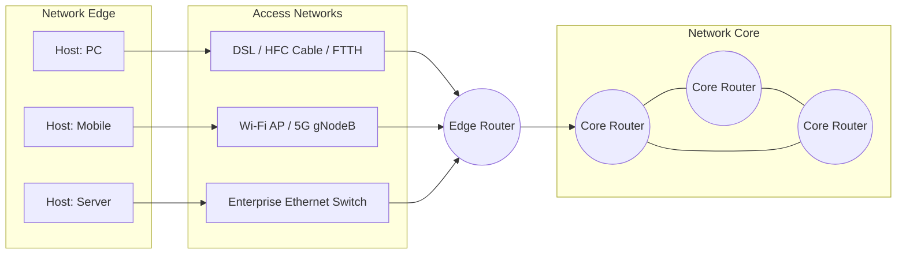

# Internet Overview & The Network Edge

> **Course Code:** PCCST501 / CST303 — Computer Networks  
> **Target Audience:** APJ Abdul Kalam Technological University (KTU) B.Tech Computer Science & Engineering  
> **Module Coverage:** Module 1 (Lecture 1) — End Systems, Access Networks, and Physical Media  

---

## Quick Navigation Anchors
- [The Intuition](#the-intuition)
- [Theoretical Framework: Dual Views & End Systems](#the-framework)
- [Access Networks & Topologies](#access-networks)
- [Physical Transmission Media](#physical-media)
- [Worked Scenario: End-to-End Packet Traversal](#worked-scenario)
- [KTU Exam Focus & Traps](#ktu-exam-focus--pitfalls)
- [Active Recall Checkpoint](#self-check)

---

## The Intuition

::: callout-intuition Core Mental Model: The Global Transportation Grid
Imagine the Internet not as an esoteric cloud of code, but as a worldwide shipping and logistics postal network:
1. **End Systems (Hosts):** The factories, residential homes, and skyscrapers where goods originate and terminate. They create and consume cargo.
2. **Access Networks:** The private driveways, residential side-alleys, and local cargo loading docks that connect individual properties to the municipal road system.
3. **Physical Media:** The underlying paved roads, dirt trails, railway tracks, and open maritime lanes over which vehicles move.
4. **Packet Switches (Routers and Switches):** The multi-lane highway interchanges, traffic roundabouts, and distribution hubs that inspect the destination labels on shipping crates and steer them onto the optimal departing highway.
5. **Packets:** Standardized shipping containers into which raw data chunks are placed, sealed with standardized header manifests, and routed across the world.
:::

---

## The Framework

To rigorously understand computer networks, we must evaluate the Internet through two complementary perspectives: the structural **Nuts-and-Bolts View** and the functional **Services View**.

```
                           THE INTERNET
                                |
        +-----------------------+-----------------------+
        |                                               |
[Nuts-and-Bolts View]                           [Services View]
  - Millions of computing devices                 - Distributed computing platform
    (Hosts / End Systems)                         - Application Programming Interfaces
  - Packet switches (Routers, Switches)             (Socket Interface)
  - Communication links (Fiber, Copper, Radio)    - Value-delivery substrate
  - Communication protocols (TCP, IP, HTTP)         (Web, Cloud, Streaming, VoIP)
```

### 1. The "Nuts-and-Bolts" View (Structural Architecture)
* **End Systems (Hosts):** All physical and virtual computing devices connected to the network edge that run user-space application programs (e.g., workstations, cloud servers, smartphones, IoT sensors, automobiles).
* **Communication Links:** Physical connections composed of various transmission media (coaxial cable, twisted pair, optical fiber, radio frequency spectrum) transmitting bits at a specific **transmission rate** (measured in bits per second, or $\text{bps}$).
* **Packet Switches:** Intermediate network devices that take an arriving packet on one incoming communication link and forward it onto an outgoing communication link. The two primary varieties are:
  * **Routers:** Typically operate at the Network Layer (Layer 3) to move data across heterogeneous networks.
  * **Link-Layer Switches:** Typically operate at the Data Link Layer (Layer 2) within a local area network.
* **Protocols:** Well-defined standards that govern the format, order of messages sent and received among network entities, and actions taken on message transmission or receipt (e.g., $\text{TCP}$, $\text{IP}$, $\text{HTTP}$, $\text{DNS}$).
* **Standards Bodies:** Governed globally by the **Internet Engineering Task Force (IETF)** via published documents called **Requests for Comments (RFCs)**, and the **IEEE 802 LAN/MAN Standards Committee**.

### 2. The "Services" View (Functional Architecture)
* **Distributed Application Substrate:** The Internet serves as a shared infrastructure providing end-to-end communication channels to distributed software applications (e.g., electronic commerce, peer-to-peer file transfer, real-time multimedia streaming, distributed databases).
* **Application Programming Interface (Socket Interface):** A standardized software interface exposed by host operating systems that defines how an application running on one host instructs the Internet infrastructure to deliver payloads to a destination program running on another host.

### 3. End Systems: Clients vs. Servers
At the edge of the network, hosts are logically categorized based on their operational roles:
* **Clients:** End-user devices requesting resources (e.g., mobile phones running a browser, embedded home automation hubs). Typically initiate connections dynamically and receive intermittent, dynamic IP addresses.
* **Servers:** High-capacity computing platforms hosting centralized resources. Today, servers rarely operate as standalone machines; they reside in massive **Hyperscale Data Centers** comprising hundreds of thousands of virtualized server instances interconnected by high-density switching fabrics.

---

## Access Networks

An **Access Network** is the physical and logical network segment that connects an end system to the first router (known as the **Edge Router**) of the network core.



### 1. Residential Access Networks

#### A. Digital Subscriber Line (DSL)
DSL repurposes the traditional local loop telephone infrastructure (unshielded twisted pair copper wire) owned by the local telephone company (Telco).
* **Architecture:**
  * The subscriber premises uses a **DSL Modem**, which converts digital bits into high-frequency analog signals.
  * A **Splitter** near the home demarcation separates telephone signals from high-frequency data signals.
  * At the Telco Central Office (CO), a **DSL Access Multiplexer (DSLAM)** unbundles incoming analog lines from hundreds of households, extracts digital data streams, and directs them into the Telco’s packet-switched routing infrastructure.
* **Frequency Division Multiplexing (FDM):**
  * $0\text{ kHz} - 4\text{ kHz}$ allocated for standard two-way analog telephone voice (POTS).
  * $4\text{ kHz} - 50\text{ kHz}$ allocated for upstream data transmission.
  * $50\text{ kHz} - 1\text{ MHz}$ allocated for downstream data transmission.
* **Characteristics:** Asymmetric bandwidth (ADSL allocates higher downstream rate than upstream rate, matching typical consumer traffic patterns). Provides a **dedicated point-to-point line** from the home to the DSLAM; throughput does not degrade due to neighbors' immediate bandwidth consumption (though backhaul links out of the CO may congest).

#### B. Cable Internet (Hybrid Fiber-Coaxial - HFC)
HFC repurposes residential cable television distribution infrastructure.
* **Architecture:**
  * Combines optical fiber and coaxial cable: fiber optic lines run from the cable headend to local neighborhood **Fiber Nodes**, from which flexible coaxial cable branches run into individual residences.
  * The subscriber premises uses a **Cable Modem**.
  * The cable headend houses a **Cable Modem Termination System (CMTS)**, performing a role analogous to the Telco DSLAM by translating analog RF signals from modems into digital IP packets.
* **Characteristics:**
  * **Shared Broadcast Medium:** Every packet sent downstream by the CMTS travels across the neighborhood coax segment and is physically received by every connected cable modem (which discards packets not addressed to it).
  * If multiple neighbors simultaneously download large video streams, the effective aggregate link capacity is divided among active users, leading to variable throughput.

#### C. Fiber to the Home (FTTH)
FTTH provides direct optical fiber links from the central office directly to private residences, providing orders-of-magnitude higher bandwidth than DSL or HFC.
* **Passive Optical Network (PON) Architecture:**
  * **Optical Line Terminal (OLT):** Located at the Telco Central Office; aggregates traffic for the neighborhood.
  * **Optical Splitter:** A completely passive, unpowered optical device placed in the neighborhood that splits a single downstream optical strand into multiple fiber paths (typically 16 to 128 homes).
  * **Optical Network Terminal (ONT):** Located inside or on the exterior of the subscriber home; translates optical light pulses into standard electrical Ethernet signals.

---

### 2. Enterprise & Campus Access: Ethernet LAN
In universities, corporate enterprises, and data centers, hosts connect via a local area network (**LAN**).
* **Standard:** IEEE 802.3 Ethernet.
* **Topology:** Star topology where end hosts connect via unshielded twisted pair (UTP) copper cables directly into an enterprise **Ethernet Switch**.
* **Transmission Rates:** Typically $100\text{ Mbps}$, $1\text{ Gbps}$, or $10\text{ Gbps}$ dedicated symmetric links to desktop nodes, with $40\text{ Gbps}$ to $100\text{ Gbps}$ links connecting switches to enterprise edge routers.

---

### 3. Wireless Access Networks
Wireless networks transmit electromagnetic waves through unguided space to connect mobile hosts to an edge base station.

| Characteristic | Wireless LAN (Wi-Fi) | Wide-Area Cellular (4G LTE / 5G NR) |
| :--- | :--- | :--- |
| **Standard** | IEEE 802.11 (a/b/g/n/ac/ax/be) | 3GPP (Release 15/16/17+) |
| **Coverage Radius** | Typically $10\text{ m} - 100\text{ m}$ (indoor / localized) | Several kilometers ($1\text{ km} - 10\text{ km}$) |
| **Edge Interconnect** | Access Point (AP) connected to enterprise/home LAN | Base Station (eNodeB / gNodeB) connected to Telco Core |
| **Licensing** | Unlicensed Spectrum ($2.4\text{ GHz}, 5\text{ GHz}, 6\text{ GHz}$) | Licensed Spectrum (Auctioned bands: Sub-6GHz, mmWave) |
| **Mobility** | Basic localized roaming; disconnects across subnets | Seamless high-velocity handoffs between base stations |

---

## Physical Media

Physical media transmit physical representations of bits (voltage levels, optical pulses, or modulated electromagnetic waves). Media are fundamentally divided into **Guided** and **Unguided**.

```
+---------------------------------------------------------------------------------+
|                                 GUIDED MEDIA                                    |
+---------------------------------------------------------------------------------+
|  Twisted Pair (UTP/STP)        Coaxial Cable            Optical Fiber           |
|  - Cat 5e / Cat 6              - Braided copper shield   - Single-Mode (Laser)  |
|  - Twisting cancels crosstalk  - High-bandwidth HFC      - Multi-Mode (LED)     |
|  - Distances: <= 100m          - Distances: Hundreds of  - Ultra-low loss,      |
|                                  meters                   total internal ref.   |
+---------------------------------------------------------------------------------+
```

#### A. Twisted Pair (TP)
* **Design:** Two insulated copper wires, typically $1\text{ mm}$ thick, arranged in a regular spiral pattern. The twisting minimizes electromagnetic radiation interference and reduces mutual signal coupling (known as **crosstalk**) between adjacent pairs.
* **Classifications:**
  * **UTP (Unshielded Twisted Pair):** Standard for building LANs; light, flexible, inexpensive.
  * **STP (Shielded Twisted Pair):** Encased in metal foil shielding to mitigate extreme industrial EMI.
* **Categories:**
  * *Cat 5e:* Bandwidth up to $100\text{ MHz}$; rates up to $1\text{ Gbps}$ over $100\text{ meters}$.
  * *Cat 6 / 6a:* Bandwidth up to $250 - 500\text{ MHz}$; rates up to $10\text{ Gbps}$ over $55 - 100\text{ meters}$.

#### B. Coaxial Cable
* **Design:** Concentric construction consisting of a stiff central copper conductor surrounded by flexible dielectric insulation, wrapped in a woven cylindrical outer copper conductor (which acts as a shield and ground), enclosed within a protective plastic sheath.
* **Use-Case:** High immunity to electrical noise; historically used in baseband Ethernet (10BASE2, 10BASE5) and currently serves as the physical backbone for residential cable television and HFC broadband networks.

#### C. Optical Fiber
* **Design:** A thin, flexible glass or silica filament that carries information encoded as optical pulses (photons). It operates on the physical principle of **Total Internal Reflection**, where light injected into an inner optical **core** reflects at the boundary of an outer glass layer of lower refractive index called the **cladding**.
* **Fiber Types:**
  * **Single-Mode Fiber (SMF):** Extremely narrow core ($\approx 8 - 10\ \mu\text{m}$) permitting only a single optical path (mode) of light to propagate. Requires expensive laser diode light sources. Virtually eliminates **modal dispersion**, permitting high-speed transmission across tens of kilometers without repeaters. Used in long-haul telco and continental submarine cables.
  * **Multi-Mode Fiber (MMF):** Wider core ($\approx 50 - 62.5\ \mu\text{m}$) allowing light rays to bounce at multiple angles (modes). Uses cheaper Light Emitting Diodes (LEDs). Prone to modal dispersion (rays arrive at slightly different times, broadening and degrading pulses), limiting runs to under a few hundred meters. Used in intra-data-center interconnects.

---

### 2. Unguided Media (Wireless Radio)
The signal propagates through the atmosphere, vacuum, or outer space without physical containment.
* **Terrestrial Radio Channels:** Operates across various RF bands. Signals are vulnerable to path loss, shadow fading, multipath reflection (signals bouncing off structures and interfering destructively), and atmospheric absorption.
* **Terrestrial Microwave:** High-frequency ($2\text{ GHz} - 40\text{ GHz}$) directional transmission using parabolic dish antennas. Requires direct **Line of Sight (LOS)**; commonly deployed on hilltops and communication towers spaced $30 - 50\text{ km}$ apart to bridge terrain where running cable is cost-prohibitive. Subject to weather-induced degradation (**rain fade**).
* **Satellite Communication:**
  * **Geostationary (GEO) Satellites:** Orbit at an altitude of approximately $35,786\text{ km}$ directly over the equator. They match Earth’s rotational speed, remaining fixed relative to ground stations. 
  $$\text{One-way Propagation Delay} \approx \frac{35,786\text{ km}}{3 \times 10^5\text{ km/s}} \approx 120\text{ ms} \implies \text{Round-Trip Time (RTT)} \approx 240 - 280\text{ ms}$$
  This significant propagation delay impacts real-time, interactive communication protocols.
  * **Low Earth Orbit (LEO) Satellites:** Orbit between $500\text{ km} - 1500\text{ km}$ altitude. Propagation delays are minimal ($20 - 40\text{ ms}$), but because they move across the sky relative to Earth, a continuous constellation of hundreds to thousands of satellites is required to maintain persistent connectivity via active handoffs (e.g., Starlink).

---

### 3. Media Comparative Matrix

| Physical Medium | Typical Bandwidth | Maximum Segment Range | Attenuation Profile | Susceptibility to EMI | Relative Cost |
| :--- | :--- | :--- | :--- | :--- | :--- |
| **Twisted Pair (Cat 6a)** | Up to $10\text{ Gbps}$ | $\approx 100\text{ meters}$ | High at high frequencies | Moderate (crosstalk mitigated by twists) | Low |
| **Coaxial Cable** | Up to $1\text{ Gbps}$ | Hundreds of meters | Moderate | Low (braided ground shield) | Moderate |
| **Fiber (Single-Mode)** | $> 100\text{ Gbps}$ (per wavelength) | Tens of kilometers | Extremely low | **Zero** (photons ignore electromagnetic fields) | High (termination/transceivers) |
| **Terrestrial Microwave**| Up to hundreds of $\text{Mbps}$ | $30 - 50\text{ km}$ (LOS) | High over distance & rain | High (atmospheric noise, interference) | Moderate (towers/dishes) |
| **GEO Satellite** | Up to tens of $\text{Mbps}$ | $\approx 36,000\text{ km}$ | Very high space path loss | High (cosmic noise, weather) | High (launch infrastructure) |

---

## Worked Scenario

### End-to-End Packet Journey: Video Frame from AWS Data Center to a 5G Mobile Client

Consider a 1500-byte video streaming packet traversing from an AWS server in Oregon to a student's 5G smartphone in Thiruvananthapuram.

::: step [Step 1: Ingestion & Server Egress] Data Center Serialization and Optical Transmission
The streaming server encapsulates the encoded video chunk into an application layer payload, attaches TCP and IP headers, and delivers it to the Network Interface Card (NIC).
1. The NIC converts digital binary states ($0$s and $1$s) into optical pulses using a semiconductor laser emitting at $1310\text{ nm}$.
2. The packet travels over **Single-Mode Fiber (SMF)** through Top-of-Rack (ToR) and Spine switches inside the data center.
3. The bitstream exits via the data center edge router through a high-bandwidth DWDM (Dense Wavelength Division Multiplexing) interface operating over intercontinental submarine fiber cables.
:::

::: step [Step 2: Core Transit & Propagation] The Optical Backbone Transit
The optical signals propagate across trans-oceanic fiber routes at the speed of light in glass:
$$v_{\text{glass}} = \frac{c}{n_{\text{glass}}} \approx \frac{3 \times 10^8\text{ m/s}}{1.5} = 2 \times 10^8\text{ m/s}$$
1. At each Tier-1 Internet Service Provider (ISP) exchange point, optical signals are converted back to electrical signals by high-speed optical transponders.
2. Core routers perform routing lookups on the 32-bit IPv4 (or 128-bit IPv6) destination address to forward the packet out the appropriate egress interface.
3. The packet traverses regional routing hops before reaching the cellular operator's User Plane Function (UPF) edge gateway in India.
:::

::: step [Step 3: Edge Ingress & Mobile Delivery] 5G NR Access Network & Radio Base Station
The packet arrives at the telecommunications central office serving the user's geographical area.
1. The cellular edge router transmits the packet over a high-capacity fiber fronthaul/backhaul link to the local 5G **gNodeB Base Station** antenna tower.
2. The gNodeB radio unit buffers the incoming packet, modulates the bits using Quadrature Amplitude Modulation (such as 256-QAM), and translates them into radio frequency waveforms in the Sub-6 GHz spectrum ($3.5\text{ GHz}$).
3. The unguided electromagnetic waves propagate through the air, suffer path attenuation and urban scattering, and are captured by the multi-antenna array (MIMO) inside the student's smartphone.
4. The smartphone's baseband modem demodulates the RF signal, strips the layer-specific headers, and passes the raw video payload up to the video player app.
:::

---

## KTU Exam Focus & Pitfalls

::: callout-exam KTU Question Patterns
1. **3-Mark Short Answer Questions:**
   * *Define an Access Network. Name two common residential access network technologies.*
   * *Distinguish between Single-Mode Fiber (SMF) and Multi-Mode Fiber (MMF).*
   * *Why is twisted-pair copper wire twisted? Explain crosstalk mitigation.*
2. **7-Mark Analytical Questions:**
   * *Compare and contrast DSL and Cable HFC Internet access architectures. Emphasize shared vs. dedicated media and bandwidth distribution under peak loads.*
   * *Explain the structure of the Internet from both the "Nuts-and-Bolts" and "Services" perspectives with supporting architectural diagrams.*
3. **14-Mark Comprehensive Essay Questions:**
   * *Elaborate on the various types of physical transmission media used in modern computer networks. Detail their physical construction, operational mechanisms, attenuation profiles, and typical applications across network topologies.*
:::

::: callout-formula Fundamental Transmission vs Propagation Comparison
Do not conflate **Transmission Rate** with **Propagation Speed**.

$$\text{Transmission Delay } (d_{\text{trans}}) = \frac{L}{R} \quad \text{[seconds]}$$
Where $L$ is the length of the packet in bits, and $R$ is the transmission rate of the link in $\text{bps}$. This is the time required to push all the packet's bits onto the physical wire.

$$\text{Propagation Delay } (d_{\text{prop}}) = \frac{d}{s} \quad \text{[seconds]}$$
Where $d$ is the physical length of the link in meters, and $s$ is the propagation speed of the medium ($s \approx 2 \times 10^8\text{ m/s}$ in copper/fiber). This is the time taken by a single bit to travel from the beginning of the link to the end.
:::

::: callout-pitfall Exam Traps
* **Trap 1: Assuming Cable Internet Bandwidth is Dedicated.**
  * *Error:* Stating that HFC cable access offers guaranteed downstream bandwidth to individual homes.
  * *Correction:* HFC is a **shared broadcast medium**. All downstream packets flow through a shared neighborhood coaxial tree. If multiple users actively saturate the channel, individual throughput drops. DSL, in contrast, provides a dedicated point-to-point local loop to the DSLAM (though the DSLAM's uplink to the ISP may still become congested).
* **Trap 2: Stating that Routers and Switches are End Systems.**
  * *Error:* Listing an edge router or Ethernet switch as an end system or host.
  * *Correction:* Routers and switches are **packet switches** (intermediate systems). They do not run user-facing application programs. Only devices sitting at the edge running the application layer stack (e.g., workstations, cloud servers, mobile phones) qualify as **End Systems / Hosts**.
* **Trap 3: Believing Fiber Optic Signals Propagate at the Speed of Light in a Vacuum.**
  * *Error:* Using $c = 3 \times 10^8\text{ m/s}$ when calculating propagation delay in optical fiber.
  * *Correction:* Photons propagate through a dielectric medium (silica glass with refractive index $n \approx 1.45 - 1.5$). The actual speed is:
  $$v = \frac{c}{n} \approx \frac{3 \times 10^8}{1.5} = 2 \times 10^8\text{ m/s}$$
:::

---

## Self-Check

::: quiz Architecture & Access Networks
In a Passive Optical Network (PON) deployed for residential Fiber to the Home (FTTH), what device is installed at the neighborhood distribution point to branch optical signals without requiring electrical power?
(A) Digital Subscriber Line Access Multiplexer (DSLAM)
(B) Cable Modem Termination System (CMTS)
(*C) Optical Splitter
(D) Optical Line Terminal (OLT)
::: explanation
An **Optical Splitter** is a completely passive (unpowered) optical component that splits light pulses originating from a single central office fiber strand out to multiple subscriber lines (typically 16 to 128 homes). The DSLAM is used in DSL, the CMTS is used in HFC cable networks, and the OLT is the powered active component located at the Telco Central Office.
:::

::: quiz Physical Media Characteristics
Which physical transmission medium is completely immune to Electromagnetic Interference (EMI) and radio frequency cross-coupling?
(A) Shielded Twisted Pair (Cat 6 STP)
(*B) Single-Mode Optical Fiber
(C) Coaxial Cable
(D) High-frequency Terrestrial Microwave
::: explanation
**Optical fiber** transmits data encoded as pulses of light (photons) through a silica glass core. Because photons carry no electrical charge and do not generate or respond to magnetic fields, optical fibers are completely immune to electromagnetic interference (EMI), radio frequency interference (RFI), and crosstalk. Metallic conductors (STP, Coaxial) mitigate EMI via physical shielding, but remain fundamentally susceptible to high fields.
:::

::: quiz Transmission Fundamentals
A sender transmits a $10\text{-megabit}$ file over a $100\text{ Mbps}$ dedicated link of length $2000\text{ km}$ where the propagation speed of the medium is $2 \times 10^8\text{ m/s}$. What are the Transmission Delay ($d_{\text{trans}}$) and Propagation Delay ($d_{\text{prop}}$), respectively?
(A) $d_{\text{trans}} = 10\text{ ms}$, $d_{\text{prop}} = 100\text{ ms}$
(*B) $d_{\text{trans}} = 100\text{ ms}$, $d_{\text{prop}} = 10\text{ ms}$
(C) $d_{\text{trans}} = 1\text{ ms}$, $d_{\text{prop}} = 10\text{ ms}$
(D) $d_{\text{trans}} = 100\text{ ms}$, $d_{\text{prop}} = 1\text{ ms}$
::: explanation
Calculate the delays systematically:
1. **Transmission Delay ($d_{\text{trans}}$):**
   $$d_{\text{trans}} = \frac{L}{R} = \frac{10 \times 10^6\text{ bits}}{100 \times 10^6\text{ bps}} = 0.1\text{ s} = 100\text{ ms}$$
2. **Propagation Delay ($d_{\text{prop}}$):**
   $$d_{\text{prop}} = \frac{d}{s} = \frac{2000 \times 10^3\text{ m}}{2 \times 10^8\text{ m/s}} = \frac{2 \times 10^6}{2 \times 10^8} = 0.01\text{ s} = 10\text{ ms}$$
Therefore, $d_{\text{trans}} = 100\text{ ms}$ and $d_{\text{prop}} = 10\text{ ms}$. Option (B) is the correct answer.
:::
