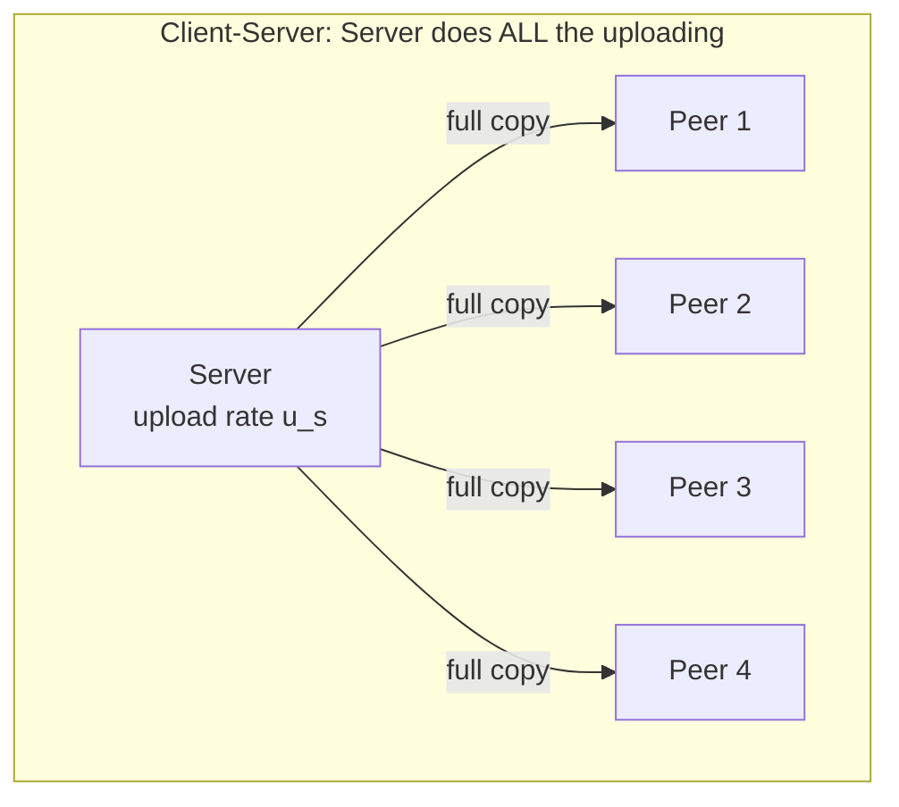
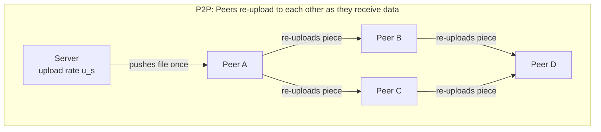

# Peer-to-Peer (P2P) Architecture

**Client-Server vs. P2P scalability — a mathematical comparison of minimum distribution time, and why P2P "self-scales."**

## 1. The Intuition

::: callout-intuition Core Mental Model: One Cashier vs. A Bucket Brigade
Imagine one cashier trying to hand a copy of a large file to $N$ customers, one at a time, at a fixed upload speed. As $N$ grows, the line only gets longer — the cashier is a **fixed-capacity bottleneck**. This is Client-Server distribution: the server's upload bandwidth is shared among however many clients show up, so more clients strictly means slower service for everyone.

Now imagine a bucket brigade instead: the moment the first customer receives even a partial copy of the file, they immediately start handing pieces of *their* copy to other waiting customers — who, in turn, do the same for others. Every new person who arrives doesn't just take a bucket; they also grab an empty bucket and start passing water forward. This is P2P distribution: every peer that finishes downloading a piece becomes an *additional* source of upload capacity for everyone else. The system's total capacity grows automatically as demand grows — this property is called **self-scalability**, and it's the single biggest structural advantage P2P has over Client-Server for large-scale file distribution.
:::

---

## 2. Theoretical Framework & Formalism

### 2.1 Setup and Notation

Consider a file of size $F$ bits being distributed by a single origin server to $N$ peers.

| Symbol | Meaning |
|---|---|
| $F$ | File size (bits) |
| $u_s$ | Server's upload rate |
| $u_i$ | Upload rate of peer $i$ |
| $d_{min}$ | The *slowest* peer's download rate |
| $N$ | Number of peers requesting the file |

### 2.2 Minimum Distribution Time — Client-Server

The server must personally push a full copy of the file to *every* one of the $N$ peers, using its own single upload link — it cannot rely on peers helping each other:

$$D_{CS} \geq \max\left(\frac{NF}{u_s},\ \frac{F}{d_{min}}\right)$$

* $\frac{NF}{u_s}$ — the server's own upload link must push $N$ full copies of the file sequentially/in-aggregate; more peers ($N$) makes this term **grow linearly**.
* $\frac{F}{d_{min}}$ — even in a fantasy world with infinite server bandwidth, the slowest peer's own download link still bounds how fast *it* alone can finish.

### 2.3 Minimum Distribution Time — P2P

In P2P, the server only needs to push the file out **once** in aggregate — and every peer that receives *any* data immediately starts re-uploading it to others:

$$D_{P2P} \geq \max\left(\frac{F}{u_s},\ \frac{F}{d_{min}},\ \frac{F}{u_s + \sum_{i=1}^{N} u_i}\right)$$

* $\frac{F}{u_s}$ — the server needs only to push one full copy out overall, not $N$ copies.
* $\frac{F}{d_{min}}$ — the slowest peer's download link is still a hard floor, same as before.
* $\frac{F}{u_s + \sum u_i}$ — the *total combined upload capacity of the server plus all peers* is the aggregate resource sharing the work; as $N$ grows, this term **shrinks**, because more peers means more total upload capacity available.

### 2.4 The Key Structural Difference

| | Client-Server | P2P |
|---|---|---|
| Server's total upload work | Grows **linearly** with $N$ (must serve every peer directly) | **Constant** — pushes roughly one copy out overall |
| Effect of adding more peers | Strictly **worse** — more contention for the same fixed server bandwidth | Can be **better** — new peers add upload capacity as well as demand |
| Scalability | Bottlenecked by server capacity | Self-scaling, bounded mainly by the slowest peer's download rate |

---

## 3. Worked Example / Step-by-Step Scenario

::: step [Step 1: Setup] Formulating the Problem
A file of size $F = 15$ Gbits is to be distributed from one server to $N = 10$ peers. The server's upload rate is $u_s = 30$ Mbps. Each peer has a download rate of $d_i = 2$ Mbps and an upload rate of $u_i = 1$ Mbps. Compute the minimum distribution time under both Client-Server and P2P.
:::

::: step [Step 2: Execution] Applying the Formulas
**Client-Server:**
$$D_{CS} \geq \max\left(\frac{NF}{u_s}, \frac{F}{d_{min}}\right) = \max\left(\frac{10 \times 15000}{30}, \frac{15000}{2}\right) = \max(5000, 7500) = 7500 \text{ seconds}$$

**P2P:**
Total peer upload capacity: $\sum u_i = 10 \times 1 = 10$ Mbps.
$$D_{P2P} \geq \max\left(\frac{F}{u_s}, \frac{F}{d_{min}}, \frac{F}{u_s + \sum u_i}\right) = \max\left(\frac{15000}{30}, \frac{15000}{2}, \frac{15000}{30+10}\right) = \max(500, 7500, 375) = 7500 \text{ seconds}$$
:::

::: step [Step 3: Conclusion] Final Result
In this particular example, both architectures bottom out at the **same** 7500 seconds — because the *slowest peer's own download rate* ($F/d_{min} = 7500$s) dominates both formulas, and no amount of extra server or peer upload capacity can push a peer's download faster than its own access link allows. This is an important nuance: P2P's advantage over Client-Server only shows up when the *server* (not the slowest peer) is the bottleneck — i.e., when $N$ is large enough that $\frac{NF}{u_s}$ would otherwise dominate. Try re-running the math with $N = 1000$ peers instead of 10, and you'll see $D_{CS}$ grow far past $D_{P2P}$, since the server term scales linearly with $N$ in Client-Server but stays roughly constant in P2P.
:::

---

## 4. Active Recall Checkpoint

::: quiz Q1: Foundational Concept
Why does the Client-Server minimum distribution time $D_{CS} \geq \frac{NF}{u_s}$ grow linearly with $N$?
(A) Because larger $N$ means the file itself grows larger
(*B) Because the server must push a full copy of the file to every one of the $N$ peers using only its own single upload link, so its total workload scales directly with the number of peers
(C) Because peers slow down the server's CPU as more of them connect
(D) Because $N$ has no effect on this term at all
::: explanation
In Client-Server, only the server uploads — peers never help each other. The server's fixed upload capacity $u_s$ must be divided among (or sequentially serve) all $N$ peers' full copies, so total time is proportional to $N$.
:::

::: quiz Q2: Foundational Concept
What is the core reason P2P distribution is described as "self-scaling"?
(A) Servers automatically add more bandwidth as peer count grows
(*B) Each new peer contributes its own upload capacity to the pool ($\sum u_i$ grows), which can offset the additional demand that same peer creates
(C) P2P networks never have a slowest-peer bottleneck
(D) P2P eliminates the need for a server entirely in all cases
::: explanation
Every peer that finishes receiving even part of the file becomes an additional uploader for others. This means the aggregate upload capacity term $u_s + \sum u_i$ tends to grow alongside $N$, in stark contrast to Client-Server where only $u_s$ (fixed) does all the uploading work.
:::

::: quiz Q3: Foundational Concept
In the P2P minimum distribution time formula, what does the term $\frac{F}{d_{min}}$ represent, and why does it appear in the Client-Server formula too?
(A) It represents the server's total upload capacity, appearing in both formulas because both architectures use the same server
(*B) It represents the unavoidable time for the single slowest peer to download the file over its own access link — a hard floor that applies regardless of how fast the source(s) of the data are
(C) It only applies to Client-Server, never to P2P
(D) It measures how long the control connection stays open
::: explanation
No matter how much aggregate upload capacity exists in the network (server alone, or server + peers), a peer still cannot receive data faster than its *own* download link allows. This makes $F/d_{min}$ a fundamental lower bound present in both architectures' formulas.
:::
