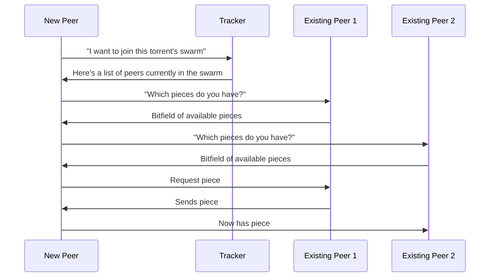
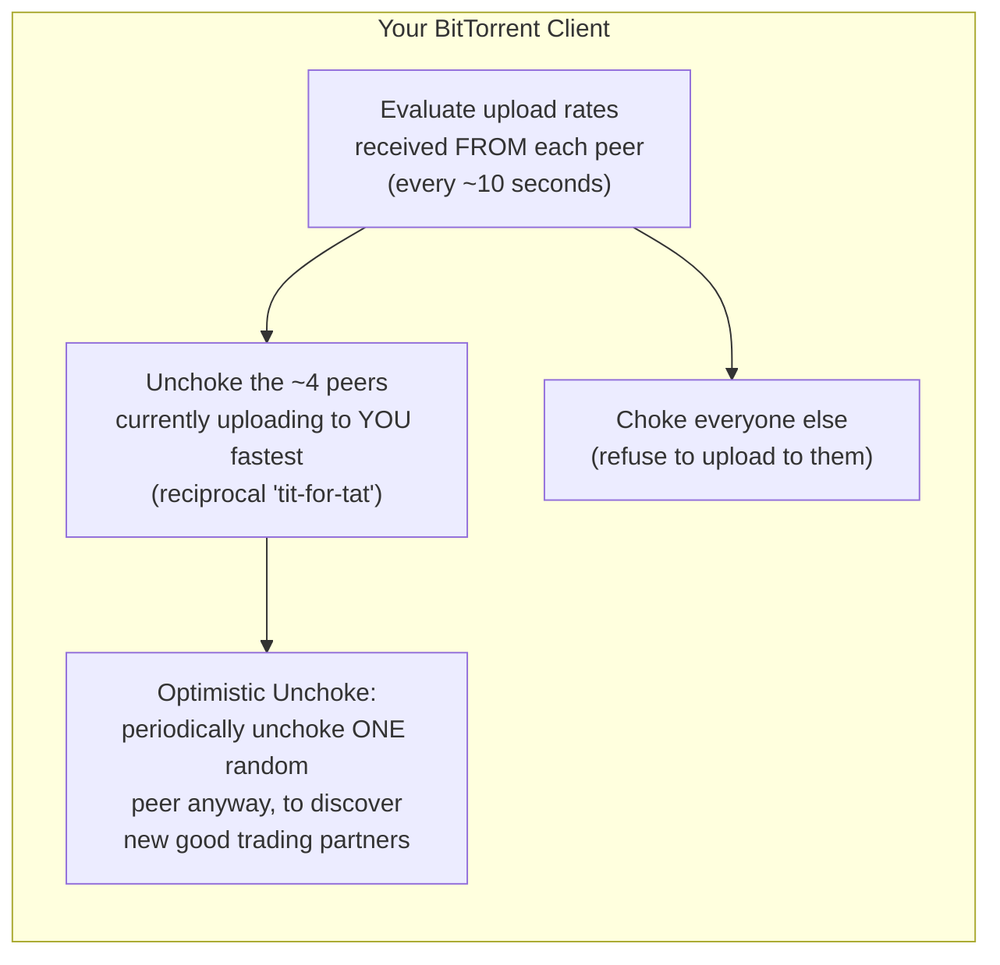

# P2P Case Study: The BitTorrent Protocol

**Torrents, trackers, swarms, file pieces, rarest-first piece selection, and tit-for-tat choking algorithms.**

## 1. The Intuition

::: callout-intuition Core Mental Model: A Thousand-Piece Jigsaw Puzzle, Shared
Imagine a huge jigsaw puzzle where no single person has all the pieces, but every person in the room has *some* pieces, and everyone wants a complete copy. The smart strategy isn't to wait patiently for one generous person to hand you piece after piece — it's to **trade**: "I'll give you a piece you're missing if you give me one I'm missing." The people who trade most generously with you get prioritized for future trades; the people who never share anything get frozen out.

This is exactly BitTorrent's philosophy. A large file is chopped into many small **pieces**. A **swarm** of peers who each have different subsets of pieces trade with each other directly, guided by two clever rules: **rarest-first** (prioritize trading for pieces almost nobody has yet, so they don't disappear from the swarm if their only holder leaves) and **tit-for-tat** (prioritize uploading to peers who are also uploading generously to you, discouraging freeloaders). A central helper called the **tracker** doesn't hold any file data at all — it just plays matchmaker, telling newcomers who else is in the swarm.
:::

---

## 2. Theoretical Framework & Formalism

### 2.1 Core Vocabulary

| Term | Meaning |
|---|---|
| **Torrent file (.torrent)** | Metadata file: piece hashes (for verifying integrity), file size, and the tracker's address — contains no actual file content |
| **Tracker** | A server that maintains the list of peers currently participating in a given torrent's swarm and introduces newcomers to existing peers |
| **Swarm** | The complete set of peers (seeders + leechers) currently exchanging pieces of one specific file |
| **Seeder** | A peer who already has the **complete** file and continues uploading pieces to others, without downloading |
| **Leecher** | A peer who has only a **partial** copy and is actively both downloading missing pieces and uploading pieces it already has |
| **Piece** | A fixed-size chunk (commonly 256 KB–4 MB) that the whole file is divided into, each independently verifiable via a hash |

### 2.2 Joining a Swarm

### 2.3 Rarest-First Piece Selection

Rather than downloading pieces sequentially (piece 1, then 2, then 3, ...), a BitTorrent client requests whichever pieces are **least common** across the swarm first.

* **Why it matters:** if a piece exists on only one seeder and that seeder disconnects before anyone else obtains it, that piece is **lost forever**, making the whole file undownloadable for everyone. Prioritizing rare pieces spreads them across more peers quickly, protecting the swarm's overall health.
* **Side benefit:** it also naturally diversifies which pieces each peer holds, which means peers have more unique pieces to *trade* with each other — directly enabling more parallel, simultaneous exchanges rather than everyone bottlenecking on the same popular pieces.

### 2.4 Tit-for-Tat and Choking

Each peer only uploads to a limited number of other peers at once — everyone else is **choked** (temporarily refused uploads):

* **Tit-for-Tat:** a peer prioritizes uploading to the handful of peers who are *currently* uploading to it the fastest — directly rewarding reciprocity and discouraging freeloaders who only download without contributing.
* **Optimistic Unchoke:** periodically, a peer unchokes one *random* other peer regardless of past behavior. This gives new peers (who haven't had a chance to prove themselves yet) an opportunity to start trading, and lets a peer discover potentially better trading partners than its current set.

---

## 3. Worked Example / Step-by-Step Scenario

::: step [Step 1: Setup] Formulating the Problem
A file is divided into 100 pieces. In a swarm of 5 peers, piece #63 exists on only 1 peer, while pieces #1–#10 exist on all 5 peers. A new peer joins the swarm with zero pieces. Explain which piece(s) the new peer's client should prioritize requesting first, and why.
:::

::: step [Step 2: Execution] Applying Rarest-First
The new client queries each existing peer for its bitfield (list of pieces held) and tallies how many peers hold each piece. Piece #63 has a **rarity count of 1** (only one holder in the entire swarm), while pieces #1–#10 have a rarity count of 5 (universally available). Following the rarest-first rule, the client requests **piece #63 first**, ahead of the common pieces #1–#10.
:::

::: step [Step 3: Conclusion] Final Result
By grabbing piece #63 early, the new peer creates a *second* copy of that rare piece in the swarm — so even if the original sole holder disconnects immediately afterward, the piece survives and remains downloadable by future peers. Had the client instead downloaded the abundant pieces #1–#10 first (which were never at risk of disappearing), it would have wasted valuable early opportunity while the truly fragile piece #63 remained a single point of failure for the entire swarm.
:::

---

## 4. Active Recall Checkpoint

::: quiz Q1: Foundational Concept
What is the primary role of the BitTorrent tracker?
(A) It stores a complete backup copy of the file being shared
(*B) It maintains a list of peers currently in the swarm and introduces newcomers to existing peers, without holding any of the actual file data
(C) It verifies the correctness of every piece transferred between peers
(D) It performs the tit-for-tat choking decisions on behalf of every peer
::: explanation
The tracker is purely a matchmaking service — it never transfers file content itself. Once it has told a new peer who else is in the swarm, all actual piece exchange happens directly between peers, peer-to-peer.
:::

::: quiz Q2: Foundational Concept
Why does BitTorrent prioritize "rarest-first" piece selection instead of downloading pieces sequentially?
(A) Sequential downloading is technically impossible in BitTorrent
(*B) It protects the swarm from losing pieces entirely (if a piece's only holder disconnects) and encourages faster diversification of pieces across peers, enabling more parallel trades
(C) Rarest pieces are always smaller in size, so they download faster
(D) It ensures every peer downloads pieces in exactly the same order
::: explanation
A piece held by only one peer is at risk of vanishing from the swarm entirely if that peer leaves before anyone else copies it. Prioritizing rare pieces spreads them to more peers quickly, safeguarding the file's completeness for the whole swarm, and also gives peers a more diverse set of pieces to trade.
:::

::: quiz Q3: Foundational Concept
What is the purpose of "Optimistic Unchoke" in BitTorrent's choking algorithm?
(A) To permanently ban peers that have never uploaded anything
(*B) To periodically unchoke a random peer regardless of past reciprocity, giving new or currently-choked peers a chance to prove themselves and letting a client discover potentially better trading partners
(C) To guarantee every peer in the swarm gets unchoked at the exact same time
(D) To disable rarest-first piece selection temporarily
::: explanation
Strict tit-for-tat alone would trap new peers in a catch-22: they can't get unchoked because they haven't uploaded anything yet, but they can't upload anything because they're choked and have no pieces. Optimistic Unchoke breaks this deadlock by occasionally giving a random peer a trial opportunity, independent of its trading history so far.
:::
