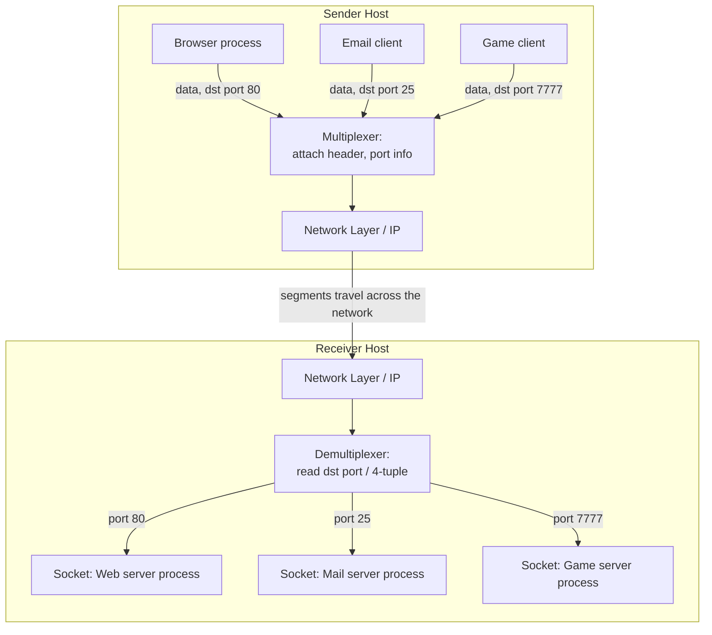

# Transport Layer Services & Multiplexing/Demultiplexing

**Process-to-process delivery, port numbers, socket identification, and the multiplexing/demultiplexing mechanism.**

## 1. The Intuition

::: callout-intuition Core Mental Model
The Network layer (IP) only promises to get a packet from one **computer** to another computer — like a postal service that only guarantees a letter reaches the right *building*, not the right *person inside* that building. But a single computer runs dozens of processes simultaneously — your browser, your email client, a background update checker, a game — all needing to send and receive data over the network at the same time. Someone has to sort the incoming mail and hand each letter to the correct occupant of the building.

That "mail sorter inside the building" is exactly the **Transport layer**. Its core job is **process-to-process delivery** — taking the network layer's "got it to the right computer" and extending it to "got it to the right *application* on that computer." It does this using **port numbers**: a 16-bit number that acts like an apartment number, identifying which specific process should receive the data. **Multiplexing** is gathering data from many different application processes on the sending side and combining them (each tagged with its own port) into segments for the network layer to carry; **demultiplexing** is the reverse — on the receiving side, unpacking arriving segments and delivering each one's payload to the correct waiting process, based on the port numbers.
:::

---

## 2. Theoretical Framework & Formalism

**Services the Transport layer can offer, generally (specific protocols choose which):**
- **Process-to-process delivery** (the one universal, non-negotiable job — every transport protocol does this).
- **Reliable data transfer** — guaranteeing data arrives, in order, without loss or duplication (TCP does this; UDP does not).
- **Flow control** — preventing a fast sender from overwhelming a slow receiver's buffer.
- **Congestion control** — preventing the *network* (not just the receiver) from being overwhelmed by too much combined traffic.

**Ports and sockets.** A port number (0–65535) identifies a process on a machine. A **socket** is the actual endpoint of communication, uniquely identified by the 4-tuple: (source IP, source port, destination IP, destination port) — for TCP specifically, this exact 4-tuple (sometimes called the 5-tuple when including the protocol type) is what distinguishes one active connection from another, even between the same pair of machines.

| Port range | Name | Typical use |
|---|---|---|
| 0 – 1023 | Well-known ports | Standard services (HTTP=80, HTTPS=443, FTP=21, SMTP=25, DNS=53) |
| 1024 – 49151 | Registered ports | Vendor-registered application ports |
| 49152 – 65535 | Dynamic / private / ephemeral ports | Temporarily assigned to a client for the duration of one connection |

**Multiplexing (sender side).** Every socket created by an application process is assigned a port. When the process sends data, the transport layer attaches header information (including source and destination port) to form a **segment**, and passes it down to the network layer — this "gathering many process-streams into one shared network layer" is multiplexing.

**Demultiplexing (receiver side).** When a segment arrives at a host, the transport layer examines its header:
- **UDP (connectionless) demultiplexing** uses only the **destination port** — every UDP segment arriving at that port is delivered to the socket bound to it, regardless of who sent it.
- **TCP (connection-oriented) demultiplexing** uses the **full 4-tuple** (source IP, source port, destination IP, destination port) — this is why a web server can simultaneously serve thousands of different clients all on the same well-known destination port 80: each client has a different source IP/port combination, so each gets routed to its own distinct socket.

---

## 3. Worked Example / Step-by-Step Scenario

::: step [Step 1: Setup] Formulating the Problem
A web server at IP `203.0.113.5`, port `80`, receives connections from two different clients: Client A at `198.51.100.10` using ephemeral port `52001`, and Client B at `198.51.100.20` using ephemeral port `52001` (note: the *same* ephemeral port number, coincidentally, but on a *different* client IP). Determine whether the server's TCP demultiplexing can correctly tell these two connections apart.
:::

::: step [Step 2: Execution] Applying Core Algorithm
TCP demultiplexing uses the full 4-tuple: (source IP, source port, destination IP, destination port).
Connection A's 4-tuple: `(198.51.100.10, 52001, 203.0.113.5, 80)`.
Connection B's 4-tuple: `(198.51.100.20, 52001, 203.0.113.5, 80)`.
Even though the source *port* is identical (52001) for both, the source *IP* differs (`.10` vs `.20`), so the two 4-tuples are distinct.
:::

::: step [Step 3: Conclusion] Final Result
Yes — the server correctly demultiplexes these as two separate connections, delivering each to its own distinct socket, because TCP's 4-tuple matching considers the *entire* combination, not port number alone. This is exactly how a single web server, listening on one well-known port (80), can simultaneously and correctly serve thousands of different clients at once — each client's unique IP (and often unique ephemeral port too) keeps every connection distinguishable.
:::

---

## 4. Active Recall Checkpoint

::: quiz Q1: Foundational Concept
What is the fundamental difference between how UDP and TCP perform demultiplexing?
(A) UDP uses the 4-tuple; TCP uses only the destination port
(*B) UDP uses only the destination port; TCP uses the full 4-tuple (source IP, source port, destination IP, destination port)
(C) Both use identical demultiplexing mechanisms
(D) Neither protocol performs demultiplexing
::: explanation
UDP is connectionless, so it only needs to know which local port to deliver a segment to — all traffic to that port goes to the same socket. TCP is connection-oriented and must distinguish between multiple simultaneous connections to the same local port, which requires the full 4-tuple to uniquely identify each individual connection.
:::

::: quiz Q2: Foundational Concept
A web server listens on well-known port 80 and simultaneously serves 5,000 different clients. How is this possible if they're all using the "same" destination port?
(*B) Each client has a distinct source IP and/or source ephemeral port, so the full 4-tuple differs for each connection even though the destination port (80) is shared
(A) The server actually opens 5,000 different destination ports
(C) Only one client can actually be served at a time
(D) TCP does not support multiple connections to the same port
::: explanation
While the destination port stays fixed at 80 for all connections to this server, TCP identifies individual connections using the complete 4-tuple. Since each client has a unique source IP (and typically a unique ephemeral source port too), every connection's 4-tuple remains distinct, allowing thousands of simultaneous connections to the same destination port.
:::

::: quiz Q3: Foundational Concept
Ephemeral (dynamic/private) port numbers, typically in the range 49152–65535, are usually assigned to:
(A) Well-known, permanent server processes like HTTP or DNS
(*B) A client application, temporarily, for the duration of a single connection
(C) The network layer's routing table
(D) Only UDP connections, never TCP
::: explanation
When a client (e.g., your browser) initiates a connection, the operating system assigns it a temporary, high-numbered ephemeral port for that specific connection's lifetime, distinguishing this outgoing connection from any others the same machine might simultaneously be making — unlike a server's well-known port, which stays fixed and is publicly known in advance.
:::
