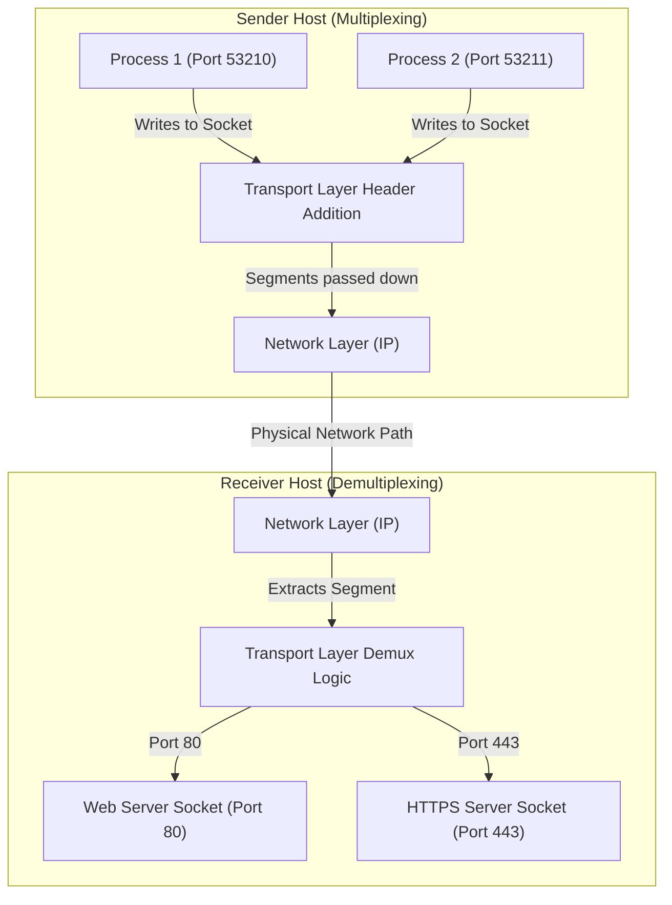

# Transport Layer Services & Multiplexing

**Process-to-process communication, port numbers, socket addressing, connectionless vs. connection-oriented demultiplexing, and the User Datagram Protocol (UDP).**

<a id="the-intuition"></a>
## 1. The Intuition

::: callout-intuition Core Mental Model: The University Mailroom
Imagine a sprawling university campus with 20 dormitories. Every day, the Postal Service delivery van arrives at each dormitory and drops off a sack of letters at the front desk. 

* The **Network Layer** (IP) is the Postal Service van: its job is strictly **host-to-host**. It drives letters from one physical building (host IP address) to another physical building (destination host IP address). The van driver does *not* deliver mail directly into individual students' hands.
* The **Transport Layer** (TCP/UDP) is the **dorm mailroom clerk**: the clerk opens the mail sack, reads the room number / student ID written on each envelope, and drops each letter into that specific student's private mail cubby. In networking, that mail cubby is a **socket**, and the room number is a **port number**.
* The processes running on your computer (Spotify, Chrome, Zoom, Discord) are the **students**. Without the transport layer, your operating system would receive a flood of incoming internet packets from the network card but would have no idea which app they belong to!
:::

---

<a id="the-math"></a>
## 2. Theoretical Framework & Formalism

### 2.1 Transport Layer vs. Network Layer

The transport layer provides **logical communication** between application processes running on different hosts, whereas the network layer provides logical communication between hosts.

| Dimension | Network Layer (IP) | Transport Layer (TCP/UDP) |
|---|---|---|
| **Scope** | Host-to-Host delivery | Process-to-Process delivery |
| **Addressing** | IP Addresses ($32$-bit IPv4 or $128$-bit IPv6) | Port Numbers ($16$-bit: $0$ to $65{,}535$) |
| **PDU Name** | Datagram (Packet) | Segment (TCP) / User Datagram (UDP) |
| **Location** | Runs on end hosts AND intermediate routers | Runs **exclusively** on end systems (hosts) |
| **Guarantees** | Best-effort (packets can be lost, corrupted, reordered) | TCP provides reliability; UDP extends best-effort |

### 2.2 Multiplexing and Demultiplexing



* **Multiplexing at Sender:** Gathering data chunks from multiple application sockets, enveloping each chunk with transport headers (including source and destination port numbers), and passing the resulting segments down to the network layer.
* **Demultiplexing at Receiver:** Examining the header fields in an incoming transport-layer segment to identify the receiving socket, then directing the segment payload to that specific socket.

### 2.3 Port Numbers and Socket Identification

Every port number is a $16$-bit unsigned integer ranging from $0$ to $65{,}535$:

* **Well-Known Ports ($0$ – $1{,}023$):** Restricted for standardized server protocols (e.g., HTTP: $80$, HTTPS: $443$, DNS: $53$, SSH: $22$, FTP: $20/21$, SMTP: $25$).
* **Registered Ports ($1{,}024$ – $49{,}151$):** Assigned by IANA for specific vendor services (e.g., MySQL: $3306$, PostgreSQL: $5432$).
* **Dynamic / Ephemeral / Private Ports ($49{,}152$ – $65{,}535$):** Temporarily assigned automatically by the client OS when an application initiates an outbound connection.

#### Connectionless Demultiplexing (UDP)
A UDP socket is fully identified by a **$2$-tuple**:
$$\text{UDP Socket} = (\text{Destination IP Address}, \text{Destination Port Number})$$
*If two UDP packets originate from different source IP addresses or source port numbers, but have the same destination IP and destination port, they are directed to the exact same destination socket.*

#### Connection-Oriented Demultiplexing (TCP)
A TCP socket is identified by a **$4$-tuple**:
$$\text{TCP Socket} = (\text{Source IP}, \text{Source Port}, \text{Destination IP}, \text{Destination Port})$$
*A welcoming listening server socket (e.g., listening on port $80$) forks an individual connection socket for each connecting client. Two arriving segments with different source IPs will map to two completely different sockets, allowing concurrent client handling.*

::: callout-exam KTU Exam Focus: 2-Tuple vs. 4-Tuple Demux
Questions frequently ask: *"Explain how port numbers are used to demultiplex packets in UDP versus TCP. Can two active TCP connections have the same destination port on a web server?"*  
**Answer:** Yes! A web server listens on port $80$. When 100 clients connect, all segments arrive at destination port $80$, but each connection has a unique client source IP and source port, allowing the OS to demultiplex them into 100 independent connection sockets.
:::

---

### 2.4 User Datagram Protocol (UDP) — RFC 768

UDP is described as a **"bare-bones"** transport protocol. It does almost nothing beyond adding process-to-process multiplexing/demultiplexing and lightweight error checking over IP.

#### The 8-Byte UDP Header
```
 0                   1                   2                   3
 0 1 2 3 4 5 6 7 8 9 0 1 2 3 4 5 6 7 8 9 0 1 2 3 4 5 6 7 8 9 0 1
+-+-+-+-+-+-+-+-+-+-+-+-+-+-+-+-+-+-+-+-+-+-+-+-+-+-+-+-+-+-+-+-+
|          Source Port          |       Destination Port        |
+-+-+-+-+-+-+-+-+-+-+-+-+-+-+-+-+-+-+-+-+-+-+-+-+-+-+-+-+-+-+-+-+
|            Length             |           Checksum            |
+-+-+-+-+-+-+-+-+-+-+-+-+-+-+-+-+-+-+-+-+-+-+-+-+-+-+-+-+-+-+-+-+
|                            Payload                            |
|                            ...                                |
+-+-+-+-+-+-+-+-+-+-+-+-+-+-+-+-+-+-+-+-+-+-+-+-+-+-+-+-+-+-+-+-+
```

1. **Source Port ($16$ bits):** Port of sending process (optional, set to $0$ if no reply expected).
2. **Destination Port ($16$ bits):** Port of receiving process.
3. **Length ($16$ bits):** Total length in bytes of the UDP header plus application payload (minimum value is $8$ bytes).
4. **Checksum ($16$ bits):** Used to detect bit errors in the segment (and pseudo-header).

#### Why Application Designers Choose UDP
1. **No Connection Establishment Delay:** UDP does not perform a 3-way handshake (saves $1$ full Round-Trip Time). DNS uses UDP for instant name resolution.
2. **No Connection State:** A server does not need to allocate receive buffers, congestion windows, or sequence number timers. A single DNS server can easily serve tens of thousands of active clients concurrently.
3. **Small Packet Header Overhead:** UDP header is only $8$ bytes; TCP header is at least $20$ bytes ($150\%$ larger overhead).
4. **Unregulated Send Rate:** UDP does not have congestion control. Real-time media (VoIP, live video streaming, multiplayer gaming) can push bits into the network as fast as desired without throttling when packets drop.

---

### 2.5 The UDP Checksum Calculation (1's Complement Sum)

The checksum provides error detection. It detects flipped bits caused by electrical interference or faulty router memory.

::: callout-formula KTU Formula Vault: 1's Complement Checksum Rule
1. Treat all $16$-bit words in the segment (including header, payload, and a $12$-byte IP pseudo-header) as unsigned $16$-bit integers.
2. Add all $16$-bit words together using standard binary addition.
3. Whenever an **overflow bit** (carry out of the 16th bit) occurs, **wrap it around** and add it to the least significant bit (end-around carry).
4. Take the **1's complement** (flip all bits: $0 \to 1, 1 \to 0$) of the sum. That result is the Checksum field.
5. **Receiver Verification:** Sum all $16$-bit words, including the received checksum. If no bits were corrupted, the resulting sum must equal `0xFFFF` (all $1$s).
:::

---

<a id="worked-example"></a>
## 3. Worked Example / Step-by-Step Scenario

::: step [Step 1: Setup] Formulating the Problem
Suppose we want to compute the UDP checksum for two $16$-bit integers:
* Word 1: `1100 1010 0101 0001` (Hex: `0xCA51`)
* Word 2: `0111 0110 1010 1111` (Hex: `0x76AF`)
Compute the $16$-bit 1's complement checksum and demonstrate how the receiver verifies integrity.
:::

::: step [Step 2: Execution] Adding the Words and Inverting
**1. Perform Binary Addition:**
```
    1100 1010 0101 0001  (Word 1)
  + 0111 0110 1010 1111  (Word 2)
  ---------------------
  1 0100 0001 0000 0000
```
Notice the **overflow bit** (the 17th bit on the far left).

**2. End-Around Carry (Wrap around overflow):**
```
    0100 0001 0000 0000
  +                   1  (Wrapped carry)
  ---------------------
    0100 0001 0000 0001  (Sum)
```

**3. Invert All Bits (1's Complement):**
```
  Sum:      0100 0001 0000 0001
  Checksum: 1011 1110 1111 1110  (Hex: 0xBEFE)
```
The sender transmits Word 1, Word 2, and the Checksum `1011 1110 1111 1110`.
:::

::: step [Step 3: Conclusion] Final Result & Receiver Verification
At the receiving end, the host sums all three numbers:
```
    0100 0001 0000 0001  (Sum of Word 1 + Word 2)
  + 1011 1110 1111 1110  (Checksum)
  ---------------------
    1111 1111 1111 1111  (All 1s = 0xFFFF)
```
Because the result contains all $1$s, the receiver concludes that no single-bit transmission error occurred.
:::

---

<a id="self-check"></a>
## 4. Active Recall Checkpoint

::: quiz Q1: Multiplexing Scope
Why can't the Network Layer (IP) handle communication directly between user processes like Chrome and Discord?
(A) Because IP addresses change every minute
(*B) Because IP addresses only identify physical or virtual host interfaces, not individual software applications running inside the host OS
(C) Because IP only works with fiber optic links
(D) Because routers block all non-web traffic
::: explanation
An IP address directs a packet to a machine's network interface card. Once inside the machine, multiple applications are listening simultaneously. The Transport Layer's port numbers are required to distinguish between processes.
:::

::: quiz Q2: Socket Identification
A web server running Apache listens on TCP port 80. Client A (IP `10.0.0.1`, port `50000`) and Client B (IP `10.0.0.2`, port `50000`) both connect to the server simultaneously. How does the server differentiate their traffic?
(A) The server rejects Client B because port 50000 is already occupied
(B) The server forces Client B to change its port number to 50001
(*C) The server uses the 4-tuple (Source IP, Source Port, Dest IP, Dest Port), which differs because the Source IPs are distinct
(D) UDP handles this automatically
::: explanation
TCP connection demultiplexing uses all 4 fields. Even though both clients chose port 50000 and target port 80, `(10.0.0.1, 50000, ServerIP, 80)` and `(10.0.0.2, 50000, ServerIP, 80)` are unique 4-tuples that map to two separate socket buffers.
:::

::: quiz Q3: UDP Checksum
If the sum of all 16-bit words plus the received UDP checksum results in `1111 1110 1111 1111`, what action does the receiver take?
(A) It delivers the packet to the socket anyway
(*B) It detects that an error has occurred and discards the segment or passes it with a warning
(C) It requests the sender to retransmit the packet using UDP ACK
(D) It flips the 0 bit to 1 automatically
::: explanation
If any bit in the final verification sum is 0, at least one bit in the segment was corrupted during transit. Because UDP does not have retransmission, it drops the packet.
:::
