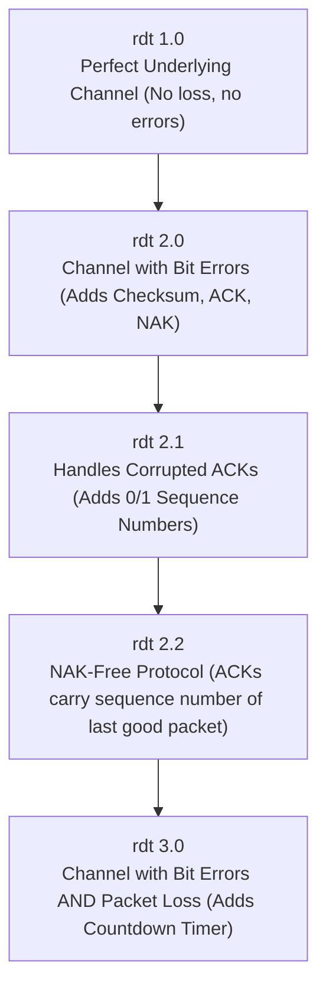
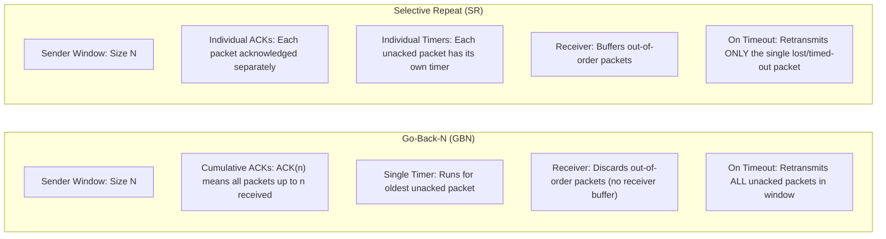

# Principles of Reliable Data Transfer (rdt)

**Building reliability over unreliable channels, Stop-and-Wait analysis, pipelining, Go-Back-N (GBN), and Selective Repeat (SR).**

## 1. The Intuition

::: callout-intuition Core Mental Model: Telephone Conversation over a Crackling Wire
Imagine talking over a noisy walkie-talkie connection with static:
* If you speak a sentence and hear silence, you don't know if your friend heard you or if the wire cut out. You need an **Acknowledgment (ACK)**: "Roger, got that!"
* If static garbles the words, your friend needs a way to say: "Say again, that was garbled" (**Negative Acknowledgment / NAK**).
* But what if the "Roger" gets lost in static? If you repeat the sentence, your friend might think you are describing two different things! To solve this, you must **number your sentences**: "Message 0: The eagle has landed", "Message 1: Bring the supplies".
* If you pause after every single sentence and wait 10 seconds for "Roger" before uttering the next sentence (**Stop-and-Wait**), a 5-minute conversation takes 4 hours! To speed things up, you speak 5 sentences in a continuous stream (**Pipelining**), keeping track of which numbers have been confirmed.
:::

---

## 2. Theoretical Framework & Formalism

### 2.1 The Evolution of Rdt (Reliable Data Transfer)

The underlying network layer (IP) is **unreliable**: packets can experience bit corruption, delay, packet loss, or arrive out of order. The transport layer builds reliability systematically:

#### rdt 1.0: Completely Reliable Channel
Sender sends, receiver receives. No feedback or error control needed.

#### rdt 2.0: Channel with Bit Errors (Stop-and-Wait)
* Uses **Checksum** to detect bit corruption.
* Uses **ACK (Acknowledgment)** when packet received cleanly.
* Uses **NAK (Negative Acknowledgment)** when packet is corrupted, triggering immediate sender retransmission.
* *Fatal Flaw:* What if the ACK or NAK itself is corrupted? The sender cannot know whether the receiver said "yes" or "no"!

#### rdt 2.1: Handling Corrupted ACKs/NAKs
* Sender adds a **$1$-bit Sequence Number** ($0$ or $1$) to each packet header.
* If an ACK/NAK is corrupted, the sender retransmits the current packet.
* If receiver receives a packet with the same sequence number as the last one, it knows it's a **duplicate**; it discards the payload and re-sends ACK.

#### rdt 2.2: Eliminating NAKs
* Instead of sending NAK, receiver sends an ACK for the *last correctly received packet*, including its sequence number: `ACK 0` or `ACK 1`.
* Duplicate ACK at sender acts as a NAK for the next expected packet.

#### rdt 3.0: Channel with Loss (The Alternating-Bit Protocol)
* Packets or ACKs can vanish completely in routers.
* Sender starts a **Countdown Timer** when transmitting. If no ACK arrives before timeout, sender retransmits.

---

### 2.2 Performance Bottleneck of Stop-and-Wait

In Stop-and-Wait, the sender cannot transmit a second packet until the ACK for the first packet arrives back.

::: callout-formula KTU Formula Vault: Stop-and-Wait Utilization
Let $L$ = packet size in bits, $R$ = transmission rate (bps), and $RTT$ = round-trip propagation time.
$$\text{Transmission Delay: } d_{\text{trans}} = \frac{L}{R}$$
$$\text{Total Cycle Time: } T_{\text{cycle}} = d_{\text{trans}} + RTT$$
$$\text{Sender Utilization: } U_{\text{sender}} = \frac{d_{\text{trans}}}{d_{\text{trans}} + RTT} = \frac{L/R}{L/R + RTT}$$

**Example:** Over a $1\text{ Gbps}$ link with $RTT = 30\text{ ms}$ and $1\text{ KB}$ packet ($8{,}000\text{ bits}$):
$$d_{\text{trans}} = \frac{8{,}000}{10^9} = 0.008\text{ ms}$$
$$U_{\text{sender}} = \frac{0.008}{0.008 + 30} = \frac{0.008}{30.008} \approx 0.00027 \quad (0.027\%)$$
A $1\text{ Gbps}$ optical link achieves only $270\text{ kbps}$ actual throughput! Stop-and-Wait completely wastes network bandwidth.
:::

---

### 2.3 Pipelined Protocols: Go-Back-N vs. Selective Repeat

Pipelining allows the sender to transmit up to $N$ unacknowledged packets concurrently:

| Dimension | Go-Back-N (GBN) | Selective Repeat (SR) |
|---|---|---|
| **Window Size at Sender ($W_s$)** | Up to $N$ | Up to $N$ |
| **Window Size at Receiver ($W_r$)** | Strictly **$1$** (no buffer) | **$N$** (buffers out-of-order packets) |
| **Acknowledgments** | **Cumulative**: ACK $k$ confirms all frames $\le k$ | **Individual**: ACK $k$ confirms only frame $k$ |
| **Timer Strategy** | Single timer for oldest unacknowledged packet | Independent timer for each unacknowledged packet |
| **Out-of-Order Handling** | Discards out-of-order packets; re-ACKs highest in-order | Buffers out-of-order packets within receiver window |
| **Retransmission on Loss** | Resends all $N$ packets from the lost packet onward | Resends **only** the specific packet that timed out |
| **Sequence Number Constraint** | Window size $N \le 2^k - 1$ for $k$-bit sequence numbers | Window size $N \le 2^{k-1} = 2^k / 2$ |

::: callout-pitfall Common Exam Trap: The SR Window Size Limit
Why must $W \le 2^{k-1}$ in Selective Repeat?  
If $k = 2$ bits, sequence numbers are $0, 1, 2, 3$. If window size $W = 3$:
1. Sender sends packets $0, 1, 2$. Receiver receives all three and advances its window to expect $3, 0, 1$.
2. All three ACKs are lost in transit!
3. Sender times out on packet $0$ and retransmits packet $0$.
4. Receiver looks at incoming packet $0$: Is this a **retransmission** of the old packet $0$, or is it the **brand-new** packet $0$ that comes after packet $3$?  
**The receiver cannot tell!** Therefore, $W_s + W_r \le 2^k$, which means for symmetric windows, $W \le 2^{k-1}$.
:::

---

## 3. Worked Example / Step-by-Step Scenario

::: step [Step 1: Setup] Formulating the Scenario
Sender window size is $N = 4$. Sequence numbers are $0, 1, 2, 3, 4, 5, \dots$  
The sender transmits packets $0, 1, 2, 3$.  
**Event:** Packet $1$ is lost in transit. Packets $0, 2, 3$ reach the receiver intact.  
Trace the exact actions of the receiver and sender under **Go-Back-N** vs. **Selective Repeat**.
:::

::: step [Step 2: Execution] Tracing GBN vs. SR
**Under Go-Back-N (GBN):**
1. Packet $0$ arrives $\to$ Receiver accepts, delivers to app, sends `ACK 0`.
2. Packet $1$ is lost.
3. Packet $2$ arrives $\to$ Receiver expects packet $1$! Packet $2$ is out-of-order. Receiver **discards packet 2** and re-sends `ACK 0`.
4. Packet $3$ arrives $\to$ Receiver still expects packet $1$. Receiver **discards packet 3** and re-sends `ACK 0`.
5. At Sender: `ACK 0` arrives, sliding the window forward by 1. Timer for packet $1$ expires.
6. Sender **goes back to 1** and retransmits packets **1, 2, and 3** (all $3$ packets).

**Under Selective Repeat (SR):**
1. Packet $0$ arrives $\to$ Accepted, delivered to app, sends `ACK 0`.
2. Packet $1$ is lost.
3. Packet $2$ arrives $\to$ Accepted, placed in receiver buffer, sends `ACK 2`.
4. Packet $3$ arrives $\to$ Accepted, placed in receiver buffer, sends `ACK 3`.
5. At Sender: Timer for packet $1$ expires. Timers for $2$ and $3$ are stopped because `ACK 2` and `ACK 3` were received.
6. Sender retransmits **only packet 1**.
7. When packet $1$ arrives at receiver $\to$ Receiver delivers buffered packets $1, 2, 3$ to application together in perfect order!
:::

::: step [Step 3: Conclusion] Comparative Efficiency
Go-Back-N retransmitted $3$ packets ($1, 2, 3$), wasting network link bandwidth on packets that had already successfully reached the destination. Selective Repeat required only $1$ retransmission, but required receiver memory to buffer packets $2$ and $3$.
:::

---

## 4. Active Recall Checkpoint

::: quiz Q1: Stop-and-Wait Bottleneck
If link capacity is 100 Mbps, round-trip time is 50 ms, and packet size is 12,500 bytes (100,000 bits), what is the sender utilization under Stop-and-Wait?
(A) 50%
(*B) ~1.96%
(C) 98%
(D) 10%
::: explanation
Transmission delay $d_{\text{trans}} = \frac{100{,}000\text{ bits}}{100 \times 10^6\text{ bps}} = 0.001\text{ s} = 1\text{ ms}$.  
$RTT = 50\text{ ms}$.  
$U = \frac{1\text{ ms}}{1\text{ ms} + 50\text{ ms}} = \frac{1}{51} \approx 0.0196 \implies 1.96\%$.
:::

::: quiz Q2: Selective Repeat Window Limit
If a system uses a 4-bit sequence number field, what is the maximum allowed window size in Selective Repeat to prevent ambiguity between duplicate and new packets?
(A) 16
(B) 15
(*C) 8
(D) 4
::: explanation
With $k = 4$ bits, the total number of distinct sequence numbers is $2^4 = 16$. In Selective Repeat, the sender and receiver window size must satisfy $W \le 2^{k-1} = 16 / 2 = 8$.
:::

::: quiz Q3: Go-Back-N Behavior
In Go-Back-N, what does the receiver do when it receives a valid, uncorrupted packet with sequence number 5, when it was expecting sequence number 4?
(A) It buffers packet 5 and waits for packet 4
(*B) It discards packet 5 and retransmits the ACK for the highest consecutively received packet
(C) It sends a NAK 5
(D) It delivers packet 5 to the application immediately
::: explanation
The Go-Back-N receiver maintains a window of size 1 and has no buffer for out-of-order packets. It discards packet 5 and repeats the ACK for the last in-order packet (ACK 3).
:::
