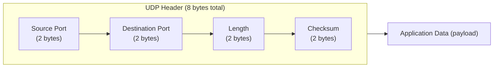

# User Datagram Protocol (UDP)

**UDP header structure, connectionless service, checksum computation, and when to prefer UDP over TCP.**

## 1. The Intuition

::: callout-intuition Core Mental Model
Imagine sending a postcard versus sending a registered, tracked parcel. A postcard is fast and cheap to send — you just drop it in the mailbox and walk away, no confirmation it arrived, no reordering if several postcards arrive out of sequence, no resending if one gets lost. A registered parcel is slower and involves more overhead — signatures, tracking numbers, delivery confirmation, automatic resending if something goes wrong — but you get a strong guarantee it arrives correctly.

**UDP (User Datagram Protocol)** is the postcard of the transport layer: a bare-bones, **connectionless**, unreliable delivery service. It adds almost nothing on top of what the network layer (IP) already offers — just enough (port numbers, and an optional checksum) to get data to the right process on the right machine, and nothing more. No handshake before sending, no acknowledgment after, no automatic retransmission of lost data, no guaranteed ordering. This sounds like a big downside, but for many applications — live video calls, online gaming, DNS lookups — a late or perfectly-reliable-but-slow retransmitted postcard is *worse* than simply losing it and moving on, which is exactly why UDP remains a deliberate, popular choice rather than an inferior fallback.
:::

---

## 2. Theoretical Framework & Formalism

**The UDP header — remarkably small, just 8 bytes:**

- **Source port (16 bits):** the sending process's port (optional to fill meaningfully — can be zeroed if no reply is expected, though almost always set in practice).
- **Destination port (16 bits):** identifies the receiving process — the only field UDP demultiplexing actually needs, as covered in the previous topic.
- **Length (16 bits):** total length of the UDP segment (header + data), in bytes.
- **Checksum (16 bits):** an *optional* (in IPv4; mandatory in IPv6) error-detection value computed over the header, data, and a "pseudo-header" (containing source/destination IP addresses, borrowed conceptually from the IP layer, to catch misdelivered packets too). If the receiver's recomputed checksum doesn't match, the segment is silently discarded — UDP does *not* request retransmission; that's left entirely to the application if it cares.

**What UDP deliberately does NOT provide** (all in contrast to TCP, covered next):
- No connection establishment (no handshake) — a sender can just start firing datagrams immediately, which is why UDP is sometimes said to have essentially zero connection-setup latency.
- No guaranteed delivery — datagrams can be lost, and UDP will never notice or retry.
- No guaranteed ordering — datagrams can arrive in a different order than sent, and UDP does not reorder them.
- No flow control — a fast sender can overwhelm a slow receiver, with UDP doing nothing to slow down.
- No congestion control — UDP does not back off even if the network is congested, unlike TCP (this is a genuine, sometimes controversial trade-off, since a network full of aggressive UDP traffic can starve out well-behaved TCP flows).

**When UDP is the better choice (comparison table):**

| Criterion | Prefer UDP when... | Prefer TCP when... |
|---|---|---|
| Timeliness vs completeness | Late data is useless (live video/audio, gaming) | Every byte must arrive correctly, even if slower |
| Overhead tolerance | Minimal header/handshake overhead is critical | Some overhead is acceptable for reliability |
| Message boundaries | Application wants each send() to arrive as one discrete datagram | Application is fine with a continuous byte stream |
| Simplicity of one-shot exchanges | Quick request/response, e.g. DNS query | Long-lived, stateful sessions, e.g. file transfer |
| Multicast/broadcast support | Needed (UDP supports these; TCP does not) | Not needed |

---

## 3. Worked Example / Step-by-Step Scenario

::: step [Step 1: Setup] Formulating the Problem
A UDP segment carries 2 bytes of 16-bit data words (for a simplified checksum example): `0x0110` and `0x0000`, plus a pseudo-header word `0x000F`. Compute the UDP checksum using 1's complement addition, and describe what the receiver does with it.
:::

::: step [Step 2: Execution] Applying Core Algorithm
Sum the words using 1's complement (end-around-carry) addition: `0x0110 + 0x0000 + 0x000F = 0x011F` (no overflow/carry beyond 16 bits here, so no wraparound needed). Take the 1's complement (flip every bit) of the sum: `0x011F` in binary is `0000 0001 0001 1111`; flipping every bit gives `1111 1110 1110 0000`, i.e. `0xFEE0`. This value, `0xFEE0`, is placed in the checksum field and sent along with the segment.
:::

::: step [Step 3: Conclusion] Final Result
At the receiver, the same 1's complement sum is computed over *all* the received words, **including** the received checksum field itself this time. If nothing was corrupted in transit, this sum will come out as all 1s (`0xFFFF`) — because adding a value to its own 1's complement always yields all 1s. If the result is anything other than all 1s, the receiver knows the segment was corrupted and silently discards it — UDP does not notify the sender or request retransmission; if the application cares about that lost data, it's entirely the application's own responsibility to detect the loss and re-request it.
:::

---

## 4. Active Recall Checkpoint

::: quiz Q1: Foundational Concept
How large is the UDP header, and what four fields does it contain?
(A) 20 bytes: source port, destination port, sequence number, checksum
(*B) 8 bytes: source port, destination port, length, checksum
(C) 4 bytes: source port and destination port only
(D) 12 bytes: source port, destination port, checksum, and a connection ID
::: explanation
UDP's header is deliberately minimal — just 8 bytes total, holding source port, destination port, length, and checksum — reflecting UDP's design philosophy of adding as little overhead as possible on top of the network layer.
:::

::: quiz Q2: Foundational Concept
When a UDP receiver detects a checksum mismatch (indicating the segment was corrupted), what does it do?
(A) Requests retransmission from the sender automatically
(*B) Silently discards the segment, with no automatic notification to the sender or the application
(C) Attempts to repair the corrupted bits itself
(D) Crashes the receiving application
::: explanation
UDP provides only error *detection*, not error *recovery*. A failed checksum simply causes the segment to be dropped; UDP itself has no mechanism to request retransmission — any such recovery must be built into the application layer if the application needs it.
:::

::: quiz Q3: Foundational Concept
Which application is the best fit for UDP rather than TCP, and why?
(A) A large file download, because completeness matters more than speed
(*B) A live video call, because a late video frame (delayed by TCP's retransmission and reordering) is often more disruptive to the user experience than simply dropping and skipping that frame
(C) An online banking transaction, because reliability is not important
(D) A software update installer, because losing some bytes is acceptable
::: explanation
In a live video/audio call, a frame delayed by TCP's wait-for-retransmission behavior arrives too late to be useful anyway (the conversation has moved on) — so applications like this prefer UDP's "just send it, and move on regardless" behavior, tolerating occasional loss or glitches in exchange for minimal delay. File downloads and financial transactions, in contrast, need every byte correct and use TCP.
:::
