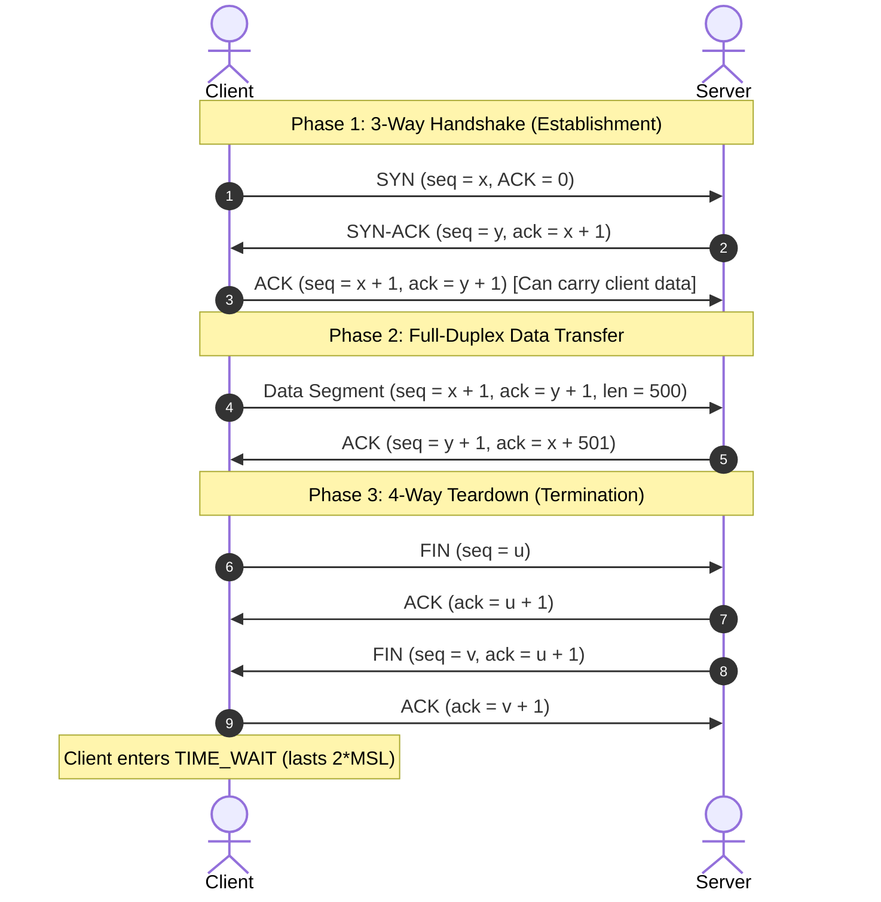

# TCP: Segment Structure, Connection Management & Flow Control

**Connection-oriented service, segment header anatomy, RTT estimation, 3-way handshake, 4-way teardown, and sliding-window flow control.**

<a id="the-intuition"></a>
## 1. The Intuition

::: callout-intuition Core Mental Model: The Registered Delivery Handshake
Imagine two bank branches exchanging confidential bearer bonds. They don't just dump envelopes into the street and hope they arrive.
* Before sending money, Manager A calls Manager B on a secure line: "I want to open a transfer channel" (SYN). Manager B checks their vault capacity and replies: "I agree, and I am ready to receive" (SYN-ACK). Manager A confirms: "Connection open" (ACK). This is the **TCP Three-Way Handshake**.
* During transmission, every single dollar bill (byte) is stamped with a serial number. The recipient acknowledges by stating: *"I have received all dollars up to #500; I am now waiting for dollar #501"*. This is **Cumulative Acknowledgment**.
* If Manager B's teller counter is full of paperwork, Manager B calls out: *"Slow down! I only have room for $2{,}000$ more dollars on my desk!"* This is **Flow Control** using the **Receive Window (`rwnd`)**.
:::

---

<a id="the-math"></a>
## 2. Theoretical Framework & Formalism

### 2.1 Characteristics of TCP (Transmission Control Protocol)

* **Connection-Oriented:** Endpoints exchange state parameters before transmitting data.
* **Point-to-Point:** Exactly one sender and one receiver (no multicasting).
* **Reliable, In-Order Byte Stream:** Application writes a continuous stream of bytes; TCP guarantees they arrive intact, in order, without duplicates.
* **Full-Duplex Service:** Host A can send data to Host B while simultaneously receiving data from Host B over the same connection.
* **Maximum Segment Size (MSS):** The maximum amount of application-layer data (payload) in a segment (typically $1{,}460\text{ bytes}$ over standard $1{,}500\text{-byte}$ Ethernet MTU).

---

### 2.2 TCP Segment Header Format (20 to 60 Bytes)

```
 0                   1                   2                   3
 0 1 2 3 4 5 6 7 8 9 0 1 2 3 4 5 6 7 8 9 0 1 2 3 4 5 6 7 8 9 0 1
+-+-+-+-+-+-+-+-+-+-+-+-+-+-+-+-+-+-+-+-+-+-+-+-+-+-+-+-+-+-+-+-+
|          Source Port          |       Destination Port        |
+-+-+-+-+-+-+-+-+-+-+-+-+-+-+-+-+-+-+-+-+-+-+-+-+-+-+-+-+-+-+-+-+
|                        Sequence Number                        |
+-+-+-+-+-+-+-+-+-+-+-+-+-+-+-+-+-+-+-+-+-+-+-+-+-+-+-+-+-+-+-+-+
|                    Acknowledgment Number                      |
+-+-+-+-+-+-+-+-+-+-+-+-+-+-+-+-+-+-+-+-+-+-+-+-+-+-+-+-+-+-+-+-+
|  Data |           |U|A|P|R|S|F|                               |
| Offset| Reserved  |R|C|S|S|Y|I|            Window             |
| (4b)  |   (6b)    |G|K|H|T|N|N|                               |
+-+-+-+-+-+-+-+-+-+-+-+-+-+-+-+-+-+-+-+-+-+-+-+-+-+-+-+-+-+-+-+-+
|           Checksum            |        Urgent Pointer         |
+-+-+-+-+-+-+-+-+-+-+-+-+-+-+-+-+-+-+-+-+-+-+-+-+-+-+-+-+-+-+-+-+
|                    Options (0 to 40 bytes)                    |
+-+-+-+-+-+-+-+-+-+-+-+-+-+-+-+-+-+-+-+-+-+-+-+-+-+-+-+-+-+-+-+-+
|                             Data                              |
+-+-+-+-+-+-+-+-+-+-+-+-+-+-+-+-+-+-+-+-+-+-+-+-+-+-+-+-+-+-+-+-+
```

1. **Source & Destination Port ($16$ bits each):** Identifies communicating client and server application sockets.
2. **Sequence Number ($32$ bits):** The byte-stream number of the **first byte** of data in this segment.
3. **Acknowledgment Number ($32$ bits):** The sequence number of the **next byte** the sender of this segment expects to receive (cumulative ACK).
4. **Data Offset (Header Length) ($4$ bits):** Number of $32$-bit ($4$-byte) words in the header. If no options are present, value is $5$ ($5 \times 4 = 20\text{ bytes}$). Maximum is $15$ ($15 \times 4 = 60\text{ bytes}$).
5. **Control Flags ($6$ bits):**
   * **URG:** Urgent pointer field is valid.
   * **ACK:** Acknowledgment field is valid (set on almost every packet after handshake).
   * **PSH:** Receiver should pass data to application immediately without buffering.
   * **RST:** Reset connection (reject connection or abort on error).
   * **SYN:** Synchronize sequence numbers during connection establishment.
   * **FIN:** Sender has finished sending data (initiates teardown).
6. **Receive Window (`rwnd`) ($16$ bits):** Flow control gauge indicating how many spare bytes the receiver currently has in its receive buffer.
7. **Checksum ($16$ bits):** Internet checksum over header, payload, and IP pseudo-header.

---

### 2.3 RTT Estimation and Timeout Calculation (Jacobson's Algorithm)

Setting the retransmission timeout ($RTO$) too small causes premature, wasteful retransmissions; setting it too large makes TCP sluggish to recover from lost packets.

::: callout-formula KTU Formula Vault: TCP RTT & Timeout Interval
1. **SampleRTT:** The measured time between transmitting a segment and receiving its ACK. (Note: Karn's algorithm dictates that SampleRTT is *never* measured for retransmitted segments).
2. **EstimatedRTT (EWMA - Exponentially Weighted Moving Average):**
   $$\text{EstimatedRTT} = (1 - \alpha) \cdot \text{EstimatedRTT} + \alpha \cdot \text{SampleRTT} \quad (\text{typical } \alpha = 0.125 = 1/8)$$
3. **DevRTT (RTT Variance Estimation):**
   $$\text{DevRTT} = (1 - \beta) \cdot \text{DevRTT} + \beta \cdot |\text{SampleRTT} - \text{EstimatedRTT}| \quad (\text{typical } \beta = 0.25 = 1/4)$$
4. **TimeoutInterval ($RTO$):**
   $$\text{TimeoutInterval} = \text{EstimatedRTT} + 4 \cdot \text{DevRTT}$$
:::

---

### 2.4 Connection Management: 3-Way Handshake & 4-Way Teardown



#### Why is a 3-Way Handshake Necessary? (Why Not 2?)
A 2-way handshake fails when delayed or duplicated SYN packets linger in the network. If an old, stale SYN from a terminated session arrives at the server, a 2-way server would immediately allocate memory and consider the connection open, while the client has no idea! The 3rd ACK verifies to the server that the client is genuinely live and reachable.

#### The Purpose of the `TIME_WAIT` State (2 MSL)
When the client sends the final ACK (step 8 above), it enters the `TIME_WAIT` state for $2 \times \text{MSL}$ (Maximum Segment Lifetime, typically $30$ to $60$ seconds, total $1$ to $2$ minutes).
1. **Ensures Final ACK Delivery:** If the client's final ACK is lost, the server will retransmit its FIN. If the client had immediately closed, it would reply with `RST`, confusing the server.
2. **Drains Wandering Segments:** Allows any old packets floating around delayed in the internet to expire before a new connection reuses the same port pair.

---

### 2.5 Flow Control: Preventing Buffer Overflow

Flow control matches the **sender's send rate** to the **receiving application's read rate**.

* Receiver maintains a receive buffer of size `RcvBuffer`.
* The available buffer space is advertised in every segment header:
$$\text{rwnd} = \text{RcvBuffer} - (\text{LastByteRcvd} - \text{LastByteRead})$$
* The sender ensures unacknowledged in-flight data never exceeds `rwnd`:
$$\text{LastByteSent} - \text{LastByteAcked} \le \text{rwnd}$$

::: callout-exam KTU Exam Focus: The Zero-Window Deadlock
If `rwnd = 0`, the sender stops transmitting. When the receiving app later reads data and clears buffer space, it sends an ACK with `rwnd > 0`.  
*What if this ACK is lost?* The sender is waiting for permission to send, and the receiver is waiting for data — **a permanent deadlock!**  
**Solution:** TCP sender runs a **Persist Timer**. When `rwnd = 0`, it periodically sends a $1$-byte probe segment to force the receiver to respond with an updated `rwnd`.
:::

---

<a id="worked-example"></a>
## 3. Worked Example / Step-by-Step Scenario

::: step [Step 1: Setup] Formulating the Problem
Host A initiates a TCP connection to Host B.
* Host A selects Initial Sequence Number ($\text{ISN}_A$) = $1{,}000$.
* Host B selects Initial Sequence Number ($\text{ISN}_B$) = $5{,}000$.
* Host A transmits an HTTP GET request containing $300\text{ bytes}$ of data.
* Host B replies with an HTTP response containing $700\text{ bytes}$ of data.
Determine the Sequence Number, Acknowledgment Number, and Flag settings for each packet in the sequence.
:::

::: step [Step 2: Execution] Step-by-Step Packet Trace
1. **Packet 1 (Client SYN):**
   * Flags: `SYN = 1, ACK = 0`
   * $\text{Seq} = 1{,}000$ (Consumes $1$ logical sequence number)
   * $\text{Ack} = 0$
2. **Packet 2 (Server SYN-ACK):**
   * Flags: `SYN = 1, ACK = 1`
   * $\text{Seq} = 5{,}000$ (Consumes $1$ logical sequence number)
   * $\text{Ack} = 1{,}000 + 1 = 1{,}001$ (Acknowledges Host A's SYN)
3. **Packet 3 (Client ACK + HTTP Request Payload):**
   * Flags: `ACK = 1`
   * $\text{Seq} = 1{,}001$ (First byte of data is byte $1{,}001$; bytes $1{,}001$ to $1{,}300$)
   * $\text{Ack} = 5{,}000 + 1 = 5{,}001$
   * Data Length: $300\text{ bytes}$
4. **Packet 4 (Server ACK + HTTP Response Payload):**
   * Flags: `ACK = 1`
   * $\text{Seq} = 5{,}001$ (Bytes $5{,}001$ to $5{,}700$)
   * $\text{Ack} = 1{,}001 + 300 = 1{,}301$ (Cumulative ACK: expects byte $1{,}301$)
   * Data Length: $700\text{ bytes}$
:::

::: step [Step 3: Conclusion] Final Result
The sequence numbers track the exact byte offsets. Notice that pure control flags like `SYN` and `FIN` consume exactly $1$ sequence number in the stream even though they carry $0$ bytes of application data.
:::

---

<a id="self-check"></a>
## 4. Active Recall Checkpoint

::: quiz Q1: TCP Acknowledgment Number
A TCP receiver has successfully received bytes up to 4,999 from the sender. What value does the receiver place in the Acknowledgment Number field of its next segment?
(A) 4,999
(*B) 5,000
(C) 5,001
(D) 1
::: explanation
TCP uses cumulative acknowledgments that state the *next expected byte*. Having received all bytes up to 4,999, the next byte the receiver expects is 5,000.
:::

::: quiz Q2: RTT Estimation
Suppose current EstimatedRTT is 40 ms, and an arriving ACK yields SampleRTT = 80 ms. Using standard weight alpha = 0.125, what is the new EstimatedRTT?
(A) 60 ms
(B) 50 ms
(*C) 45 ms
(D) 42.5 ms
::: explanation
$\text{New EstimatedRTT} = (1 - 0.125) \times 40 + 0.125 \times 80 = (0.875 \times 40) + 10 = 35 + 10 = 45\text{ ms}$.
:::

::: quiz Q3: Header Length Calculation
If the 4-bit Data Offset field in a TCP header contains the binary value `1000` (decimal 8), what is the total size of the TCP header in bytes, and how many bytes of options are present?
(A) Header is 8 bytes; 0 bytes options
(B) Header is 16 bytes; 0 bytes options
(*C) Header is 32 bytes; 12 bytes of options
(D) Header is 64 bytes; 44 bytes options
::: explanation
Data Offset measures header length in 32-bit (4-byte) words: $8 \times 4 = 32\text{ bytes}$. Since the base header is always 20 bytes, the options occupy $32 - 20 = 12\text{ bytes}$.
:::
