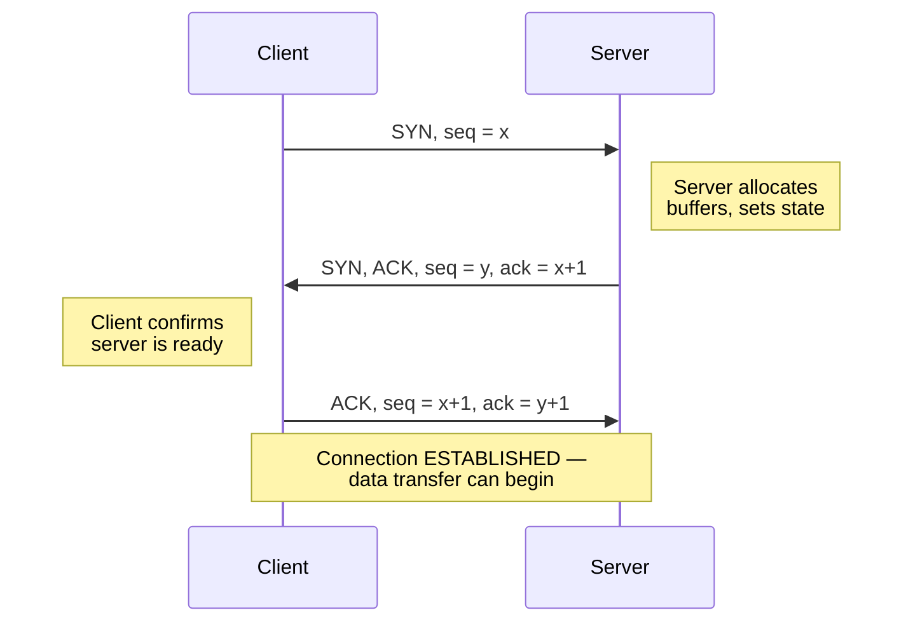
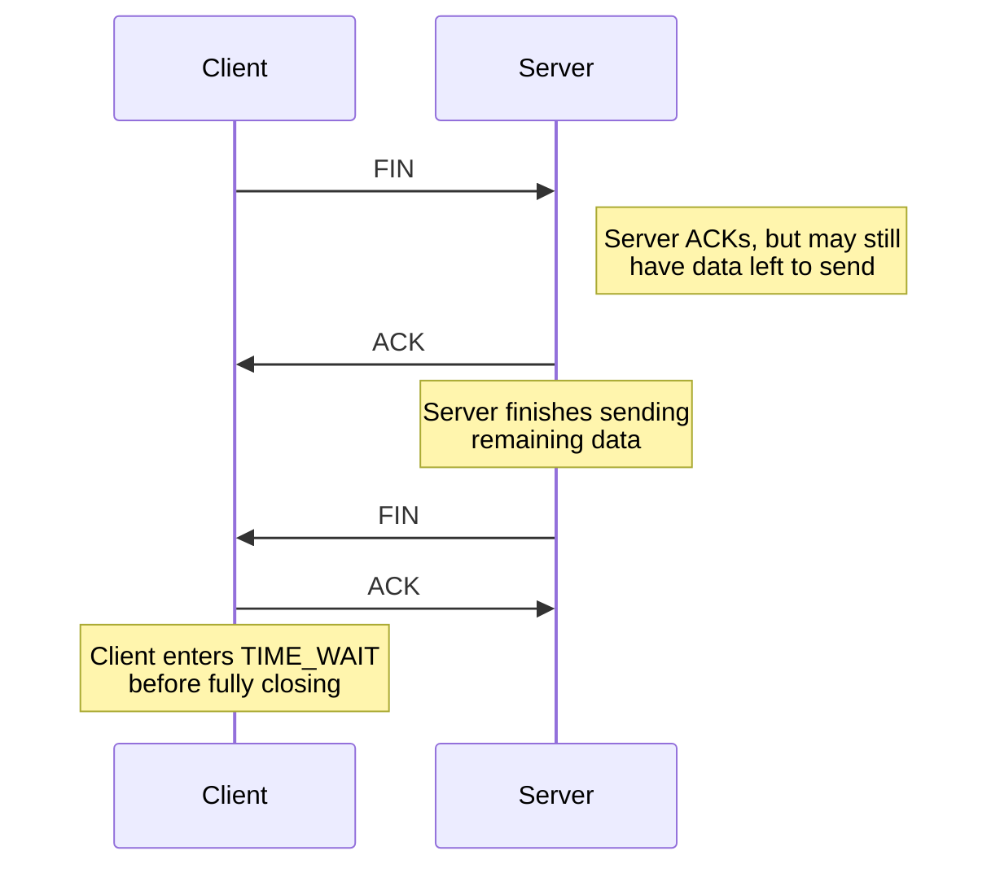

# Transmission Control Protocol (TCP): Header & Connection Management

**TCP segment format, sequence/ACK numbers, 3-way handshake, 4-way teardown, and TIME_WAIT state.**

## 1. The Intuition

::: callout-intuition Core Mental Model
If UDP is a postcard, TCP is a formal phone call. Before either side says anything meaningful, there's a brief ritual to establish that both parties are actually there and ready to listen — "Hello, can you hear me?" / "Yes, I can hear you, can you hear me?" / "Yes, let's begin." Only after this three-step check does the actual conversation happen. And when the conversation ends, there's a polite closing ritual too — each side explicitly says "I'm done talking" and waits for the other to acknowledge, rather than just hanging up mid-sentence.

This is exactly TCP's **3-way handshake** (connection setup) and **4-way teardown** (connection close). TCP is **connection-oriented**: before any data flows, both sides exchange a small number of special control segments to agree on initial sequence numbers and confirm both ends are ready — turning what IP provides (individual, independent, unordered packets) into what the application experiences (a reliable, ordered, continuous byte stream, as if it were a dedicated wire directly connecting the two processes).
:::

---

## 2. Theoretical Framework & Formalism

**The TCP header (20 bytes minimum, before options):**

| Field | Size | Purpose |
|---|---|---|
| Source port / Destination port | 2 + 2 bytes | Identify sending/receiving process (same role as in UDP) |
| Sequence number | 4 bytes | Byte-stream position of the *first* data byte in this segment |
| Acknowledgment number | 4 bytes | The *next* byte the receiver expects (i.e., "I've received everything up to, but not including, this byte") |
| Header length | 4 bits | Length of the TCP header (accounting for variable-length options) |
| Flags (control bits) | 6+ bits | SYN, ACK, FIN, RST, PSH, URG — signal special segment purposes |
| Window size | 2 bytes | Receiver's current available buffer space, for flow control |
| Checksum | 2 bytes | Error detection (mandatory in TCP, unlike UDP's optional checksum) |
| Urgent pointer, Options | variable | Rarely-used urgent data marker; options like Maximum Segment Size (MSS), window scaling |

**Sequence and acknowledgment numbers — the core of TCP's reliability.** TCP treats the data being sent as one continuous stream of bytes, and every byte has an implicit position number in that stream. The **sequence number** in a segment's header marks the stream-position of its *first* data byte. The **acknowledgment number** sent back tells the sender "I have correctly received everything up through byte (ACK number − 1); please send byte number (ACK number) next." This is what allows a receiver to detect gaps (missing data) and what allows a sender to know exactly what still needs (re)sending.

**The 3-Way Handshake (connection establishment):**

1. **SYN:** the client sends a segment with the SYN flag set and an initial (often randomly chosen) sequence number $x$ — "I'd like to connect; my starting sequence number is $x$."
2. **SYN-ACK:** the server responds with *both* SYN and ACK flags set: it acknowledges the client's SYN (`ack = x+1`) and announces its *own* initial sequence number $y$ — "Got it, and here's my own starting sequence number too."
3. **ACK:** the client acknowledges the server's SYN (`ack = y+1`) — "Confirmed, let's begin." The connection is now open in both directions.

Why three steps, not two? A simple two-way handshake (SYN, then ACK) cannot let *both* sides confirm *their own* initial sequence number was received correctly by the other — the third step is what lets the server also receive confirmation that its SYN-ACK actually reached the client, fully establishing mutual, bidirectional readiness.

**The 4-Way Teardown (connection close):**

Because TCP connections are **full-duplex** (independent data streams flow in both directions), each direction must be closed *independently* — the client saying "I'm done sending" (FIN) doesn't mean the server is also done sending its own remaining data, so each side sends its own FIN and receives its own ACK, giving four total messages (though the middle ACK and FIN are sometimes combined/piggybacked in practice).

**The TIME_WAIT state.** After sending the final ACK, the side that initiated the close (typically the client) enters TIME_WAIT and waits for a period (conventionally twice the Maximum Segment Lifetime, "2MSL") before fully releasing the connection's resources. This wait serves two purposes: it ensures the final ACK is not lost (if the other side didn't receive it and retransmits its FIN, the waiting side can resend the ACK), and it prevents stray, delayed packets from an old connection being mistakenly accepted as part of a brand-new connection that happens to reuse the same port numbers soon after.

---

## 3. Worked Example / Step-by-Step Scenario

::: step [Step 1: Setup] Formulating the Problem
A client initiates a TCP connection with initial sequence number $x = 1000$. The server responds with its own initial sequence number $y = 5000$. Trace the exact sequence and acknowledgment numbers exchanged during the full 3-way handshake.
:::

::: step [Step 2: Execution] Applying Core Algorithm
**Segment 1 (Client → Server):** SYN flag set, `seq = 1000` (no ACK yet, since the client hasn't received anything from the server).
**Segment 2 (Server → Client):** SYN and ACK flags set, `seq = 5000` (server's own initial sequence number), `ack = 1001` (acknowledging the client's SYN — even though SYN carries no actual data payload, it consumes one sequence number, so the server expects the client's *next* byte to start at 1001).
**Segment 3 (Client → Server):** ACK flag set, `seq = 1001` (client's next byte, following its own SYN), `ack = 5001` (acknowledging the server's SYN, which likewise consumed one sequence number).
:::

::: step [Step 3: Conclusion] Final Result
After these three segments, both sides agree: the client's data stream starts at byte 1001, and the server's data stream starts at byte 5001 — and both sides have confirmation the other received their SYN correctly. The connection moves to the ESTABLISHED state, and either side may now begin sending actual application data, with subsequent sequence numbers continuing to climb from these agreed starting points as real data bytes are sent.
:::

---

## 4. Active Recall Checkpoint

::: quiz Q1: Foundational Concept
Why does TCP connection establishment require three segments (a 3-way handshake) rather than just two?
(A) TCP always sends redundant messages for no functional reason
(*B) A third message is needed so that *both* sides — not just the client — receive confirmation that their own initial sequence number was successfully received by the other party, fully establishing mutual, bidirectional readiness
(C) The third message carries the actual application data
(D) Two-way handshakes are impossible due to network hardware limitations
::: explanation
With only SYN then ACK, the server would know the client received its SYN-ACK, but the client would have no way to be sure the server got its final acknowledgment. The third segment closes this gap, letting both sides independently confirm the connection is genuinely ready before any real data is sent.
:::

::: quiz Q2: Foundational Concept
Why does TCP connection teardown involve four segments rather than two?
(A) Redundancy for error correction purposes only
(*B) Because TCP connections are full-duplex, and each direction (client-to-server, server-to-client) must be closed independently, since one side finishing its sending doesn't mean the other side has finished sending its own data
(C) Four segments are needed to compute the final checksum
(D) TCP always requires exactly four segments for any operation
::: explanation
A TCP connection carries two independent data streams (one each direction). When one side sends FIN, it means "I have no more data to send," but the other side might still have data left to transmit — so each side sends its own FIN when *it* is truly done, and each FIN gets its own ACK, totaling four messages for a full close (though these are sometimes combined in practice).
:::

::: quiz Q3: Foundational Concept
What is the purpose of the TIME_WAIT state after a TCP connection closes?
(A) It has no real purpose and exists only for legacy compatibility
(*B) It ensures the final ACK isn't lost (allowing retransmission of a lost FIN to be handled correctly) and prevents stray delayed packets from an old connection from being mistaken for a new one that reuses the same port numbers
(C) It permanently reserves the port so it can never be reused
(D) It actively retransmits application data during this period
::: explanation
TIME_WAIT is a safety-net waiting period: if the final ACK didn't arrive, the peer's retransmitted FIN can still be met with another ACK during this window, and any old, delayed packets still wandering the network from this now-closed connection will be recognized as stale rather than confused with a brand-new connection that happens to reuse the same port numbers soon afterward.
:::
