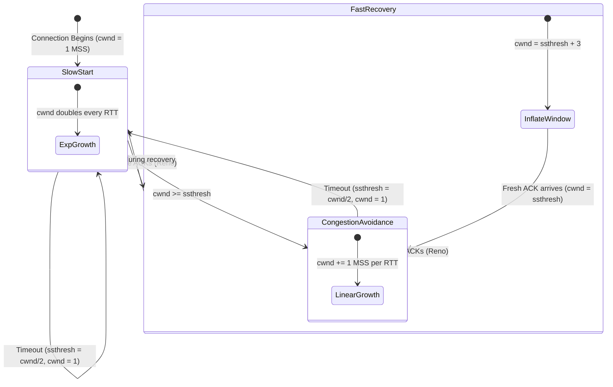

# TCP Congestion Control & Principles

**The congestion crisis, AIMD, Slow Start, Congestion Avoidance, Fast Retransmit, and Fast Recovery (Tahoe vs. Reno).**

<a id="the-intuition"></a>
## 1. The Intuition

::: callout-intuition Core Mental Model: Rush Hour on an Unmetered Highway
Imagine a city with a 3-lane highway connecting two districts.
* If only 10 cars enter per minute, every car cruises at maximum speed.
* When 500 cars try to merge simultaneously, a traffic jam develops. Cars slow to a crawl, exhaust fumes build up, and drivers wait for hours.
* If frustrated drivers respond by sending *even more cars* onto the highway, total gridlock occurs: the throughput drops to zero!

In computer networking, **Congestion Control** is the automated throttle that prevents millions of internet users from causing total gridlock in the shared router buffers of the global network. Notice the critical difference:
* **Flow Control** protects the *receiver's memory* from being flooded by a fast sender.
* **Congestion Control** protects the *shared intermediate network switches and routers* from being flooded by all senders combined.
:::

---

<a id="the-math"></a>
## 2. Theoretical Framework & Formalism

### 2.1 The TCP Congestion Control State Machine

The sender regulates its transmission rate by adjusting the **Congestion Window (`cwnd`)**. The actual amount of unacknowledged data allowed in flight is:
$$\text{Max In-Flight Bytes} = \min(\text{cwnd}, \text{rwnd})$$

TCP uses **AIMD (Additive Increase, Multiplicative Decrease)** to achieve both fairness and optimal bandwidth utilization.



---

### 2.2 The Four Core Phases

#### Phase 1: Slow Start
* **Initial State:** $cwnd = 1\text{ MSS}$, with a high initial threshold (e.g., $ssthresh = 64\text{ KB}$).
* **Behavior:** For every received ACK, increase $cwnd$ by $1\text{ MSS}$:
$$\text{On ACK: } cwnd \leftarrow cwnd + 1\text{ MSS}$$
* **Result:** In one RTT, if $cwnd = 4$ segments are sent and $4$ ACKs return, $cwnd$ increases by $4$, becoming $8$. **The window doubles every RTT (exponential growth: $1 \to 2 \to 4 \to 8 \to 16 \dots$).**
* **Exit Condition:** When $cwnd \ge ssthresh$, transition immediately to **Congestion Avoidance**.

#### Phase 2: Congestion Avoidance (Additive Increase)
* **Rationale:** Exponential growth near network capacity would quickly trigger massive buffer overflows. TCP probes cautiously for additional bandwidth.
* **Behavior:** Increases $cwnd$ by only **$1\text{ MSS}$ per entire RTT** (linear growth):
$$\text{On each ACK: } cwnd \leftarrow cwnd + \frac{\text{MSS} \times \text{MSS}}{cwnd}$$
* **Result:** A gentle, linear upward slope.

---

### 2.3 Loss Event Detection & Recovery: Tahoe vs. Reno

TCP detects packet loss through two distinct mechanisms:
1. **Retransmission Timeout (RTO):** Catastrophic. No packets or ACKs are coming back through the pipe; the network is heavily congested.
2. **Three Duplicate ACKs:** Mild congestion. Packets are still arriving at the destination (generating duplicate ACKs), but one intermediate segment was lost or delayed.

```
                    TCP Tahoe vs. TCP Reno Behavior
    Window Size (MSS)
       |
    16 |           /\ (Loss Event)
       |          /  \
    12 |         /    \                     /---\ Reno (Fast Recovery: drops to ssthresh = 8)
       |        /      \                   /     \
     8 | - - - / - - -  \ - - - - - - - - / - - - - ssthresh = 8
       |      /          \               /
     4 |     /            \             /
     2 |    /              \           /
     1 |  _/_               \_       _/_     Tahoe (drops to 1 MSS on any loss)
       +----------------------------------------------------> Time (RTTs)
```

| Dimension | TCP Tahoe (1988) | TCP Reno (1990) |
|---|---|---|
| **On Timeout Event** | $ssthresh = cwnd / 2$<br/>$cwnd = 1\text{ MSS}$<br/>Enters **Slow Start** | $ssthresh = cwnd / 2$<br/>$cwnd = 1\text{ MSS}$<br/>Enters **Slow Start** |
| **On 3 Duplicate ACKs** | Treats identical to Timeout:<br/>$ssthresh = cwnd / 2$<br/>$cwnd = 1\text{ MSS}$ | Triggers **Fast Retransmit** and **Fast Recovery**:<br/>$ssthresh = cwnd / 2$<br/>$cwnd = ssthresh + 3\text{ MSS}$ |
| **Recovery Mechanism** | Resets to $1$ MSS, forces Slow Start crawl | Stays in Fast Recovery; when fresh ACK arrives, sets $cwnd = ssthresh$ and enters **Congestion Avoidance** directly |
| **Throughput Impact** | Severe performance drop; drains the pipeline | Much higher average throughput; keeps pipeline partially full |

::: callout-formula KTU Formula Vault: TCP Sawtooth & Average Throughput
Because TCP continually increases window size until loss occurs, then halves the window, its window size graphs as a characteristic **sawtooth pattern**.
Between $W/2$ and $W$:
$$\text{Average Window} = \frac{3}{4} W$$
$$\text{Average TCP Throughput} \approx \frac{1.22 \times \text{MSS}}{\text{RTT} \times \sqrt{L}}$$
where $L$ is the packet loss rate.
:::

---

<a id="worked-example"></a>
## 3. Worked Example / Step-by-Step Scenario

::: step [Step 1: Setup] Formulating the Problem
A TCP Reno connection has:
* Current $cwnd = 16\text{ MSS}$
* Current $ssthresh = 8\text{ MSS}$
* Current state: **Congestion Avoidance**

Trace the exact value of $cwnd$ and $ssthresh$ over the next 5 RTTs under two independent scenarios:
1. **Scenario A:** A retransmission timeout occurs during RTT 1.
2. **Scenario B:** Three duplicate ACKs are received during RTT 1.
:::

::: step [Step 2: Execution] Tracing Window Evolution
**Scenario A (Timeout):**
* At RTT 1: Loss detected via Timeout.
  $$ssthresh \leftarrow \frac{16}{2} = 8\text{ MSS}, \quad cwnd \leftarrow 1\text{ MSS}$$
* RTT 2: Slow start: $cwnd = 1 \times 2 = 2\text{ MSS}$
* RTT 3: Slow start: $cwnd = 2 \times 2 = 4\text{ MSS}$
* RTT 4: Slow start: $cwnd = 4 \times 2 = 8\text{ MSS}$ ($cwnd$ hits $ssthresh = 8$)
* RTT 5: Congestion Avoidance: $cwnd = 8 + 1 = 9\text{ MSS}$

**Scenario B (3 Duplicate ACKs under Reno):**
* At RTT 1: 3 duplicate ACKs detected. Fast Retransmit fires.
  $$ssthresh \leftarrow \frac{16}{2} = 8\text{ MSS}$$
  $$cwnd \leftarrow ssthresh + 3 = 8 + 3 = 11\text{ MSS} \quad (\text{Fast Recovery})$$
* RTT 2: Retransmitted segment is acknowledged by the receiver (fresh ACK arrives). Reno exits Fast Recovery:
  $$cwnd \leftarrow ssthresh = 8\text{ MSS}$$
  Enters Congestion Avoidance directly!
* RTT 3: Congestion Avoidance (linear): $cwnd = 8 + 1 = 9\text{ MSS}$
* RTT 4: Congestion Avoidance: $cwnd = 9 + 1 = 10\text{ MSS}$
* RTT 5: Congestion Avoidance: $cwnd = 10 + 1 = 11\text{ MSS}$
:::

::: step [Step 3: Conclusion] Final Result
Notice that under Scenario B (Reno Fast Recovery), $cwnd$ never dropped to $1\text{ MSS}$. In RTT 4, Reno achieved $10\text{ MSS}$ throughput, while Tahoe in Scenario A was still recovering at only $8\text{ MSS}$.
:::

---

<a id="self-check"></a>
## 4. Active Recall Checkpoint

::: quiz Q1: Slow Start Growth Rate
During the TCP Slow Start phase, if the sender begins with cwnd = 1 MSS and all transmitted packets are acknowledged without loss, how does the congestion window grow over the first 4 RTTs?
(A) 1, 2, 3, 4 MSS
(*B) 1, 2, 4, 8 MSS
(C) 1, 10, 20, 30 MSS
(D) It stays at 1 MSS until the handshake finishes
::: explanation
Slow start increases cwnd by 1 MSS for each ACK received. Because all packets in the window are ACKed during each RTT, the window size doubles every round-trip time: $1 \to 2 \to 4 \to 8\text{ MSS}$ (exponential growth).
:::

::: quiz Q2: Reno vs Tahoe Distinction
What is the fundamental difference between TCP Tahoe and TCP Reno when 3 duplicate ACKs are received?
(A) Tahoe increases window size, whereas Reno pauses
(B) Tahoe retransmits the packet immediately, whereas Reno waits for timeout
(*C) Tahoe cuts cwnd to 1 MSS and re-enters Slow Start, whereas Reno sets cwnd = ssthresh + 3 MSS and avoids Slow Start
(D) Reno switches to UDP mode
::: explanation
Tahoe treats 3 duplicate ACKs and timeouts identically (collapsing cwnd to 1 MSS). Reno recognizes that 3 duplicate ACKs mean packets are still flowing through the network; it fast-retransmits and enters Fast Recovery, dropping cwnd only to roughly half of its previous value.
:::

::: quiz Q3: AIMD Principle
Why does TCP use Additive Increase rather than Multiplicative Increase when probing for available network bandwidth during Congestion Avoidance?
(A) Multiplicative increase causes CPU spikes on the host
(*B) Linear (additive) increase avoids abruptly saturating router queues, preventing sudden widespread packet drops while fairly allocating bandwidth
(C) Because standard Ethernet cannot support exponential bitrates
(D) To allow UDP packets to take priority
::: explanation
Additive increase guarantees stability. If connections doubled their rate while already near bottleneck capacity, enormous queue build-up and packet loss bursts would occur instantly. AIMD mathematically converges to both efficiency and fairness.
:::
