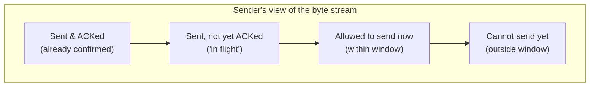

# TCP Reliable Data Transfer & Flow Control

**Sliding window protocol, cumulative ACKs, timeout/retransmission, fast retransmit, and the receiver's advertised window.**

## 1. The Intuition

::: callout-intuition Core Mental Model
Picture a teacher handing out worksheets to a long line of students, one at a time, but only being allowed to hand out a *limited stack* before checking that the students at the front have actually received and are keeping up — if the teacher just kept piling worksheets on the first student's desk without checking, papers would pile up, fall on the floor, or overwhelm them. So the teacher hands out a manageable batch, waits for confirmation ("got it, ready for more") from the front of the line, and then slides the "currently allowed to send" batch forward.

This is **TCP's sliding window** in a nutshell — a mechanism that lets a sender transmit *multiple* segments before waiting for each individual acknowledgment (much more efficient than "send one, wait, send one, wait"), while still respecting a limit (the **window size**) on how much unacknowledged data can be "in flight" at once. **Flow control** is specifically about respecting the *receiver's* stated capacity — the receiver tells the sender, via the advertised window size in every ACK, exactly how much more data its buffer can currently hold, and the sender must never send more than that, so a fast sender never floods a slow receiver's buffer.
:::

---

## 2. Theoretical Framework & Formalism

**Cumulative acknowledgments.** TCP uses **cumulative ACKs**: an ACK with number $N$ means "I have correctly received every byte up through $N-1$, in order, with no gaps" — it does *not* separately acknowledge each individual segment. If segments arrive out of order, TCP (in its basic form) simply re-sends the ACK for the last *in-order* byte received so far (a "duplicate ACK"), rather than acknowledging the out-of-order data directly.

**The sliding window mechanism:**

The window "slides" forward across the byte stream as ACKs arrive: whenever new data is acknowledged, the left edge of the window advances by that many bytes, which frees up an equal amount of room at the right edge for new, previously-not-yet-allowed bytes to be sent.

**Timeout and retransmission.** For every segment sent, the sender starts a retransmission timer. If an ACK for that segment doesn't arrive before the timer expires (the RTO, Retransmission Timeout, typically computed adaptively from measured round-trip times), the sender assumes the segment (or its ACK) was lost, and retransmits it.

**Fast Retransmit — a faster alternative to waiting for a timeout.** If the sender receives **three duplicate ACKs** in a row (the same ACK number repeated three extra times), this is a strong signal that a specific segment was lost — because the receiver keeps getting *later* segments (each triggering another duplicate ACK for the same missing byte position) but never gets the one it's actually waiting for. Rather than waiting for the (often much longer) timeout to expire, TCP immediately retransmits the apparently-missing segment — this "fast retransmit" significantly reduces the delay caused by an isolated lost segment.

**Flow control via the advertised (receive) window.** Every ACK segment includes a `window size` field, computed by the receiver as:
$$\text{rwnd} = \text{RcvBuffer} - (\text{LastByteRcvd} - \text{LastByteRead})$$
i.e., total receive buffer size, minus however much data is currently sitting in the buffer waiting to be read by the application. The sender is required to never have more than `rwnd` bytes of unacknowledged data outstanding at once — this directly throttles a fast sender to match a slow receiving application's actual consumption rate, entirely independent of any network congestion concerns (which is a *separate* mechanism, congestion control, covered in the next topic).

---

## 3. Worked Example / Step-by-Step Scenario

::: step [Step 1: Setup] Formulating the Problem
A sender has a window size of 3000 bytes and sends three 1000-byte segments back to back: Segment 1 (bytes 1–1000), Segment 2 (bytes 1001–2000), Segment 3 (bytes 2001–3000). Segment 2 is lost in transit, but Segments 1 and 3 arrive successfully. Trace what ACKs the receiver sends, and how the sender recovers.
:::

::: step [Step 2: Execution] Applying Core Algorithm
Segment 1 arrives: receiver has everything up through byte 1000, sends ACK with `ack=1001`.
Segment 2 (bytes 1001–2000) is lost — never arrives.
Segment 3 (bytes 2001–3000) arrives, but there's a *gap* (bytes 1001–2000 are still missing) — the receiver cannot advance its cumulative ACK past the gap, so it re-sends `ack=1001` again (a duplicate ACK), signalling "I still only have everything through byte 1000."
If the sender had sent more segments after Segment 3 (say, Segments 4 and 5), each would similarly trigger another duplicate `ack=1001`, since the gap still isn't filled. Once the sender has received **three duplicate ACKs** for `ack=1001`, Fast Retransmit triggers: the sender immediately retransmits Segment 2, without waiting for its timer to expire.
:::

::: step [Step 3: Conclusion] Final Result
Once the retransmitted Segment 2 arrives successfully, the receiver now has a complete, gap-free stream through at least byte 3000 (having already buffered Segment 3 earlier, even though it couldn't acknowledge it yet), so it sends a cumulative ACK jumping straight to `ack=3001` — acknowledging *everything* through byte 3000 in one message, not needing a separate ACK for Segment 3 individually. This illustrates two TCP hallmarks working together: cumulative ACKs (one ACK can confirm multiple segments at once) and Fast Retransmit (recovering from a single lost segment quickly, without the delay of a full timeout).
:::

---

## 4. Active Recall Checkpoint

::: quiz Q1: Foundational Concept
What does a TCP cumulative acknowledgment with `ack=5001` actually confirm?
(A) Only that byte 5001 specifically was received
(*B) That every byte up through byte 5000 has been received correctly and in order, with no gaps, and the sender should send byte 5001 next
(C) That the connection is about to close
(D) That exactly 5001 segments have been sent so far
::: explanation
TCP's cumulative acknowledgment scheme means an ACK number represents the *next expected byte*, implicitly confirming that everything before it has arrived correctly and in order — a single ACK can therefore confirm many bytes (potentially across several segments) at once, rather than acknowledging each segment individually.
:::

::: quiz Q2: Foundational Concept
What condition triggers TCP's Fast Retransmit mechanism?
(A) A single duplicate ACK
(*B) Three duplicate ACKs received in a row for the same sequence number
(C) The connection's window size reaching zero
(D) The receiver sending a FIN segment
::: explanation
Three duplicate ACKs (the original ACK plus three exact repeats) is used as a strong, standard signal of a lost segment — it indicates the receiver keeps getting later data but is still missing something specific, prompting the sender to retransmit immediately, without waiting for the (typically much slower) retransmission timeout.
:::

::: quiz Q3: Foundational Concept
The "advertised window" (rwnd) that a TCP receiver sends back to the sender is used for:
(A) Congestion control, preventing network-wide overload
(*B) Flow control, preventing the sender from overwhelming this specific receiver's available buffer space
(C) Determining the initial sequence number
(D) Selecting which port number to use
::: explanation
The advertised window reflects how much free space is currently available in the receiver's own buffer, and directly limits how much unacknowledged data the sender may have in flight — this is flow control, a receiver-capacity concern, distinct from congestion control (a network-capacity concern), which is covered in the next topic.
:::
