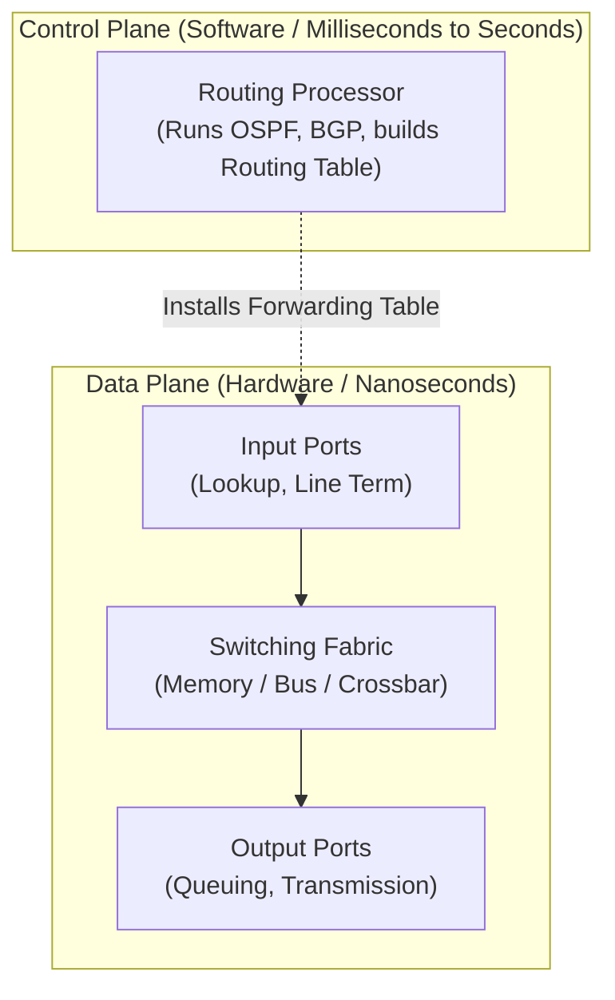

# Network Layer Overview, IPv4 Addressing & Subnetting

**Forwarding vs. routing, router architecture, IPv4 datagram anatomy, MTU fragmentation, CIDR subnetting, NAT, and IPv6 foundations.**

<a id="the-intuition"></a>
## 1. The Intuition

::: callout-intuition Core Mental Model: The Road Trip & The GPS
Imagine driving across the country from Los Angeles to New York:
* **Routing (The Control Plane):** Before leaving, you look at a nationwide highway map (or GPS) to compute the best route through cities: LA $\to$ Denver $\to$ Chicago $\to$ NYC. This is the **global, end-to-end path calculation**.
* **Forwarding (The Data Plane):** When your car reaches a specific highway interchange in Denver, you read the physical overhead sign pointing toward "I-70 East: Chicago" and steer your wheel into that single exit ramp. This is **local, per-hop forwarding**.

Every router in the Internet performs these two duties: it runs routing algorithms (calculating routes) and switches individual incoming packets onto the correct outgoing physical wires (forwarding).
:::

---

<a id="the-math"></a>
## 2. Theoretical Framework & Formalism

### 2.1 Forwarding vs. Routing & Router Architecture



* **Forwarding:** Moving a packet from a router's input port to the appropriate output port (hardware-switched in nanoseconds).
* **Routing:** Determining the complete end-to-end path that packets follow from source to destination (software routing protocols like OSPF, BGP).

#### Router Subcomponents:
1. **Input Ports:** Physical termination, data link decapsulation, and look up destination IP in forwarding table using **Longest Prefix Matching**.
2. **Switching Fabric:** The internal cross-connect. Types:
   * *Via Memory:* CPU copies packet from input buffer to system memory to output buffer (slowest).
   * *Via Shared Bus:* Packets travel over a shared bus line (limited by bus bandwidth).
   * *Via Interconnection Network (Crossbar):* $2N$ buses connecting $N$ inputs to $N$ outputs; multiple packets can transfer in parallel as long as they target different outputs.
3. **Output Ports:** Store packets in queues awaiting line transmission. If queue fills, packets drop (**Buffer Overflow / Drop-Tail**).
4. **Head-of-Line (HOL) Blocking:** A packet stuck waiting at the head of an input queue for an occupied output port blocks all other packets behind it, even if those packets want to go to completely idle output ports!

---

### 2.2 IPv4 Datagram Header Format (20 to 60 Bytes)

```
 0                   1                   2                   3
 0 1 2 3 4 5 6 7 8 9 0 1 2 3 4 5 6 7 8 9 0 1 2 3 4 5 6 7 8 9 0 1
+-+-+-+-+-+-+-+-+-+-+-+-+-+-+-+-+-+-+-+-+-+-+-+-+-+-+-+-+-+-+-+-+
|Version|  IHL  |Type of Service|          Total Length         |
+-+-+-+-+-+-+-+-+-+-+-+-+-+-+-+-+-+-+-+-+-+-+-+-+-+-+-+-+-+-+-+-+
|         Identification        |Flags|     Fragment Offset     |
+-+-+-+-+-+-+-+-+-+-+-+-+-+-+-+-+-+-+-+-+-+-+-+-+-+-+-+-+-+-+-+-+
|  Time to Live |    Protocol   |        Header Checksum        |
+-+-+-+-+-+-+-+-+-+-+-+-+-+-+-+-+-+-+-+-+-+-+-+-+-+-+-+-+-+-+-+-+
|                       Source IP Address                       |
+-+-+-+-+-+-+-+-+-+-+-+-+-+-+-+-+-+-+-+-+-+-+-+-+-+-+-+-+-+-+-+-+
|                    Destination IP Address                     |
+-+-+-+-+-+-+-+-+-+-+-+-+-+-+-+-+-+-+-+-+-+-+-+-+-+-+-+-+-+-+-+-+
|                    Options (if any, variable)                 |
+-+-+-+-+-+-+-+-+-+-+-+-+-+-+-+-+-+-+-+-+-+-+-+-+-+-+-+-+-+-+-+-+
|                            Payload                            |
+-+-+-+-+-+-+-+-+-+-+-+-+-+-+-+-+-+-+-+-+-+-+-+-+-+-+-+-+-+-+-+-+
```

* **Version ($4$ bits):** Always `4` for IPv4.
* **IHL (Internet Header Length) ($4$ bits):** Number of $32$-bit ($4$-byte) words in header. Minimum $= 5$ ($20\text{ bytes}$).
* **Total Length ($16$ bits):** Total size of datagram (header + data) in bytes. Maximum $= 65{,}535\text{ bytes}$.
* **Identification ($16$ bits):** Unique ID assigned by sender to group fragments belonging to the same original datagram.
* **Flags ($3$ bits):**
  * Bit 0: Reserved (must be 0).
  * Bit 1: **DF (Don't Fragment)** — If $1$, router must drop packet if it exceeds MTU.
  * Bit 2: **MF (More Fragments)** — Set to $1$ for all fragments except the very last one ($0$).
* **Fragment Offset ($13$ bits):** Specifies where this fragment belongs in the original payload, measured in units of **$8$-byte blocks**.
* **Time to Live (TTL) ($8$ bits):** Decremented by $1$ at every router hop. When $\text{TTL} = 0$, the packet is dropped and an ICMP "Time Exceeded" message is sent to sender. Prevents infinite looping!
* **Protocol ($8$ bits):** Demultiplexing tag indicating upper-layer protocol: `6` = TCP, `17` = UDP, `1` = ICMP.

---

### 2.3 Subnetting and CIDR (Classless Inter-Domain Routing)

In CIDR, an IP address is divided into a **Network Prefix** ($x$ bits) and a **Host Identifier** ($32 - x$ bits), written as `a.b.c.d/x`:

$$\text{Total IP Space} = 32\text{ bits} = \text{Subnet Prefix } (x\text{ bits}) + \text{Host Bits } (h\text{ bits})$$

::: callout-formula KTU Formula Vault: Subnetting Equations
* **Number of Host Bits:** $h = 32 - x$
* **Total IP Addresses in Subnet:** $N_{\text{total}} = 2^h$
* **Number of Usable Host Addresses:** 
  $$N_{\text{usable}} = 2^h - 2$$
  *(We subtract $2$ because the all-zeros host address is the **Network Address**, and the all-ones host address is the **Directed Broadcast Address**).*
* **Subnetting an existing network:** If you borrow $s$ bits from the host portion:
  * Number of new subnets created $= 2^s$
  * New prefix length $= x + s$
  * Usable hosts per new subnet $= 2^{h - s} - 2$
:::

#### Special Address Ranges (RFC 1918 Private Addresses)
* **Class A Private:** `10.0.0.0/8` (`10.0.0.0` to `10.255.255.255`)
* **Class B Private:** `172.16.0.0/12` (`172.16.0.0` to `172.31.255.255`)
* **Class C Private:** `192.168.0.0/16` (`192.168.0.0` to `192.168.255.255`)
* **Loopback:** `127.0.0.0/8` (e.g., `127.0.0.1`)

---

### 2.4 NAT (Network Address Translation) & IPv6 Overview

* **NAT:** Allows an entire local office or home network with hundreds of private devices to share a single public IP address. The NAT router modifies the Source IP and Source Port in outgoing packets and records the mapping in a **NAT Translation Table**.
* **IPv6:** Replaces $32$-bit addresses with **$128$-bit addresses** (providing $3.4 \times 10^{38}$ unique IPs, enough for trillions of devices per square millimeter of Earth's surface).
  * Fixed $40$-byte header (no variable options in base header).
  * Removed header checksum (streamlines router processing speed).
  * Routers never fragment packets in IPv6 (fragmentation is handled exclusively by end-hosts).

---

<a id="worked-example"></a>
## 3. Worked Example / Step-by-Step Scenario

::: step [Step 1: Setup] Formulating the Problem
An organization is assigned the network block `192.168.10.0/24`. The network administrator needs to split this block into **4 distinct subnets** for 4 separate departments.
For each subnet, find:
1. The new Subnet Mask (in slash and dotted decimal).
2. The number of usable host IP addresses per subnet.
3. The Network ID, First Usable IP, Last Usable IP, and Broadcast IP for Subnet 1.
:::

::: step [Step 2: Execution] Calculating Subnet Parameters
1. **Determine bits to borrow ($s$):**
   To create $4$ subnets: $2^s \ge 4 \implies s = 2\text{ bits}$.
2. **New Subnet Mask:**
   Original prefix was $/24$. New prefix $= 24 + 2 = \mathbf{/26}$.
   The fourth octet has $2$ ones followed by $6$ zeros: `11000000` = $128 + 64 = 192$.
   $$\text{Subnet Mask} = \mathbf{255.255.255.192}$$
3. **Hosts per Subnet:**
   Host bits remaining $h = 32 - 26 = 6\text{ bits}$.
   Total IPs per subnet $= 2^6 = 64$.
   $$\text{Usable Hosts per Subnet} = 2^6 - 2 = 64 - 2 = \mathbf{62\text{ hosts}}$$
4. **Block Size / Increment:**
   The block size is $256 - 192 = 64$.
   The subnets start at multiples of $64$:
   * Subnet 0: `192.168.10.0/26`
   * Subnet 1: `192.168.10.64/26`
   * Subnet 2: `192.168.10.128/26`
   * Subnet 3: `192.168.10.192/26`
:::

::: step [Step 3: Conclusion] Subnet 1 Address Allocation
For Subnet 1 (block spanning `64` to `127`):
* **Network Address:** `192.168.10.64`
* **First Usable Host IP:** `192.168.10.65`
* **Last Usable Host IP:** `192.168.10.126`
* **Broadcast Address:** `192.168.10.127`
:::

---

<a id="self-check"></a>
## 4. Active Recall Checkpoint

::: quiz Q1: IPv4 Header Offset
Why is the Fragment Offset in an IPv4 datagram measured in units of 8-byte blocks rather than individual bytes?
(A) Because routers can only process numbers divisible by 8
(*B) Because the Fragment Offset field is only 13 bits wide, while the Total Length field is 16 bits wide ($2^{16} / 2^{13} = 8$)
(C) To maintain compatibility with ASCII characters
(D) Because all IP headers are 8 bytes long
::: explanation
A 13-bit offset field can only represent numbers up to $2^{13} - 1 = 8{,}191$. By multiplying the field value by 8, it can cover the full 65,535-byte maximum datagram size.
:::

::: quiz Q2: Usable Host Calculation
How many usable host IP addresses are available in a `/28` subnet?
(A) 28
(B) 16
(*C) 14
(D) 30
::: explanation
Host bits $h = 32 - 28 = 4$. Total addresses $= 2^4 = 16$. Usable hosts $= 2^4 - 2 = 14$ (subtracting network and broadcast addresses).
:::

::: quiz Q3: Router Queuing
What is Head-of-Line (HOL) blocking in a router?
(A) When the CPU fails to update the routing table
(*B) When a queued packet at an input port waits for a busy output port, thereby preventing all other packets behind it from reaching idle output ports
(C) When an output port cable is physically disconnected
(D) When IPv6 packets block IPv4 packets
::: explanation
HOL blocking occurs at input ports. Even if subsequent packets in the input buffer are addressed to completely free and idle output ports, they cannot be forwarded because the packet at the very front of the queue is stalled waiting for a contested output port.
:::
