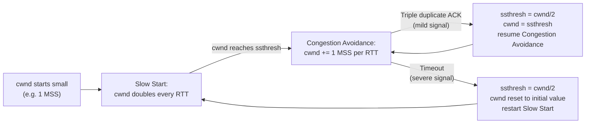

# TCP Congestion Control

**Congestion window (cwnd), slow start, congestion avoidance (AIMD), and reaction to loss (timeout vs triple duplicate ACK).**

## 1. The Intuition

::: callout-intuition Core Mental Model
The previous topic's flow control kept a sender from overwhelming one specific *receiver's* buffer. But there's a second, entirely different danger: what if the sender and receiver are both perfectly fine, but the *network path between them* — the routers and links in the middle — gets overloaded because too many senders, across the whole internet, are all pushing data through the same congested links at once? This is like a traffic jam: no single driver is doing anything wrong, but the road itself simply can't carry everyone's combined traffic at full speed simultaneously.

**Congestion control** is TCP's self-imposed traffic discipline for this exact situation — since the network gives no direct signal like "you're causing congestion," TCP has to *infer* congestion indirectly, primarily from **packet loss**, and respond by voluntarily throttling itself. It's deliberately cautious in a specific, well-motivated pattern: cautiously probe for available bandwidth in a rapidly growing way at first, then transition to a much slower, more careful increase once you're in unknown territory, and — crucially — aggressively cut back the moment loss suggests you've overshot, so that many independent senders sharing a link can all "back off" and converge on a fair, sustainable division of the available capacity, rather than every sender greedily grabbing as much as possible until the network collapses under the combined load.
:::

---

## 2. Theoretical Framework & Formalism

**The congestion window (cwnd).** Separate from the receiver's flow-control window (rwnd), TCP maintains its own internal state variable, `cwnd`, representing how much data the sender believes the *network* can currently handle without causing congestion. The sender's actual allowed sending amount at any moment is the *smaller* of the two: $\min(\text{cwnd}, \text{rwnd})$ — respecting whichever constraint (network capacity or receiver capacity) is currently tighter.

**Phase 1 — Slow Start.** Despite its name, this phase grows `cwnd` *rapidly*: starting from a small initial value (often 1 or a few Maximum Segment Sizes, MSS), `cwnd` **doubles every round-trip time** (exponential growth) — because each successfully-acknowledged segment increases `cwnd` by 1 MSS, and within one RTT, the *current* `cwnd`'s worth of segments all get acknowledged, adding `cwnd` MSS total, i.e. doubling it. This continues until `cwnd` reaches a threshold, `ssthresh` (slow-start threshold), at which point TCP transitions to the next phase — or until loss is detected, whichever happens first.

**Phase 2 — Congestion Avoidance (AIMD: Additive Increase, Multiplicative Decrease).** Once `cwnd` reaches `ssthresh`, growth switches to a much more cautious *linear* increase — roughly, `cwnd` grows by 1 MSS per round-trip time (rather than doubling) — probing for more available bandwidth gently, since we're now in territory where congestion becomes a real risk. This is the "Additive Increase" half of AIMD.

**Reaction to loss — the "Multiplicative Decrease" half of AIMD, and it matters *how* loss was detected:**
- **Triple duplicate ACK (Fast Retransmit signal)** — interpreted as a *mild* congestion signal (the network delivered later segments successfully, so it's not catastrophically overloaded): `ssthresh` is set to `cwnd/2`, and `cwnd` is cut to this new `ssthresh` value (some variants use Fast Recovery, temporarily inflating `cwnd` further during recovery) — then congestion avoidance resumes from this halved value, rather than restarting all the way from scratch.
- **Timeout (no ACK at all for a segment)** — interpreted as a *severe* congestion signal (something is badly wrong; possibly nothing is getting through at all): `ssthresh` is set to `cwnd/2`, but `cwnd` itself is reset all the way down to its small initial value, and TCP restarts from **Slow Start** again, growing back up exponentially from the beginning.

**The characteristic "sawtooth" pattern.** Plotting `cwnd` over time under steady congestion avoidance produces a repeating sawtooth: a long, gentle linear climb (probing for more bandwidth) followed by a sudden sharp drop (backing off after detected loss), repeating indefinitely — this pattern is one of the most recognisable signatures in all of networking, visible in almost any real packet capture of a long-lived TCP connection under load.

---

## 3. Worked Example / Step-by-Step Scenario

::: step [Step 1: Setup] Formulating the Problem
A TCP connection starts Slow Start with `cwnd = 1` MSS and `ssthresh = 16` MSS. Trace `cwnd`'s value at the start of each round-trip time (RTT) until it either reaches `ssthresh` or loss occurs (assume no loss for now), then determine what phase it's in once it exceeds `ssthresh`.
:::

::: step [Step 2: Execution] Applying Core Algorithm
RTT 0 (start): `cwnd = 1`.
After RTT 1 (doubled): `cwnd = 2`.
After RTT 2: `cwnd = 4`.
After RTT 3: `cwnd = 8`.
After RTT 4: `cwnd = 16` — this exactly reaches `ssthresh = 16`.
:::

::: step [Step 3: Conclusion] Final Result
At the moment `cwnd` reaches `ssthresh` (16 MSS, after 4 RTTs of exponential doubling), TCP transitions from Slow Start into **Congestion Avoidance**. From this point on, `cwnd` grows *linearly* instead — roughly +1 MSS per RTT (17, 18, 19, ...) — rather than continuing to double, reflecting the shift from "aggressively probe for bandwidth when we know almost nothing" to "cautiously probe further now that we're near a previously-observed danger zone." This exact exponential-then-linear transition is the defining shape of TCP's congestion-control startup behaviour.
:::

---

## 4. Active Recall Checkpoint

::: quiz Q1: Foundational Concept
During Slow Start, how does the congestion window (cwnd) grow over successive round-trip times?
(A) Linearly, by 1 MSS per RTT
(*B) Exponentially — it roughly doubles every RTT
(C) It stays constant until loss occurs
(D) It decreases gradually
::: explanation
Slow Start's name refers to starting from a small initial value, not to a slow growth rate — in fact, each successfully-acknowledged segment increments cwnd, and since a full cwnd's worth of segments get acknowledged within one RTT, the net effect is cwnd doubling every RTT, an exponential growth pattern.
:::

::: quiz Q2: Foundational Concept
How does TCP's response to a *timeout* differ from its response to *three duplicate ACKs*?
(A) Both responses are identical in every respect
(*B) A timeout (severe signal) resets cwnd all the way to its small initial value and restarts Slow Start; three duplicate ACKs (milder signal) only halve cwnd/ssthresh and resume from Congestion Avoidance, without a full restart
(C) Three duplicate ACKs cause a full restart, while timeout only halves cwnd
(D) Neither event affects cwnd at all
::: explanation
A timeout suggests a potentially serious problem (no acknowledgment arrived at all), warranting a full, cautious restart from Slow Start. Three duplicate ACKs indicate later data is still getting through successfully, a comparatively milder situation, so TCP only cuts cwnd in half and continues from Congestion Avoidance rather than restarting from scratch — this distinction is precisely why Fast Retransmit (paired with this milder response) recovers from isolated packet loss so much faster than waiting for a timeout would.
:::

::: quiz Q3: Foundational Concept
What is the defining shape of the "AIMD" (Additive Increase, Multiplicative Decrease) pattern that gives TCP congestion avoidance its characteristic sawtooth graph?
(A) Exponential growth followed by exponential decay, repeating
(*B) A slow, steady linear increase in cwnd (additive increase, probing for more bandwidth) followed by a sudden sharp halving of cwnd upon detecting loss (multiplicative decrease), repeating indefinitely
(C) cwnd remains perfectly constant at all times
(D) cwnd increases multiplicatively and decreases additively
::: explanation
"Additive Increase" refers to the linear, +1-MSS-per-RTT growth during Congestion Avoidance; "Multiplicative Decrease" refers to cwnd being cut by a fixed multiplicative factor (typically halved) upon detecting loss. Together, repeated over time, this produces the classic sawtooth pattern seen in TCP throughput graphs.
:::
