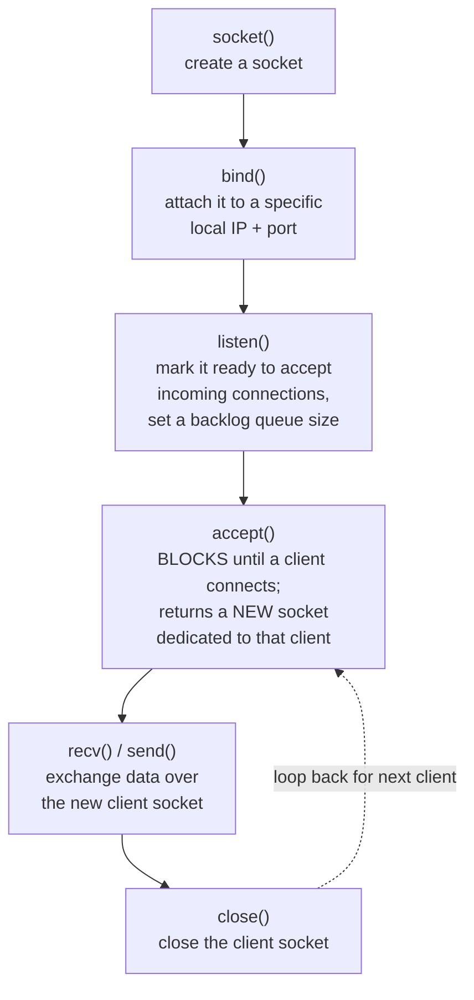
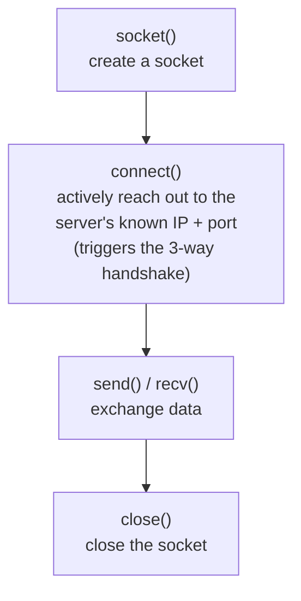

# Socket Programming: Elementary TCP (Client-Server)

**The socket API call sequence for TCP: socket, bind, listen, accept, connect, send/recv, close — with a complete working Python example.**

<a id="the-intuition"></a>
## 1. The Intuition

::: callout-intuition Core Mental Model
Everything covered so far in this module — ports, the 3-way handshake, sliding windows, congestion control — happens *underneath* what a programmer actually writes. From an application programmer's point of view, all of that complexity is hidden behind a small, standard set of function calls called the **socket API** — think of a socket as a "phone" your program picks up, dials with, and talks through, while the operating system's networking stack handles the dial tone, the actual wiring, and the busy signals behind the scenes.

There's a natural asymmetry between the two ends: a **server** must first set up a phone that can *receive* calls at a known, published number (a specific IP and port) and then patiently wait — it doesn't know who will call, or when. A **client**, in contrast, already knows the server's "phone number" and simply dials it whenever it's ready. This asymmetry is directly reflected in which socket API calls each side uses — the server calls `bind`, `listen`, and `accept` (setting up to receive), while the client calls `connect` (actively reaching out) — and understanding *why* each call exists, in this specific order, is the key to writing correct network code, not just memorising the function names.
:::

---

<a id="the-math"></a>
## 2. Theoretical Framework & Formalism

**The TCP server call sequence:**



**The TCP client call sequence:**


**Why the server's `accept()` returns a *brand-new* socket.** This is one of the most commonly misunderstood parts of socket programming: the original socket created by `bind()`/`listen()` is the **listening socket** — it never actually exchanges any application data. Every time `accept()` successfully returns (after a client connects), it hands back a *different*, brand-new socket specifically dedicated to that one client connection, while the original listening socket goes right back to waiting for the *next* incoming connection. This is exactly what allows a single server process to keep listening for new clients while separately exchanging data with already-connected ones (typically by handling each accepted socket in its own thread or process, or via the I/O multiplexing techniques covered in the next topic).

**A complete, minimal working example (Python, using the standard `socket` module):**

```python
# --- server.py ---
import socket

HOST, PORT = "0.0.0.0", 5000

server_sock = socket.socket(socket.AF_INET, socket.SOCK_STREAM)  # 1. socket()
server_sock.setsockopt(socket.SOL_SOCKET, socket.SO_REUSEADDR, 1)
server_sock.bind((HOST, PORT))                                   # 2. bind()
server_sock.listen(5)                                            # 3. listen(), backlog=5
print(f"Server listening on {HOST}:{PORT}")

while True:
    client_sock, client_addr = server_sock.accept()              # 4. accept() — blocks
    print(f"Connected by {client_addr}")
    data = client_sock.recv(1024)                                # 5. recv()
    print(f"Received: {data.decode()}")
    client_sock.sendall(b"Hello from server!")                   #    send()
    client_sock.close()                                          # 6. close() this client
```

```python
# --- client.py ---
import socket

HOST, PORT = "127.0.0.1", 5000

client_sock = socket.socket(socket.AF_INET, socket.SOCK_STREAM)  # 1. socket()
client_sock.connect((HOST, PORT))                                 # 2. connect() — handshake happens here
client_sock.sendall(b"Hello from client!")                        #    send()
data = client_sock.recv(1024)                                     #    recv()
print(f"Received: {data.decode()}")
client_sock.close()                                                # 3. close()
```

---

<a id="worked-example"></a>
## 3. Worked Example / Step-by-Step Scenario

::: step [Step 1: Setup] Formulating the Problem
Using the code above, trace exactly what happens, in order, from the moment `server.py` is started, through a single client connecting via `client.py`, exchanging one message each way, and disconnecting.
:::

::: step [Step 2: Execution] Applying Core Algorithm
1. `server.py` runs `socket()`, then `bind()` to `0.0.0.0:5000` (listening on all local network interfaces), then `listen(5)` — the server is now waiting, and its `accept()` call blocks (pauses execution) until a client shows up.
2. `client.py` runs `socket()`, then `connect(("127.0.0.1", 5000))` — this triggers the actual TCP 3-way handshake (SYN, SYN-ACK, ACK) with the server, at the transport layer, entirely hidden beneath this one function call.
3. The moment the handshake completes, the server's blocked `accept()` call returns, providing a new `client_sock` dedicated to this connection, and the server prints the client's address.
4. The client calls `sendall(b"Hello from client!")`; the server's `recv(1024)` (previously blocked, waiting for data) receives this message and prints it.
5. The server calls `sendall(b"Hello from server!")`; the client's `recv(1024)` receives and prints this reply.
6. The server calls `client_sock.close()` for this one client's dedicated socket — the underlying TCP 4-way teardown happens automatically behind this call — while its *original* listening socket, still open, loops back to `accept()` again, ready for the next client.
:::

::: step [Step 3: Conclusion] Final Result
This trace shows the exact one-to-one correspondence between the transport-layer concepts from earlier in this module and the socket API calls that trigger them: `connect()` triggers the 3-way handshake; `close()` triggers the 4-way teardown; and the reliable, ordered, byte-stream delivery guaranteed by `send()`/`recv()` is exactly TCP's sliding-window and retransmission machinery working invisibly underneath. Nothing about congestion control, sequence numbers, or ACKs needed to appear anywhere in this application code — that's precisely the point of the layered architecture from Module 1: the transport layer's complexity is fully hidden behind this small, clean API.
:::

---

<a id="self-check"></a>
## 4. Active Recall Checkpoint

::: quiz Q1: Foundational Concept
On the server side, what does the socket returned by `accept()` represent, and how is it different from the original socket created by `bind()`/`listen()`?
(A) They are the exact same socket object, used interchangeably
(*B) `accept()` returns a brand-new, dedicated socket specifically for the newly connected client, while the original listening socket remains open and continues waiting for future connections via further `accept()` calls
(C) `accept()` closes the original listening socket permanently
(D) The listening socket is used for sending data, and the accepted socket is only used for receiving
::: explanation
This distinction is the most common point of confusion for beginners: the listening socket's only job is to sit and wait for incoming connection attempts. Each time a client successfully connects, `accept()` hands back a completely separate socket dedicated to that one client's data exchange, freeing the original listening socket to immediately go back to waiting for the next client.
:::

::: quiz Q2: Foundational Concept
Which socket API call on the client side actually triggers the underlying TCP 3-way handshake?
(A) socket()
(*B) connect()
(C) send()
(D) recv()
::: explanation
`socket()` merely creates an unconnected socket object locally, with no network activity yet. It's specifically the `connect()` call that reaches out to the server's IP and port, triggering the SYN / SYN-ACK / ACK exchange described in the TCP basics topic, entirely hidden beneath this one function call.
:::

::: quiz Q3: Foundational Concept
In the server's call sequence, why must `bind()` happen before `listen()`, and `listen()` before `accept()`?
(A) The order doesn't actually matter; they can be called in any sequence
(*B) `bind()` must first attach the socket to a specific local address/port before the socket can meaningfully `listen()` for connections to that address; and `listen()` must mark the socket as ready to accept connections (setting up the backlog queue) before any call to `accept()` can meaningfully wait for and retrieve one
(C) `listen()` creates the socket, so it must come first
(D) `accept()` must be called before `bind()` to reserve the port in advance
::: explanation
Each call builds logically on the previous one: you can't listen for connections on an address you haven't bound to yet, and you can't accept a connection from a socket that hasn't been marked as actively listening. This dependency is exactly why the socket API enforces this specific calling order.
:::
