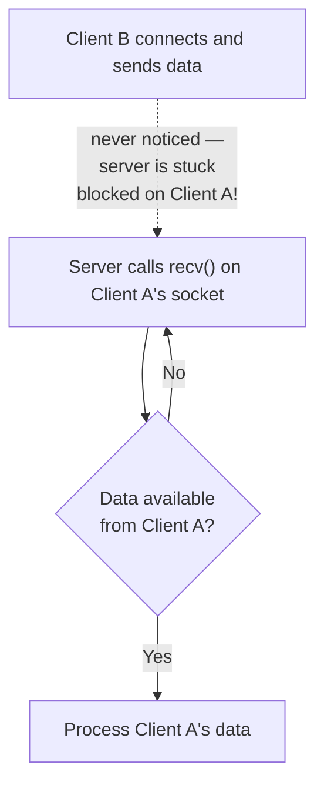

# Socket I/O Multiplexing: select() and poll()

**The problem of blocking I/O with multiple clients, the select() system call, poll() as its improvement, and a working multi-client server example.**

<a id="the-intuition"></a>
## 1. The Intuition

::: callout-intuition Core Mental Model
The previous topic's server handled exactly one client at a time — while `recv()` is blocked waiting for data from Client A, the server is *frozen*, completely unable to notice that Client B has also just connected and is waiting. Imagine a single receptionist who can only watch one phone line at a time — if they pick up line 1 and just sit there waiting silently for the caller to speak, they'll completely miss line 2 ringing, even though technically the phone system could handle both calls.

**I/O multiplexing** solves this by giving the receptionist an "watch all lines at once and tell me when *any* of them has something to report" ability. The `select()` (and its more scalable cousin, `poll()`) system call does exactly this at the socket level: instead of blocking on any *one* socket's `recv()`, you hand the operating system a whole list of sockets and ask "please block until at least one of these is ready for reading/writing, then tell me exactly which one(s)." This lets a *single* thread of a program handle many simultaneous client connections, without needing a separate thread or process per client.
:::

---

<a id="the-math"></a>
## 2. Theoretical Framework & Formalism

**The core problem with plain blocking sockets and many clients:**


**select() — the classic solution.** `select(readfds, writefds, exceptfds, timeout)` takes sets of file descriptors (sockets) to monitor for read-readiness, write-readiness, and exceptional conditions, plus an optional timeout, and blocks until at least one socket in any set becomes ready (or the timeout expires) — then returns the specific subset that's actually ready, so the program only calls `recv()`/`accept()` on sockets it *knows* won't block.
- **Limitation:** `select()`'s socket sets are conventionally implemented as fixed-size bitmasks with a hardcoded maximum (`FD_SETSIZE`, often 1024), and internally, checking readiness typically requires an $O(n)$ linear scan over every monitored socket on each call, every time — this becomes a real performance bottleneck as the number of simultaneous connections grows into the thousands.

**poll() — an improvement.** `poll(fds, timeout)` takes a dynamically-sized array of `{socket, events_to_watch}` structures instead of fixed bitmasks, removing the `FD_SETSIZE` ceiling and making it more convenient for large numbers of sockets — though it still involves an $O(n)$ scan internally, same fundamental cost as `select()`, just without the hard socket-count limit. (Even more scalable mechanisms — `epoll` on Linux, `kqueue` on BSD/macOS — avoid even this linear scan by having the kernel maintain the ready-list incrementally, but these are typically covered as further, OS-specific extensions beyond `select`/`poll`.)

**A working multi-client TCP server using select() (Python):**
```python
import select
import socket

HOST, PORT = "0.0.0.0", 5000
server_sock = socket.socket(socket.AF_INET, socket.SOCK_STREAM)
server_sock.setsockopt(socket.SOL_SOCKET, socket.SO_REUSEADDR, 1)
server_sock.bind((HOST, PORT))
server_sock.listen(5)
server_sock.setblocking(False)

sockets_to_monitor = [server_sock]   # start by watching only the listening socket

print(f"Multiplexed server listening on {HOST}:{PORT}")
while True:
    ready_to_read, _, _ = select.select(sockets_to_monitor, [], [])
    for sock in ready_to_read:
        if sock is server_sock:
            # the listening socket is "ready" -> a new client is waiting to be accepted
            client_sock, addr = server_sock.accept()
            client_sock.setblocking(False)
            sockets_to_monitor.append(client_sock)
            print(f"New connection from {addr}")
        else:
            # an existing client socket is "ready" -> it has data to read
            data = sock.recv(1024)
            if data:
                sock.sendall(b"Echo: " + data)
            else:
                # empty recv() means the client disconnected
                print("Client disconnected")
                sockets_to_monitor.remove(sock)
                sock.close()
```

---

<a id="worked-example"></a>
## 3. Worked Example / Step-by-Step Scenario

::: step [Step 1: Setup] Formulating the Problem
Trace what happens in the `select()`-based server above when: Client A connects, Client B connects shortly after (while Client A hasn't sent anything yet), and then Client A finally sends a message.
:::

::: step [Step 2: Execution] Applying Core Algorithm
Initially, `sockets_to_monitor = [server_sock]`. `select()` blocks, watching just this one socket.
Client A connects → the listening socket (`server_sock`) becomes "ready to read" (an incoming connection counts as data being ready) → `select()` returns, the loop sees `sock is server_sock`, calls `accept()`, and adds Client A's new dedicated socket to `sockets_to_monitor`. The loop then calls `select()` again, now watching `[server_sock, client_A_sock]`.
Client B connects next → again the listening socket becomes ready → `accept()` is called, Client B's socket is added too. `select()` is now watching `[server_sock, client_A_sock, client_B_sock]`.
Client A finally sends data → `client_A_sock` (specifically, only that one) becomes ready to read → `select()` returns with exactly `[client_A_sock]` in the ready list, and the server calls `recv()` on it — safely, since `select()` already confirmed data is waiting, so this `recv()` call is guaranteed not to block.
:::

::: step [Step 3: Conclusion] Final Result
At no point did the server ever block waiting on one specific client while ignoring the others — `select()` continuously re-evaluates the *entire* set of monitored sockets each time through the loop, and only returns once *something* (a new connection, or new data on an existing connection) is actually ready, telling the program precisely which socket(s) to act on. This is exactly how a single-threaded server can juggle many simultaneous clients: not by doing multiple things literally at once, but by never wastefully blocking on a socket that has nothing to offer yet.
:::

---

<a id="self-check"></a>
## 4. Active Recall Checkpoint

::: quiz Q1: Foundational Concept
What core problem does I/O multiplexing (select()/poll()) solve, compared to a simple server that calls blocking recv() on one socket at a time?
(A) It makes data transfer faster over the network itself
(*B) It prevents the server from getting stuck blocked on one client's socket while other clients are waiting with data (or new connections) ready, by monitoring many sockets simultaneously and only acting on whichever ones are actually ready
(C) It eliminates the need for the TCP handshake
(D) It removes the need for a listening socket entirely
::: explanation
A server blocked inside `recv()` on one specific socket cannot notice activity on any other socket at the same time. `select()`/`poll()` instead monitor a whole group of sockets and return only once at least one is ready, letting a single thread of execution service many clients without ever blocking on one to the exclusion of the others.
:::

::: quiz Q2: Foundational Concept
What is a key limitation of select() compared to poll()?
(A) select() cannot be used with TCP sockets
(*B) select() typically has a hardcoded maximum number of sockets it can monitor (FD_SETSIZE), which poll()'s dynamically-sized array-based interface does not impose
(C) poll() cannot detect new incoming connections
(D) select() runs faster than poll() in every case
::: explanation
select()'s traditional implementation represents socket sets as fixed-size bitmasks with a compile-time maximum size, which becomes a real constraint for servers needing to handle very large numbers of simultaneous connections; poll() uses a dynamically-sized structure instead, removing this particular ceiling (though both still share an underlying O(n) scan cost as the number of monitored sockets grows).
:::

::: quiz Q3: Foundational Concept
In the example server code, why does receiving an empty result from `sock.recv(1024)` (i.e., zero bytes) indicate the client has disconnected, rather than simply "no data available right now"?
(A) It never indicates disconnection; empty data always means an error occurred
(*B) Because select() only returns a socket as "ready to read" when there is actually something to read — including the special end-of-stream signal that occurs when the other side has closed the connection — so recv() returning zero bytes on a socket confirmed ready by select() specifically means the peer has closed the connection, not merely "nothing arrived yet"
(C) Empty data means the server itself has crashed
(D) It indicates the client is about to send a very large message
::: explanation
Since `select()` already guarantees the socket is "ready to read" before `recv()` is called, a genuinely empty result (0 bytes, not a would-block condition) specifically signals that the TCP connection has been closed by the peer — this is the standard way socket APIs represent a graceful disconnect, and it's exactly why the example code treats this case as "client disconnected" and removes/closes that socket.
:::
