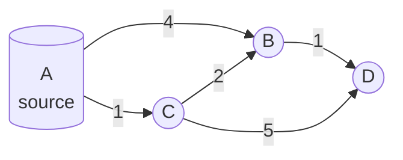

# Unicast Routing Algorithms: Distance Vector & Link State

**Bellman-Ford-based distance vector routing, Dijkstra-based link state routing, and a full step-by-step Dijkstra trace.**

## 1. The Intuition

::: callout-intuition Core Mental Model
Imagine you want to find the fastest route to a friend's house, and you have two very different ways of gathering the information needed. **Method 1 (Distance Vector):** you only ever ask your immediate neighbours, "how far do you think it is to my friend's house?" — and you trust their answer completely, adjusting only by adding the distance from you to them. You never see a full map; you just gradually refine your own best guess by gossiping with neighbours, who are themselves gossiping with *their* neighbours, and so on, until the information (eventually) propagates and stabilises across the whole network. **Method 2 (Link State):** instead, every single location floods the *entire network* with information about its own direct connections ("I'm connected to A, 5 km away; to B, 3 km away") — so that eventually, *everyone* has a complete, identical map of the whole network's connections, and each person can independently run their own careful shortest-path calculation (using that complete map) to figure out the best route to anywhere, all on their own, with no further need to trust anyone else's calculations.

These are the two fundamental philosophies underlying essentially all unicast routing algorithms: **Distance Vector** (decentralised, gossip-based, each router knows only distances, not the actual topology) and **Link State** (each router independently computes shortest paths using a complete, globally-known topology map). Real routing protocols (RIP for distance vector; OSPF for link state) are practical implementations of these two philosophies.
:::

---

## 2. Theoretical Framework & Formalism

**Distance Vector Routing (based on the Bellman-Ford equation).** Each router $x$ maintains a distance vector — its current best-known cost to every destination $y$ — and periodically exchanges this vector with its direct neighbours. Upon receiving a neighbour $v$'s vector, router $x$ updates its own estimate using:
$$D_x(y) = \min_{v \in \text{neighbours}(x)} \big\{ c(x,v) + D_v(y) \big\}$$
i.e., "my best cost to $y$ is the minimum, over all my neighbours, of (my direct cost to that neighbour) plus (that neighbour's own best-known cost to $y$)." This is applied iteratively and asynchronously — as neighbours' vectors change, routers recompute and potentially propagate further updates — and, given enough time and no further topology changes, the whole network **converges** to correct shortest-path distances everywhere. A well-known weakness: the **"count-to-infinity" problem**, where bad news (a link going down) can propagate very slowly through a chain of routers still trusting each other's stale, now-incorrect information, temporarily creating routing loops before eventually stabilising (mitigated by techniques like "split horizon" and "poison reverse," which prevent a router from advertising a route back to the neighbour it learned that route from).

**Link State Routing (based on Dijkstra's shortest-path algorithm).** Each router first uses a **reliable flooding** mechanism to distribute its own direct link costs to *every other router* in the network — so that, eventually, every router holds an identical, complete map of the network's full topology. Each router then independently runs Dijkstra's algorithm, using itself as the source, to compute shortest paths to every other node.

**Dijkstra's algorithm — the core mechanism (recap and formalisation):**
1. Maintain a set $N'$ of nodes whose shortest distance from the source is already finalised (initially just the source itself, distance 0).
2. For every node not yet in $N'$, maintain a tentative distance estimate (initially $\infty$, except direct neighbours of the source).
3. Repeatedly: select the node **not yet in $N'$** with the smallest tentative distance, add it to $N'$ (its distance is now finalised), and "relax" all of its outgoing edges — for each neighbour $w$ of the just-added node $u$, check if going through $u$ improves $w$'s tentative distance: $D(w) = \min(D(w), D(u)+c(u,w))$.
4. Repeat until every node has been added to $N'$.

**Distance Vector vs. Link State — comparison:**

| Criterion | Distance Vector | Link State |
|---|---|---|
| Information known to each router | Only distances (not the actual topology) | The complete network topology |
| How information spreads | Gossip with immediate neighbours only | Flooded to every router |
| Computation | Distributed, iterative (Bellman-Ford) | Centralised-per-router (Dijkstra), run independently by each router on the same known map |
| Convergence speed after a change | Can be slow (count-to-infinity risk) | Generally faster |
| Example real protocol | RIP | OSPF |

---

## 3. Worked Example / Step-by-Step Scenario

::: step [Step 1: Setup] Formulating the Problem
Using the graph shown above (A–B: 4, A–C: 1, C–B: 2, C–D: 5, B–D: 1), run Dijkstra's algorithm from source A, tracing the full step-by-step selection and distance updates.
:::

::: step [Step 2: Execution] Applying Core Algorithm
**Initialise:** $D(A)=0$ (source), $D(B)=4$ (direct edge), $D(C)=1$ (direct edge), $D(D)=\infty$ (no direct edge). $N' = \{\}$.
**Round 1:** smallest tentative distance not yet in $N'$: $D(C)=1$. Add $C$ to $N'$. Relax $C$'s edges: via $C$, $D(B)$ could be $D(C)+c(C,B) = 1+2=3$, which is better than the current $4$ → update $D(B)=3$. Via $C$, $D(D)$ could be $D(C)+c(C,D)=1+5=6$, better than $\infty$ → update $D(D)=6$.
**Round 2:** smallest tentative distance not yet in $N'$: $D(B)=3$. Add $B$ to $N'$. Relax $B$'s edges: via $B$, $D(D)$ could be $D(B)+c(B,D)=3+1=4$, which is better than the current $6$ → update $D(D)=4$.
**Round 3:** smallest tentative distance not yet in $N'$: $D(D)=4$. Add $D$ to $N'$. No further unvisited nodes remain to relax against.
**Round 4:** only $A$ (already in $N'$ from initialisation) remains — algorithm terminates.
:::

::: step [Step 3: Conclusion] Final Result
Final shortest distances from $A$: $D(A)=0$, $D(C)=1$, $D(B)=3$ (via path A→C→B, cost $1+2=3$, cheaper than the direct A→B edge costing 4), $D(D)=4$ (via path A→C→B→D, cost $1+2+1=4$, cheaper than the direct A→C→D path costing $1+5=6$). This demonstrates Dijkstra's core insight: the shortest path to a node is not always the most "direct-looking" edge, and the algorithm systematically discovers genuinely optimal routes — including ones passing through several intermediate hops — by always finalising the globally-closest remaining node at each step.
:::

---

## 4. Active Recall Checkpoint

::: quiz Q1: Foundational Concept
What key piece of information does a Distance Vector router know that a Link State router's underlying algorithm relies on having *more* of?
(A) Distance Vector routers know the complete topology; Link State routers know only distances
(*B) Distance Vector routers know only distances to destinations (learned via neighbour gossip); Link State routers, in contrast, have the *complete* network topology (via flooding) before computing shortest paths independently
(C) Both approaches require identical information
(D) Neither approach requires any information exchange at all
::: explanation
This is the fundamental philosophical difference: Distance Vector routers never see the actual network map, only cumulative distance estimates passed along by neighbours. Link State routers first ensure every router has full topology information via flooding, and only then does each one independently compute shortest paths (typically via Dijkstra) using that complete picture.
:::

::: quiz Q2: Foundational Concept
In Dijkstra's algorithm, once a node is added to the finalised set $N'$, can its shortest-path distance ever change afterward?
(A) Yes, it can be updated later if a cheaper path is discovered
(*B) No — once a node is added to $N'$, its distance is permanently finalised; this is guaranteed correct precisely because Dijkstra always selects the node with the smallest *tentative* distance among all unvisited nodes at each step, and (assuming non-negative edge weights) no later-discovered path through a still-unvisited, therefore-more-distant node could possibly be shorter
(C) Distances are only finalised at the very end of the algorithm, for all nodes simultaneously
(D) Node distances are never actually finalised; the algorithm only estimates
::: explanation
Dijkstra's correctness relies on always finalising the globally closest remaining node next. Since all unvisited nodes have tentative distances at least as large as the one just selected (and edge weights are non-negative), no future path routed through a still-more-distant, unvisited node could ever produce a shorter path to an already-finalised node — this is exactly why the algorithm never needs to revisit or "undo" a finalised distance.
:::

::: quiz Q3: Foundational Concept
What is the "count-to-infinity" problem, and which routing approach is specifically susceptible to it?
(A) Link State routing, because flooding takes too long
(*B) Distance Vector routing, where bad news (e.g., a failed link) can propagate slowly through a chain of routers that keep trusting each other's stale, outdated distance information, temporarily creating routing loops with steadily increasing (but still incorrect) distance estimates before finally stabilising
(C) Both approaches are equally susceptible, with no meaningful difference
(D) It only affects the very first router that detects a failure, never any others
::: explanation
Because Distance Vector routers only trust their neighbours' self-reported distances (without knowing the actual topology), a chain of routers can end up in a temporary loop of gradually-increasing incorrect distance estimates after a failure, slowly "counting up" toward correctly recognising a destination is unreachable — a known weakness specifically of the distributed, gossip-based Distance Vector approach, mitigated in practice by techniques like split horizon and poison reverse.
:::
