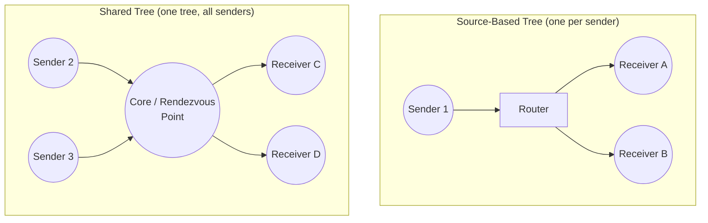

# Multicast Routing Basics

**Unicast vs broadcast vs multicast, IGMP group membership, and the two families of multicast tree construction (source-based vs shared trees).**

## 1. The Intuition

::: callout-intuition Core Mental Model
Suppose a company needs to send the same live-streamed announcement video to exactly 500 specific employees scattered across a large office network, but not to the other 2,000 employees who aren't part of that department. There are three naive-sounding options: send 500 completely separate individual copies (**unicast** to each — wildly wasteful, since the same video data gets duplicated over and over across shared links); send it to *everyone* on the network and let uninterested devices discard it (**broadcast** — simpler, but wastes bandwidth on the 2,000 uninterested recipients and doesn't even work across most of the wider internet, where broadcast is deliberately blocked); or, the smart option: send it just *once*, and have the network itself — the routers — intelligently duplicate the traffic only at the specific points where paths to different interested recipients actually diverge, so no single link ever carries more copies of the same data than it strictly needs to.

That third option is **multicast** — one sender, one transmission, delivered efficiently to an arbitrary, dynamically-changing group of interested receivers, with the network doing the smart work of duplicating traffic only where paths genuinely branch. This requires two distinct pieces of machinery: a way for individual devices to tell their local router "I want to join this multicast group" (**IGMP**), and a way for routers, network-wide, to collectively build an efficient distribution tree connecting the sender(s) to all the currently-interested receivers (**multicast routing**).
:::

---

## 2. Theoretical Framework & Formalism

**Three delivery models compared:**

| Model | Destinations | Efficiency | Typical use |
|---|---|---|---|
| Unicast | One specific receiver | One separate copy per receiver — inefficient for large groups | Web browsing, normal file transfer |
| Broadcast | Every device on the (local) network | Single transmission, but reaches many uninterested devices too, and doesn't scale to the wider internet | ARP requests, DHCP discovery (local network only) |
| Multicast | An arbitrary, dynamically-changing *group* of interested receivers | Single transmission per link, duplicated by routers only where paths to different receivers actually diverge | Live video/audio streaming to a subscribed audience, some routing protocol updates, IPTV |

**IGMP (Internet Group Management Protocol).** This is the *local* half of multicast — the protocol a host uses to tell its **directly-connected router** which multicast group(s) it currently wants to receive. A host sends an IGMP "Join" message for a specific multicast group address; the local router keeps track of which of its directly-attached networks currently have at least one interested member for each group, and periodically sends IGMP queries to confirm membership is still active (so it can stop forwarding traffic for a group once nobody local is interested anymore).

**Multicast tree construction — two families of approaches:**
- **Source-based trees:** build a separate shortest-path tree rooted at *each individual sender*, reaching all current group members — this tends to give more efficient (shorter) paths from each specific sender, but at the cost of routers needing to maintain separate tree state for every distinct source, which can become a significant scaling burden with many senders.
- **Shared trees (Core-based/Rendezvous-Point trees):** instead, build just *one single tree*, shared by *all* senders to the group, rooted at a designated central point (often called a "Rendezvous Point" or "Core"). Every sender's traffic is first routed to this central point, and from there distributed out along the one shared tree to all receivers. This dramatically reduces the amount of routing state each router must maintain (just one tree per group, not one per sender), at the cost of potentially less efficient (longer) individual paths, since traffic isn't necessarily following each sender's own true shortest path.

---

## 3. Worked Example / Step-by-Step Scenario

::: step [Step 1: Setup] Formulating the Problem
A company streams a single live video feed (one sender) to employees across 3 different office buildings, with a varying number of interested viewers in each building, changing throughout the day as people join and leave the stream. Decide, with justification, whether a source-based tree or a shared tree is the more natural fit for this specific scenario.
:::

::: step [Step 2: Execution] Applying Core Algorithm
Key facts of the scenario: there is only **one sender** (the live stream's single source), so source-based tree construction doesn't face the "many separate trees to maintain" scaling concern that arises with many simultaneous senders. Since a source-based tree, per sender, is specifically optimised for shortest paths *from that one sender*, and this scenario has exactly one sender whose efficient reach to all current viewers is the main goal, a source-based tree naturally provides the shortest, most efficient paths from this single source to every current, dynamically changing receiver.
:::

::: step [Step 3: Conclusion] Final Result
A **source-based tree** is the better natural fit here — with only one sender, its main downside (routing-state overhead scaling with the number of distinct senders) simply doesn't apply, while its main advantage (efficient, direct paths from the source) is fully realised. A shared tree's key benefit — reducing state when *many* different senders exist — would be solving a problem this particular scenario doesn't actually have, at the cost of potentially longer, less direct paths through a designated core point that isn't needed here.
:::

---

## 4. Active Recall Checkpoint

::: quiz Q1: Foundational Concept
What is the core efficiency advantage of multicast over sending separate unicast transmissions to every group member?
(A) Multicast uses stronger encryption
(*B) A single transmission is duplicated by routers only at the specific points where paths to different receivers actually diverge, so no link carries more copies of the same data than genuinely necessary — unlike unicast, which sends one full separate copy per receiver over potentially the same shared links
(C) Multicast guarantees reliable, ordered delivery, unlike unicast
(D) Multicast requires no routers at all
::: explanation
Multicast's whole design goal is bandwidth efficiency for one-to-many delivery: rather than the sender producing N separate copies for N receivers, the network itself intelligently replicates the traffic only where paths to different receivers genuinely split apart, sharing links wherever multiple receivers' paths still overlap.
:::

::: quiz Q2: Foundational Concept
What is the specific role of IGMP in the overall multicast system?
(A) It builds the multicast distribution tree across the whole network
(*B) It is the local protocol a host uses to inform its directly-connected router which multicast group(s) it currently wants to receive, allowing that router to track local group membership
(C) It replaces TCP for reliable multicast delivery
(D) It assigns IP addresses to multicast group members
::: explanation
IGMP operates purely at the "last hop" — between an individual host and its directly-attached router — communicating group membership interest. The broader task of actually building an efficient distribution tree across the entire network, connecting senders to all interested receivers network-wide, is handled by separate multicast routing protocols/mechanisms, not IGMP itself.
:::

::: quiz Q3: Foundational Concept
What is the main trade-off between source-based trees and shared trees for multicast routing?
(A) Source-based trees are always strictly better in every scenario
(*B) Source-based trees give more efficient (shorter) paths per sender but require separate tree state for every distinct sender, which can become costly with many senders; shared trees use just one tree for all senders (much less routing state), at the cost of potentially less direct paths, since traffic is funnelled through one central rendezvous point
(C) Shared trees only work for exactly one receiver
(D) There is no meaningful difference between the two approaches
::: explanation
This is a direct trade-off between path efficiency and routing-state scalability: source-based trees optimise each individual sender's paths but multiply routing state with every additional sender; shared trees minimise routing state to just one tree per group (regardless of sender count) but route all traffic through a single central point, which isn't necessarily each sender's own true shortest path.
:::
