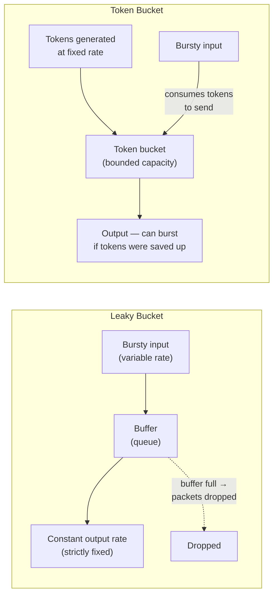

# Quality of Service (QoS)

**Best-effort vs QoS-aware networks, key QoS metrics, traffic shaping via the Leaky Bucket and Token Bucket algorithms, and DiffServ/IntServ.**

## 1. The Intuition

::: callout-intuition Core Mental Model
By default, the internet is what's called a **best-effort** network — every packet, whether it's part of a life-critical video call or a background software update silently downloading, is treated exactly the same by routers, with no special priority given to anything. This works acceptably most of the time, but breaks down noticeably during congestion: a video call and a large file download competing for the same limited bandwidth will both suffer somewhat, when really, the video call's late-arriving packets are far more damaging to the user's experience (causing stutters, freezes) than the file download taking a few seconds longer would be.

**Quality of Service (QoS)** is the deliberate set of mechanisms that let a network *differentiate* between traffic types, and treat some traffic preferentially — reserving bandwidth, minimising delay, or reducing jitter specifically for the traffic classes that need it most (like live video/voice), while accepting that other, less time-sensitive traffic (like a background download) can be treated with lower priority or throttled during periods of congestion. A key building block underlying much of QoS is **traffic shaping** — smoothing out a bursty stream of packets into a more predictable, steady flow, so it doesn't itself become the source of congestion.
:::

---

## 2. Theoretical Framework & Formalism

**Key QoS metrics** — the specific properties an application might care about, and QoS mechanisms try to control:

| Metric | Meaning | Especially matters for |
|---|---|---|
| Bandwidth (throughput) | Data rate actually achievable | Large file transfers, video streaming quality |
| Delay (latency) | Time for a packet to travel from source to destination | Live voice/video calls, online gaming |
| Jitter | *Variation* in delay between successive packets (even if average delay is fine, wildly inconsistent delay is disruptive) | Real-time audio/video (causes choppy, uneven playback) |
| Packet loss | Fraction of packets that never arrive | Anything requiring completeness; some tolerance for loss in live audio/video |

**The Leaky Bucket algorithm — smoothing bursty traffic into a constant rate.** Picture an actual bucket with a small hole in the bottom, leaking water at a fixed, constant rate, regardless of how fast water is poured in from the top (excess water above the bucket's capacity simply overflows and is lost). Applied to network traffic: incoming packets (arriving in bursts, at varying rates) are queued in a buffer, and released onto the network at a strictly **constant** output rate, no matter how bursty the input was — smoothing traffic into a steady, predictable stream. If the buffer fills up faster than it's draining, excess packets are dropped.

**The Token Bucket algorithm — allowing controlled bursts.** A bucket accumulates **tokens** at a fixed rate (one token roughly corresponds to permission to send one unit of data, e.g. one byte or one packet), up to some maximum bucket capacity. A packet can only be transmitted if there are enough tokens currently available in the bucket, and transmitting it consumes that many tokens. Crucially, if the bucket has been accumulating tokens during a quiet period (no traffic sent), those tokens remain banked — allowing a **burst** of traffic to be sent all at once (up to the bucket's capacity) when data finally does arrive, rather than being forced into the Leaky Bucket's rigidly constant output rate.

**Comparison — Leaky Bucket vs Token Bucket:**

| | Leaky Bucket | Token Bucket |
|---|---|---|
| Output pattern | Strictly constant rate, always | Allows bursts, up to bucket capacity, when tokens have accumulated |
| Best suited for | Applications needing a perfectly smooth, predictable output rate | Applications that are naturally bursty but should still be rate-limited on *average* |

**Two architectural approaches to network-wide QoS:**
- **IntServ (Integrated Services):** an application explicitly *reserves* resources (bandwidth, etc.) along the entire path before sending, using a signalling protocol (RSVP) — provides strong, per-flow guarantees, but requires every router along the path to maintain per-flow state, which scales poorly to internet-wide deployment.
- **DiffServ (Differentiated Services):** instead of per-flow reservations, packets are simply marked (via a field in the IP header) with a traffic class/priority ("expedited forwarding" for latency-sensitive traffic, "best effort" for everything else, etc.), and routers apply different queuing/forwarding treatment based on this marking — no per-flow state needed, making it far more scalable, at the cost of weaker (class-level, not flow-level) guarantees.

---

## 3. Worked Example / Step-by-Step Scenario

::: step [Step 1: Setup] Formulating the Problem
A Token Bucket has a token generation rate of 2 tokens/second, and a maximum bucket capacity of 10 tokens. The bucket starts completely full (10 tokens) after a long idle period. A sudden burst of data requiring 8 tokens' worth of transmission arrives, followed immediately by another burst requiring 5 tokens' worth, arriving exactly 1 second later. Determine whether each burst can be fully transmitted immediately, or must be partially delayed.
:::

::: step [Step 2: Execution] Applying Core Algorithm
At time 0: bucket has 10 tokens (full, from the idle period). First burst arrives, needing 8 tokens — sufficient tokens are available (10 ≥ 8), so it transmits immediately, consuming 8 tokens, leaving 2 tokens in the bucket.
Between time 0 and time 1 (1 second passes): tokens regenerate at 2 tokens/second, adding 2 more tokens: $2 + 2 = 4$ tokens now in the bucket (still within the 10-token cap, so no overflow/waste here).
At time 1: second burst arrives, needing 5 tokens — but only 4 tokens are currently available (4 < 5), which is **insufficient**.
:::

::: step [Step 3: Conclusion] Final Result
The second burst cannot be fully transmitted immediately — it can send only the portion covered by the 4 available tokens right away, and must wait for additional tokens to regenerate (at 2/second) before the remaining 1 token's worth can be sent, roughly half a second later. This demonstrates the Token Bucket's defining behaviour precisely: it comfortably absorbs occasional bursts up to the banked token capacity, but still enforces a genuine average-rate limit (2 tokens/second) over time, gracefully throttling — rather than simply dropping — traffic that temporarily exceeds what's currently available.
:::

---

## 4. Active Recall Checkpoint

::: quiz Q1: Foundational Concept
What is the key behavioural difference between the Leaky Bucket and Token Bucket traffic shaping algorithms?
(A) They are functionally identical, just with different names
(*B) The Leaky Bucket always outputs traffic at a strictly constant rate, smoothing out all bursts; the Token Bucket allows a burst of traffic to be sent immediately (up to the bucket's capacity) if tokens have accumulated during a prior quiet period, while still enforcing an average rate limit over time
(C) The Leaky Bucket allows unlimited bursts; the Token Bucket enforces a strictly constant rate
(D) Neither algorithm actually limits the sending rate
::: explanation
The Leaky Bucket's defining property is a rigid, constant output rate regardless of input burstiness. The Token Bucket is more flexible: it permits controlled bursts (spending banked-up tokens all at once) while still constraining the long-run average rate to the token generation rate — a meaningfully different, often more practically useful, behaviour for genuinely bursty traffic sources.
:::

::: quiz Q2: Foundational Concept
What is "jitter," as a QoS metric, and why does it matter particularly for live audio/video applications?
(A) The total number of packets lost
(*B) The variation in delay between successive packets — even if the average delay is acceptable, wildly inconsistent packet-to-packet delay causes choppy, uneven playback in real-time audio/video applications, which need a steady, predictable stream to sound/look smooth
(C) The maximum achievable bandwidth on a link
(D) The time it takes to establish a TCP connection
::: explanation
Live audio/video quality depends on packets arriving at a steady, predictable cadence for smooth playback — high jitter (inconsistent delay) causes noticeable stutters and glitches even when the *average* delay would otherwise be perfectly acceptable, which is why jitter is tracked as its own distinct QoS metric, separate from raw average delay.
:::

::: quiz Q3: Foundational Concept
What is the key architectural trade-off between IntServ and DiffServ approaches to QoS?
(A) They are functionally identical approaches with different names
(*B) IntServ provides strong, explicit, per-flow resource reservations (via signalling like RSVP) but requires every router to maintain per-flow state, scaling poorly to internet-wide deployment; DiffServ instead marks packets with a traffic class and lets routers apply class-based treatment with no per-flow state, scaling much better but providing only weaker, class-level (not flow-level) guarantees
(C) IntServ requires no signalling at all; DiffServ requires per-flow reservations
(D) Both approaches require identical router state
::: explanation
IntServ's strength (precise, guaranteed, per-flow resource reservation) comes at the direct cost of requiring every router along a path to track and maintain state for every individual flow — a scalability problem at internet scale. DiffServ trades away that per-flow precision for a much more scalable, stateless-per-flow approach, marking traffic into a small number of classes that routers can treat differently without tracking individual flows.
:::
