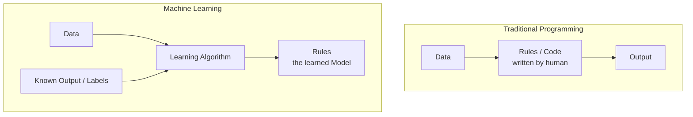

# Machine Learning vs Traditional Programming

**Why hardcoded IF-ELSE rules fail in complex domains, and how inductive learning replaces deductive rule-writing.**

## 1. The Intuition

::: callout-intuition The Cake Recipe, Reversed
Traditional programming is like following a recipe: you already know the ingredients (data) and the exact steps (rules/code), and you follow them mechanically to produce a cake (output). Machine Learning flips this around: you're handed a pile of ingredients *and* a finished cake, and asked to reverse-engineer the recipe by tasting many such cake-ingredient pairs until you can predict, for a *new* pile of ingredients, roughly what cake will come out.

- **Traditional Software:** $\text{Data} + \text{Rules (Code)} \implies \text{Output}$ — a human engineer writes every logical condition by hand: "if input $A$ happens, do $B$."
- **Machine Learning:** $\text{Data} + \text{Output} \implies \text{Rules (The Model)}$ — you provide raw observations and historical outcomes, and the learning algorithm discovers the underlying statistical mapping $f: X \to Y$ on its own.
:::

---

## 2. Theoretical Framework & Formalism

**In-depth comparison:**

| Dimension | Traditional Programming (Deductive) | Machine Learning (Inductive) |
| :--- | :--- | :--- |
| **Primary Input** | Raw data + explicit algorithm | Input features ($X$) + ground-truth labels ($Y$) |
| **Generated Artifact** | Program execution output | Model weights / hypothesis $h_\theta(x)$ |
| **Logic Formulation** | Handcrafted by human domain experts | Inferred statistically via numerical optimization |
| **Edge-Case Handling** | Requires manual bug fixes and patch rules | Improves automatically when retrained on new edge cases |
| **Ideal Problem Domain** | Deterministic calculations (taxes, compilers, banking) | Fuzzy, high-dimensional patterns (vision, audio, NLP) |

**The two pipelines, side by side** — notice how "Rules" and "Output" swap positions between the two paradigms:

::: callout-pitfall When NOT to Use Machine Learning
Never use Machine Learning when exact, deterministic business rules already exist. For example, calculating GST/VAT (e.g. $\text{Tax} = \text{Total} \times 0.18$) should **always** be traditional code — introducing a statistical model adds uncertainty, latency, and maintenance cost to a problem that has a single, exact, legally-defined answer.
:::

---

## 3. Worked Example / Step-by-Step Scenario

::: step [Step 1: Setup] Formulating the Problem
A company wants to automatically decide whether to approve or reject loan applications. An engineer proposes two possible designs: Design A hardcodes 40 nested IF-ELSE rules based on income, credit score, and existing debt. Design B trains a classification model on 200,000 historical loan applications and their actual repayment outcomes. Decide which paradigm suits this problem, and why.
:::

::: step [Step 2: Execution] Applying the Comparison Framework
Loan default risk depends on a large number of interacting, non-obvious factors (income *combined with* debt-to-income ratio *combined with* regional economic conditions, etc.) — exactly the "fuzzy, high-dimensional pattern" row of the comparison table, not the "deterministic calculation" row. A hardcoded 40-rule system (Design A) would need constant manual patching every time a new edge case or fraud pattern emerges, and the engineer's 40 rules are almost certainly missing subtle statistical interactions a human wouldn't think to encode by hand.
:::

::: step [Step 3: Conclusion] Final Result
Design B (the learned model) is the better fit: it lets the algorithm discover the statistical mapping $f: X \to Y$ from 200,000 real outcomes, automatically capturing interactions the human rule-writer would likely miss, and it can be improved simply by retraining on new data as repayment patterns shift — rather than requiring an engineer to rewrite rules by hand every time.
:::

---

## 4. Active Recall Checkpoint

::: quiz Q1: Architectural Decision
Which of the following problems should NEVER be implemented using Machine Learning?
(A) Transcribing spoken Malayalam voice notes into text
(B) Recommending relevant research papers to college students
(*C) Calculating exact bank account interest using government-mandated rate tiers
(D) Detecting credit card fraud from spending anomalies
::: explanation
Banking interest formulas are exact legal equations. Using ML introduces statistical uncertainty and variance to a problem that requires one line of exact, deterministic code — a clear case for the "Traditional Programming" side of the table.
:::

::: quiz Q2: Reversing the Pipeline
Which statement correctly describes how Machine Learning "reverses" the traditional programming pipeline?
(*A) ML treats data and known outputs as inputs, and produces the rules (model) as output, whereas traditional programming treats data and rules as inputs and produces output
(B) ML always runs faster than traditional programming for every task
(C) ML requires no data whatsoever, unlike traditional programming
(D) Traditional programming and ML both require exactly the same inputs
::: explanation
In traditional programming: $\text{Data} + \text{Rules} \implies \text{Output}$. In Machine Learning, this is inverted: $\text{Data} + \text{Output} \implies \text{Rules}$ — the model itself is the "rules" the ML pipeline produces, rather than something a human writes in advance.
:::

::: quiz Q3: Edge-Case Handling
A traditional rule-based fraud detector keeps missing new fraud patterns as scammers change tactics. What is the core reason a Machine-Learning-based detector handles this better, according to the comparison framework?
(A) Machine learning models never need to be updated once deployed
(*B) A retrained ML model can automatically adapt its learned mapping when exposed to new labeled examples of the new fraud pattern, without an engineer manually writing a new rule
(C) Rule-based systems are always faster to update than ML systems
(D) ML models eliminate the need for any historical data
::: explanation
The "Edge-Case Handling" row of the comparison table is precisely this distinction: traditional rule-based systems require a human to notice the new pattern and hand-write a patch rule, while an ML model can improve automatically simply by being retrained on data that now includes examples of the new pattern.
:::
