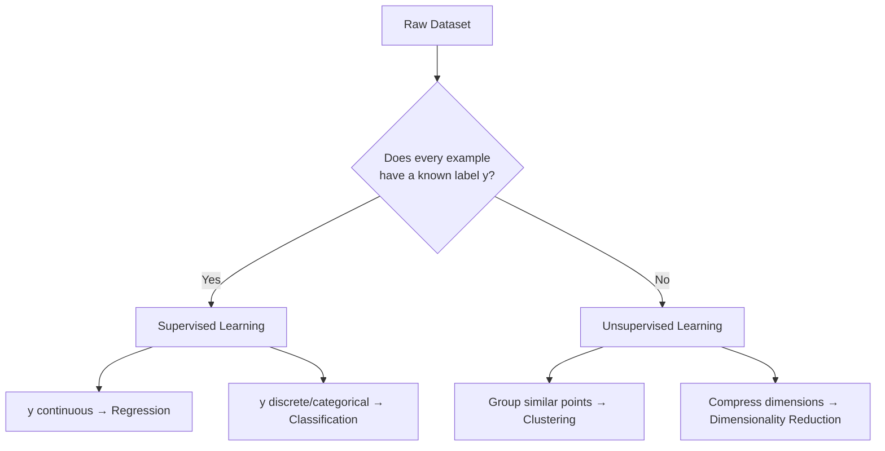

# Learning Paradigms: Supervised vs Unsupervised

**Comparing learning with an answer key against discovering latent structure in unlabeled data.**

## 1. The Intuition

::: callout-intuition Flashcards vs Lego Sorting
- **Supervised Learning (the flashcard):** You are shown an image ($x$) and told its true label ($y$) — "this is a cat." You guess, check the answer key, and adjust your internal weights based on how wrong you were. Repeat thousands of times.
- **Unsupervised Learning (Lego sorting):** You are handed 10,000 unsorted Lego pieces with zero labels — nobody tells you the "correct" categories. You naturally group them into piles based on inherent color, geometry, and size, discovering structure that was never explicitly told to you.

The dividing line between the two paradigms is simple and absolute: **does the training data include a target label $y$ or not?**
:::

---

## 2. Theoretical Framework & Formalism

**1. Supervised Learning.** Given dataset $\mathcal{D} = \{(x^{(i)}, y^{(i)})\}_{i=1}^m$, where every example carries a known label:
- **Regression:** $y \in \mathbb{R}$ (continuous prediction, e.g. stock prices, house valuations).
- **Classification:** $y \in \{0, 1\}$ or $\{1, \dots, K\}$ (discrete category, e.g. cancer diagnosis, spam detection).

**2. Unsupervised Learning.** Given dataset $\mathcal{D} = \{x^{(i)}\}_{i=1}^m$ with **no** target labels $y$:
- **Clustering:** discovering natural group assignments $c^{(i)} \in \{1, \dots, K\}$ (e.g. K-Means, Hierarchical Clustering).
- **Dimensionality Reduction:** compressing high-dimensional $x \in \mathbb{R}^D$ down to $z \in \mathbb{R}^d$ (with $d \ll D$) while preserving as much variance/structure as possible (e.g. PCA).

**Choosing a paradigm — the decision starts with what your data actually contains:**

---

## 3. Worked Example / Step-by-Step Scenario

::: step [Step 1: Setup] Formulating the Problem
An airline has two separate datasets. Dataset A: 50,000 past flights, each tagged with whether the flight was "Delayed" or "On-Time." Dataset B: passenger baggage weight and travel-frequency records for 200,000 passengers, with no predefined category tags at all. For each dataset, decide which learning paradigm applies and what specific technique fits.
:::

::: step [Step 2: Execution] Applying the Decision Framework
**Dataset A** has a known target label attached to every example (Delayed / On-Time) — this is Supervised Learning, and since the label is a discrete category with two possible values, it's specifically a **binary classification** problem.
**Dataset B** has no predefined tags at all — passengers are not pre-labeled into any traveler "type." This is Unsupervised Learning; since the goal is to discover natural passenger groupings from the raw features, it's specifically a **clustering** problem (e.g., K-Means could be used to identify 4 distinct traveler personas).
:::

::: step [Step 3: Conclusion] Final Result
Dataset A trains a supervised classifier that predicts Delayed/On-Time for a *new* flight, evaluated against the known ground-truth labels it was trained on. Dataset B trains an unsupervised clustering algorithm that groups *existing* passengers into personas with no ground truth to check against — its success is judged by how coherent and useful the discovered clusters are (e.g., cluster cohesion metrics), not by matching a predefined answer key, because no such answer key exists.
:::

---

## 4. Active Recall Checkpoint

::: quiz Q1: Paradigm Selection
An airline wants to analyze passenger baggage weight records to automatically identify 4 distinct traveler personas without predefined tags. Which paradigm applies?
(A) Supervised Regression
(*B) Unsupervised Clustering
(C) Reinforcement Learning
(D) Supervised Classification
::: explanation
Because there are no predefined class labels or target outputs $y$, the model must uncover hidden cluster structures on its own — the defining trait of unsupervised clustering.
:::

::: quiz Q2: Regression vs Classification
A supervised model is trained to predict a house's exact resale price in rupees. Which supervised sub-type is this, and why?
(*A) Regression, because the target $y$ is a continuous real-valued number
(B) Classification, because houses can be grouped into price "categories"
(C) Clustering, because similar houses are grouped together
(D) Dimensionality Reduction, because many features describe each house
::: explanation
The target variable — exact resale price — takes continuous real values ($y \in \mathbb{R}$), which is precisely the defining criterion for regression, as opposed to classification's discrete category labels.
:::

::: quiz Q3: Dimensionality Reduction Purpose
A dataset has 500 highly correlated numerical features per image. Before clustering the images, an engineer first applies PCA to reduce this to 20 dimensions. What unsupervised task does this PCA step represent, and what is it trying to preserve?
(A) Classification; it tries to preserve the class boundaries
(*B) Dimensionality Reduction; it tries to preserve as much of the original variance/structure as possible while using far fewer dimensions
(C) Regression; it tries to preserve the continuous target value
(D) Reinforcement Learning; it tries to preserve the cumulative reward
::: explanation
PCA is a classic dimensionality-reduction technique: it has no labels to work with (unsupervised), and its explicit mathematical objective is compressing $x \in \mathbb{R}^D$ into $z \in \mathbb{R}^d$ ($d \ll D$) while retaining as much of the data's variance as possible, making downstream tasks like clustering faster and less noisy.
:::
