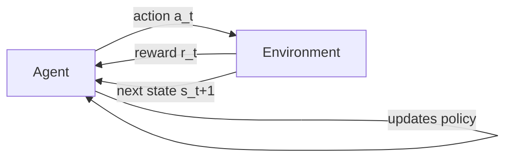

# Learning Paradigms: Semi-Supervised & Reinforcement Learning

**Leveraging cheap unlabeled data to anchor a small labeled set, and training goal-oriented agents through scalar reward feedback.**

## 1. The Intuition

::: callout-intuition The Goldmine of Unlabeled Data & The Video Game Player
- **Semi-Supervised Learning:** Labeling medical X-rays requires expensive radiologist time (roughly $200/hour). You have only 500 labeled scans, but 100,000 free unlabeled scans sitting in storage. Semi-supervised learning uses the small labeled set to anchor the categories, and the large unlabeled set to learn the underlying data geometry — effectively getting most of the benefit of a much bigger labeled dataset for a fraction of the labeling cost.
- **Reinforcement Learning:** An AI plays Super Mario. Nobody tells it which exact button to press at millisecond 42. It presses buttons semi-randomly at first, receives $+100$ score for finishing the level or $-50$ for dying, and gradually learns the optimal sequence of actions (its **policy**) purely from this trial-and-error reward signal, over millions of attempts.
:::

---

## 2. Theoretical Framework & Formalism

**Semi-Supervised Learning** sits between the two paradigms from the previous topic: it trains on a dataset $\mathcal{D} = \mathcal{D}_{\text{labeled}} \cup \mathcal{D}_{\text{unlabeled}}$, where $|\mathcal{D}_{\text{unlabeled}}| \gg |\mathcal{D}_{\text{labeled}}|$. The core assumption is that nearby points in the unlabeled data's geometry likely share the same label, letting the model propagate label information outward from the small labeled anchor set.

**Reinforcement Learning (RL)** formalizes an agent interacting with an **Environment**, modeled as a **Markov Decision Process (MDP)**:
$$ (S, A, P, R, \gamma) $$

| Symbol | Meaning |
| :--- | :--- |
| $s_t \in S$ | Current state at time $t$ |
| $a_t \in A$ | Action taken by the agent |
| $P(s_{t+1} \mid s_t, a_t)$ | Transition dynamics of the environment |
| $r_t \in \mathbb{R}$ | Immediate scalar reward received |
| $\gamma \in [0, 1)$ | Discount factor, controlling how much future rewards matter versus immediate ones |

**The Bellman Optimality Equation** — the recursive relationship that defines the best possible long-term value of taking action $a$ in state $s$:
$$ Q^*(s, a) = \mathbb{E}\left[ r + \gamma \max_{a'} Q^*(s', a') \;\middle|\; s, a \right] $$

**The Agent–Environment interaction loop:**

---

## 3. Worked Example / Step-by-Step Scenario

::: step [Step 1: Setup] Formulating the Problem
A warehouse robot must learn to navigate to a charging dock. At each time step it can move North, South, East, or West. It receives $+10$ reward for reaching the dock, $-1$ for every step taken (to encourage efficiency), and $-20$ if it collides with a shelf. Identify the MDP components $(S, A, R)$ and explain why this is Reinforcement Learning rather than Supervised Learning.
:::

::: step [Step 2: Execution] Applying the MDP Framework
**State space $S$:** the robot's current grid coordinates (and possibly battery level).
**Action space $A$:** $\{\text{North}, \text{South}, \text{East}, \text{West}\}$.
**Reward function $R$:** $+10$ at the dock, $-1$ per step, $-20$ on collision.
This is *not* Supervised Learning because nobody hands the robot a labeled dataset of "correct move given this exact grid state" — instead, it only receives a delayed, scalar evaluation (reward) of the *consequences* of its actions, and must discover the best action sequence through repeated trial and error.
:::

::: step [Step 3: Conclusion] Final Result
Over many episodes, the robot's policy converges toward paths that maximize cumulative discounted reward $G_t = \sum_k \gamma^k r_{t+k+1}$ — favoring short, collision-free paths to the dock, since collisions and wasted steps are explicitly penalized while reaching the goal is explicitly rewarded. This is the Bellman equation being solved implicitly through experience, exactly as in the Super Mario example above.
:::

---

## 4. Active Recall Checkpoint

::: quiz Q1: RL Core Mechanics
What provides the training feedback signal to a Reinforcement Learning agent?
(A) Human-annotated gradient vectors for each step
(*B) Scalar rewards and penalties from the environment
(C) Mean Squared Error calculated against a test dataset
(D) Information gain splits
::: explanation
RL agents optimize their actions to maximize the cumulative discounted scalar reward ($G_t = \sum \gamma^k r_{t+k+1}$) received purely from environment interactions — there is no labeled "correct action" dataset involved.
:::

::: quiz Q2: Semi-Supervised Motivation
Why would a hospital prefer semi-supervised learning over pure supervised learning for X-ray classification, given 500 labeled scans and 100,000 unlabeled scans?
(*A) It exploits the large pool of cheap unlabeled data to learn the data's underlying geometry, improving on what the small labeled set alone could achieve
(B) It eliminates the need for any labeled data whatsoever
(C) It always outperforms reinforcement learning on every task
(D) It requires no assumptions about how labeled and unlabeled points relate to each other
::: explanation
Semi-supervised learning explicitly leverages the abundant unlabeled data to understand the shape/geometry of the input distribution, then uses the (expensive, scarce) labeled anchor points to attach meaning to that geometry — getting more mileage out of 500 labels than supervised learning could alone.
:::

::: quiz Q3: Discount Factor Behavior
In the Bellman Optimality Equation, what happens to an RL agent's behavior as the discount factor $\gamma$ approaches $0$?
(A) The agent ignores all rewards, immediate and future alike
(*B) The agent becomes extremely short-sighted, valuing only the immediate reward $r$ and largely ignoring future rewards
(C) The agent becomes perfectly far-sighted, weighing all future rewards equally with the immediate one
(D) The MDP framework becomes undefined for $\gamma = 0$
::: explanation
As $\gamma \to 0$, the term $\gamma \max_{a'} Q^*(s', a')$ vanishes, leaving $Q^*(s,a) \approx \mathbb{E}[r \mid s, a]$ — the agent essentially only cares about the immediate reward of its next action, ignoring long-term consequences.
:::
