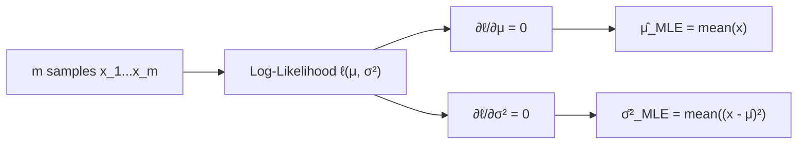

# MLE for Continuous Variables: The 1D Gaussian Distribution

**Deriving why the sample mean and sample variance are the mathematically optimal parameters of a normal distribution.**

## 1. The Intuition

::: callout-intuition Fitting the Bell Curve
Suppose you measure the heights of 1,000 students. You assume heights follow a normal (Gaussian) distribution $\mathcal{N}(\mu, \sigma^2)$ — the familiar bell curve. Two knobs control that curve's shape: $\mu$ (where the peak sits) and $\sigma^2$ (how spread out it is).

Just as with the coin-flip example in the previous topic, MLE asks: which values of $\mu$ and $\sigma^2$ make your 1,000 actually-observed height measurements the most probable outcome? The pleasantly intuitive answer, proven rigorously below, turns out to be exactly the arithmetic average and the average squared deviation — the "obvious" sample statistics you'd compute anyway.
:::

---

## 2. Theoretical Framework & Formalism

For $m$ independent samples $x_1, \dots, x_m$ drawn from $\mathcal{N}(\mu, \sigma^2)$, each has probability density:
$$ P(x_i \mid \mu, \sigma^2) = \frac{1}{\sqrt{2\pi\sigma^2}} \exp\left( -\frac{(x_i - \mu)^2}{2\sigma^2} \right) $$

**Step 1 — Log-Likelihood Formulation.** Taking the log of the product of $m$ such densities:
$$ \ell(\mu, \sigma^2) = -\frac{m}{2}\ln(2\pi) - \frac{m}{2}\ln(\sigma^2) - \frac{1}{2\sigma^2}\sum_{i=1}^m (x_i - \mu)^2 $$

**Step 2 — Deriving the Optimal Mean $\hat{\mu}_{\text{MLE}}$.** Take the partial derivative with respect to $\mu$ and set it to zero:
$$ \frac{\partial \ell}{\partial \mu} = \frac{1}{\sigma^2}\sum_{i=1}^m (x_i - \mu) = 0 \implies \sum_{i=1}^m x_i - m\mu = 0 \implies \hat{\mu}_{\text{MLE}} = \frac{1}{m}\sum_{i=1}^m x_i $$

**Step 3 — Deriving the Optimal Variance $\hat{\sigma}^2_{\text{MLE}}$.** Take the partial derivative with respect to $\sigma^2$ and set it to zero:
$$ \frac{\partial \ell}{\partial \sigma^2} = -\frac{m}{2\sigma^2} + \frac{1}{2(\sigma^2)^2}\sum_{i=1}^m (x_i - \mu)^2 = 0 \implies \hat{\sigma}^2_{\text{MLE}} = \frac{1}{m}\sum_{i=1}^m (x_i - \mu)^2 $$

::: callout-pitfall A Subtle Bias
$\hat{\sigma}^2_{\text{MLE}}$ (dividing by $m$) is a slightly *biased* estimator of the true population variance — it systematically underestimates it a little, especially for small $m$. The commonly-used "sample variance" divides by $(m-1)$ instead (Bessel's correction) to correct this bias; MLE, however, doesn't know or care about unbiasedness — it purely maximizes likelihood, and dividing by $m$ is what that maximization yields.
:::

---

## 3. Worked Example / Step-by-Step Scenario

::: step [Step 1: Setup] Formulating the Problem
Five sensor readings are recorded: $x = \{10, 12, 11, 13, 9\}$. Assuming these are i.i.d. samples from $\mathcal{N}(\mu, \sigma^2)$, compute $\hat{\mu}_{\text{MLE}}$ and $\hat{\sigma}^2_{\text{MLE}}$.
:::

::: step [Step 2: Execution] Applying the Closed-Form Results
**Mean:** $\hat{\mu}_{\text{MLE}} = \frac{10+12+11+13+9}{5} = \frac{55}{5} = 11.0$
**Variance:** compute squared deviations from $\hat{\mu} = 11.0$: $(10-11)^2=1,\ (12-11)^2=1,\ (11-11)^2=0,\ (13-11)^2=4,\ (9-11)^2=4$. Sum $= 1+1+0+4+4 = 10$.
$$ \hat{\sigma}^2_{\text{MLE}} = \frac{10}{5} = 2.0 $$
:::

::: step [Step 3: Conclusion] Final Result
The fitted Gaussian is $\mathcal{N}(\mu=11.0, \sigma^2=2.0)$ — the bell curve centered at 11.0 with variance 2.0 that makes these five exact readings the most probable joint outcome among all possible $(\mu, \sigma^2)$ pairs. Note that with only $m=5$ samples, this MLE variance estimate would understate the true spread more than it would with a larger sample, per the bias caveat above.
:::

---

## 4. Active Recall Checkpoint

::: quiz Q1: Analytical Result
What is the Maximum Likelihood Estimator for the mean $\mu$ of a 1D Gaussian distribution?
(*A) The sample mean $\frac{1}{m}\sum x_i$
(B) The sample median
(C) The maximum value in the dataset
(D) $\frac{1}{m-1}\sum (x_i - \bar{x})^2$
::: explanation
Setting the derivative of the Gaussian log-likelihood with respect to $\mu$ to zero directly yields the arithmetic average $\frac{1}{m}\sum x_i$.
:::

::: quiz Q2: Why Take the Log First
Why is the log-likelihood $\ell(\mu, \sigma^2)$ used instead of directly differentiating the raw product of Gaussian densities $\prod_i P(x_i \mid \mu, \sigma^2)$?
(*A) The log converts the product (and its embedded exponential terms) into a sum, making the derivatives with respect to $\mu$ and $\sigma^2$ far simpler to compute while preserving the same maximizer
(B) The log changes the shape of the Gaussian distribution itself
(C) Only the log-likelihood is guaranteed to be positive
(D) Differentiating a product of exponentials is mathematically impossible
::: explanation
Differentiating a product of $m$ exponential terms directly is algebraically painful and numerically unstable; the log turns the product into a sum of simpler terms (as shown in Step 1), and since $\ln(\cdot)$ is monotonic, the resulting maximizer is identical either way.
:::

::: quiz Q3: MLE Variance Bias
Why is $\hat{\sigma}^2_{\text{MLE}} = \frac{1}{m}\sum(x_i-\hat{\mu})^2$ described as a "biased" estimator of the true population variance?
(A) It always overestimates the true variance by a large margin
(*B) It systematically underestimates the true variance on average, especially for small sample sizes $m$, because it divides by $m$ rather than $(m-1)$
(C) It is only valid for discrete distributions, not continuous ones
(D) It produces a different maximizer than the mean estimator
::: explanation
MLE purely maximizes the likelihood of the observed sample and, in doing so, divides the summed squared deviations by $m$; the statistically "unbiased" sample variance instead divides by $(m-1)$ (Bessel's correction) to compensate for the fact that deviations are measured from the *estimated* mean rather than the unknown true mean, which otherwise makes MLE's variance estimate slightly too small on average.
:::
