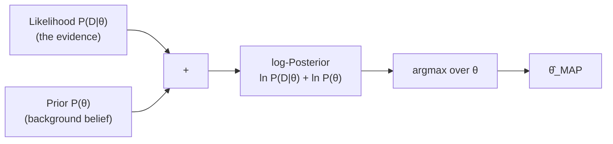

# Maximum A Posteriori (MAP): Bayesian Parameter Estimation

**Overcoming MLE's small-data overfitting flaw by incorporating prior knowledge via Bayes' Theorem.**

## 1. The Intuition

::: callout-intuition Why MLE Fails on 3 Coin Flips
If you flip a normal coin 3 times and happen to get 3 Heads, pure MLE (from the previous two topics) asserts $\hat{p} = 1.00$ — "this coin *always* lands heads." This is absurd, because you walk into the experiment with a lifetime of prior experience telling you coins are almost always close to fair. MLE has no way to incorporate that prior belief — it only ever looks at the data in front of it, no matter how small the sample.

MAP fixes this by combining the evidence (likelihood) with prior knowledge, using **Bayes' Theorem**:
$$ P(\theta \mid D) = \frac{P(D \mid \theta)\, P(\theta)}{P(D)} $$
- **Posterior** $P(\theta \mid D)$: our updated belief about $\theta$ *after* seeing data $D$.
- **Likelihood** $P(D \mid \theta)$: the MLE objective from before — how probable the data is, given $\theta$.
- **Prior** $P(\theta)$: our background knowledge about $\theta$ *before* seeing any data.
:::

---

## 2. Theoretical Framework & Formalism

**The MAP objective.** Since $P(D)$ doesn't depend on $\theta$, maximizing the posterior is equivalent to maximizing the numerator; taking logs turns the product into a sum, exactly as with MLE:
$$ \hat{\theta}_{\text{MAP}} = \arg\max_\theta P(\theta \mid D) = \arg\max_\theta \left[ \ln P(D \mid \theta) + \ln P(\theta) \right] $$

Notice this is literally **"MLE's objective, plus a regularizing term for the prior."** When the prior is completely flat/uninformative, $\ln P(\theta)$ contributes nothing, and MAP collapses exactly to MLE.

::: callout-formula Asymptotic Convergence
As dataset size $N \to \infty$, the likelihood term $\ln P(D\mid\theta)$ grows linearly with $N$ and eventually completely overwhelms the fixed-size prior term $\ln P(\theta)$. Thus:
$$ \lim_{N \to \infty} \hat{\theta}_{\text{MAP}} = \hat{\theta}_{\text{MLE}} $$
In other words: **priors matter most when data is scarce, and matter less and less as data accumulates** — which is exactly the sensible behavior a Bayesian estimator should have.
:::

---

## 3. Worked Example / Step-by-Step Scenario

::: step [Step 1: Setup] Formulating the Problem
A brand-new e-commerce product receives its first $n=3$ customer ratings, and all 3 happen to be 5-star ("positive"). Pure MLE would estimate $\hat{p}_{\text{MLE}} = 3/3 = 1.00$ (100% chance of a positive rating). Explain, conceptually, why a MAP estimate — incorporating a prior belief that most products get a mix of positive and negative reviews — would instead pull this estimate down toward something more moderate, without yet performing the full numeric derivation (covered in the next topic).
:::

::: step [Step 2: Execution] Applying the Bayesian Reasoning]
The prior $P(\theta)$ encodes the platform's general historical experience — e.g., "across all products, the typical positive-rating rate hovers around 60–70%, rarely near 100% even for genuinely good products." Bayes' Theorem combines this prior belief with the (very thin) new evidence of 3 reviews. Because the prior carries real informational weight and the likelihood is based on only 3 data points, the posterior — and therefore $\hat{\theta}_{\text{MAP}}$ — sits *between* the prior's expectation and the raw MLE estimate of 1.00, rather than jumping straight to the extreme.
:::

::: step [Step 3: Conclusion] Final Result
Conceptually, MAP acts as a "regularizer against overconfidence from small samples": it refuses to fully trust an extreme conclusion (100% positive) drawn from only 3 observations, and instead blends that thin evidence with accumulated prior knowledge to produce a more defensible estimate. The exact numeric mechanics of this blending — using a Beta prior — are derived precisely in the next topic.
:::

---

## 4. Active Recall Checkpoint

::: quiz Q1: Large Data Limit
What happens to the MAP parameter estimate as the number of observed training samples approaches infinity ($N \to \infty$)?
(A) The prior completely overrides the data
(*B) The MAP estimate converges exactly to the MLE estimate
(C) The model severely overfits
(D) The parameter estimate goes to zero
::: explanation
With infinite data, empirical observations overwhelm any fixed-size prior belief, making Bayesian MAP converge to Frequentist MLE — exactly the asymptotic convergence result shown above.
:::

::: quiz Q2: Identifying the Three Bayesian Terms
In the equation $P(\theta \mid D) = \frac{P(D \mid \theta) P(\theta)}{P(D)}$, which term represents the MLE objective, exactly, and which term represents pre-existing background belief?
(*A) $P(D \mid \theta)$ is the MLE (likelihood) objective; $P(\theta)$ is the prior, representing background belief
(B) $P(\theta \mid D)$ is the MLE objective; $P(D)$ is the prior
(C) $P(D)$ is the MLE objective; $P(\theta \mid D)$ is the prior
(D) All four terms represent the same underlying quantity
::: explanation
$P(D \mid \theta)$ — "how probable is the observed data, given a candidate $\theta$" — is exactly the likelihood function that MLE alone maximizes. $P(\theta)$ is the separate prior term that MAP additionally incorporates, and $P(\theta \mid D)$ (the posterior) is what MAP ultimately maximizes.
:::

::: quiz Q3: When Priors Matter Most
In which scenario does incorporating a prior via MAP make the *largest* practical difference compared to plain MLE?
(*A) A brand-new product with only 3 customer ratings so far
(B) A well-established product with 50,000 customer ratings collected over five years
(C) A scenario where the likelihood function is undefined
(D) MAP and MLE always produce identical results regardless of sample size
::: explanation
Per the asymptotic convergence formula, the prior's relative influence shrinks as $N$ grows. With only 3 data points, the likelihood term is weak and easily swamped, so the prior term $\ln P(\theta)$ has outsized influence — precisely the small-data regime where MAP's regularizing effect against overconfidence matters most.
:::
