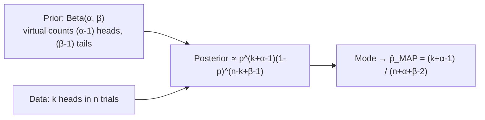

# MAP with Beta Priors: The Math & the Cold-Start Problem

**Step-by-step derivation of conjugate Beta-Binomial MAP estimation, resolving the extreme-estimate problem from the previous topic.**

## 1. The Intuition

::: callout-intuition Virtual Data (Pseudo-Counts)
A **Beta Distribution** $\text{Beta}(\alpha, \beta)$ is the natural choice of prior for a Bernoulli/Binomial parameter $p$, because it's a **conjugate prior** — combining it with Bernoulli data via Bayes' Theorem produces another Beta distribution as the posterior, keeping the math clean and closed-form.

The most useful way to *think* about $\alpha$ and $\beta$: treat $\alpha - 1$ as "virtual prior heads" and $\beta - 1$ as "virtual prior tails" — imaginary observations baked into your prior belief before you ever collect real data. A strong prior belief that a coin is fair might be encoded as $\text{Beta}(50, 50)$ (lots of virtual balanced evidence); a weak, nearly-agnostic prior might be $\text{Beta}(2, 2)$ (barely any virtual evidence).
:::

---

## 2. Theoretical Framework & Formalism

**Setup.** The Beta prior density and the Bernoulli likelihood (for $k$ successes in $n$ trials):
$$ P(p) \propto p^{\alpha - 1} (1-p)^{\beta - 1}, \qquad L(p) \propto p^k (1-p)^{n-k} $$

**Step 1 — Posterior Formulation.** By Bayes' Theorem, the posterior is proportional to prior $\times$ likelihood:
$$ P(p \mid D) \propto p^{k + \alpha - 1} (1-p)^{n - k + \beta - 1} $$
This is itself the kernel of another Beta distribution — $\text{Beta}(k+\alpha,\ n-k+\beta)$ — confirming conjugacy.

**Step 2 — Mode of the Beta Posterior.** Taking the log, differentiating with respect to $p$, and setting the result to zero (the same mechanical procedure as the MLE derivations earlier) yields the mode of this posterior Beta distribution:
$$ \hat{p}_{\text{MAP}} = \frac{k + \alpha - 1}{n + \alpha + \beta - 2} $$

Notice the "virtual counts" intuition made rigorous: the numerator adds $\alpha - 1$ virtual heads to the real $k$ heads, and the denominator adds $(\alpha - 1) + (\beta - 1)$ total virtual trials to the real $n$ trials.

::: callout-exam Concrete Example
If you observe $k=3$ heads in $n=3$ tosses with a prior $\text{Beta}(5, 5)$:
$$ \hat{p}_{\text{MAP}} = \frac{3 + 5 - 1}{3 + 5 + 5 - 2} = \frac{7}{11} \approx 0.636 $$
Instead of the extreme $\hat{p}_{\text{MLE}} = 1.00$ from before, MAP regularizes the estimate down to a far more sensible $0.636$ — exactly the "cold-start" fix promised in the previous topic.
:::

---

## 3. Worked Example / Step-by-Step Scenario

::: step [Step 1: Setup] Formulating the Problem
Revisit the e-commerce cold-start scenario: a new product gets $k=3$ five-star ratings out of $n=3$ total ratings. The platform's historical prior belief about positive-rating rates is modeled as $\text{Beta}(\alpha=7, \beta=3)$ (reflecting that products, on average, skew positive but rarely perfect). Compute $\hat{p}_{\text{MAP}}$.
:::

::: step [Step 2: Execution] Applying the MAP Formula
$$ \hat{p}_{\text{MAP}} = \frac{k + \alpha - 1}{n + \alpha + \beta - 2} = \frac{3 + 7 - 1}{3 + 7 + 3 - 2} = \frac{9}{11} \approx 0.818 $$
:::

::: step [Step 3: Conclusion] Final Result
The MAP estimate is $\hat{p}_{\text{MAP}} \approx 0.818$ (81.8%) — pulled down from the raw MLE estimate of $1.00$, but still fairly high, because the chosen prior $\text{Beta}(7,3)$ itself already reflects a belief that products tend to skew positive (its own implied mean is $\frac{\alpha}{\alpha+\beta} = 0.7$). As more real ratings arrive, per the asymptotic convergence property from the previous topic, this estimate will increasingly reflect the actual observed data rather than the prior.
:::

---

## 4. Active Recall Checkpoint

::: quiz Q1: Prior Parameters
If $\alpha = 1$ and $\beta = 1$ in a Beta prior (representing a flat uniform prior $U(0, 1)$), what does $\hat{p}_{\text{MAP}}$ equal?
(A) 0.50
(*B) $\frac{k}{n}$ (identical to MLE)
(C) 0.00
(D) 1.00
::: explanation
Substituting $\alpha=1, \beta=1$ yields $\hat{p}_{\text{MAP}} = \frac{k+0}{n+0} = \frac{k}{n}$, proving that MLE is a special case of MAP with a uniform, fully uninformative prior — consistent with the general "MAP collapses to MLE when the prior is flat" principle.
:::

::: quiz Q2: Virtual Counts Interpretation
A prior $\text{Beta}(\alpha=21, \beta=11)$ is used. How many "virtual prior heads" and "virtual prior tails" does this represent?
(*A) 20 virtual heads and 10 virtual tails
(B) 21 virtual heads and 11 virtual tails
(C) 1 virtual head and 1 virtual tail
(D) 31 virtual total trials, split evenly
::: explanation
Per the "virtual pseudo-count" interpretation, virtual heads $= \alpha - 1 = 20$ and virtual tails $= \beta - 1 = 10$; these get directly added to the real observed counts $k$ and $(n-k)$ in the MAP formula's numerator and denominator.
:::

::: quiz Q3: Effect of a Stronger Prior
Two analysts use different priors for the same data ($k=3$ heads, $n=3$ trials): Analyst A uses $\text{Beta}(2,2)$ (weak prior), Analyst B uses $\text{Beta}(50,50)$ (very strong prior favoring fairness). Whose $\hat{p}_{\text{MAP}}$ will land closer to $0.5$?
(A) Analyst A, because a weak prior always dominates
(*B) Analyst B, because a much larger $\alpha+\beta$ contributes far more "virtual trials" relative to the tiny real sample of $n=3$, pulling the estimate strongly toward the prior's own mean of 0.5
(C) Both will produce identical results regardless of prior strength
(D) Neither prior has any effect on a MAP estimate
::: explanation
The denominator $n + \alpha + \beta - 2$ shows that a large $\alpha+\beta$ (Analyst B's $100$) heavily outweighs a small real sample ($n=3$), so the posterior mode sits very close to the prior's own mode near $0.5$. Analyst A's much smaller $\alpha+\beta=4$ lets the real data pull the estimate further toward the raw MLE value of $1.00$.
:::
