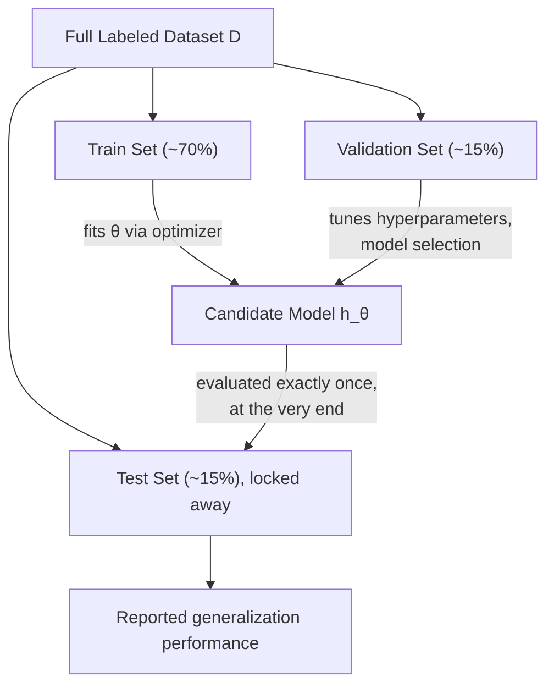

# Supervised Learning Formalism & Dataset Splitting

**The rigorous mathematical notation of feature spaces and hypothesis functions, and why datasets are split into three separate parts.**

## 1. The Intuition

::: callout-intuition Studying for an Exam, Correctly
Imagine a student who only ever practices using the exact same 10 questions the teacher will later ask on the final exam. They'll score 100% — but that tells you nothing about whether they actually *understand* the subject, only that they memorized 10 answers. A fair evaluation requires practice questions (to learn from), some check-in quizzes along the way (to tune study strategy), and a genuinely unseen final exam (to measure true understanding).

This is exactly why supervised learning splits its data into three separate, non-overlapping parts — Training, Validation, and Test — each with a distinct job, so that the final reported performance actually reflects how the model will behave on *new*, never-before-seen data, not how well it memorized what it already saw.
:::

---

## 2. Theoretical Framework & Formalism

**Formal notation.** Let training dataset $\mathcal{D} = \{(x^{(1)}, y^{(1)}), \dots, (x^{(m)}, y^{(m)})\}$, where:
- $m$: number of training examples.
- $x^{(i)} \in \mathbb{R}^d$: the $d$-dimensional feature vector for example $i$.
- $y^{(i)}$: the ground-truth label for example $i$.
- $h_\theta(x)$: a candidate **hypothesis function**, parameterized by $\theta$, that the learning algorithm searches over to best approximate the true underlying relationship between $x$ and $y$.

**The 3-way dataset split** — and its role in a proper ML workflow:

| Split | Typical Size | Used For |
| :--- | :--- | :--- |
| **Train Set** | ~70% | The optimizer (e.g. Gradient Descent) directly updates model parameters $\theta$ to fit this data |
| **Validation Set** | ~15% | Selecting model complexity/hyperparameters (e.g. polynomial degree, regularization strength $\lambda$), without touching the test set |
| **Test Set** | ~15% | Locked away until the very end, used exactly once for unbiased evaluation of true generalization on unseen data |

---

## 3. Worked Example / Step-by-Step Scenario

::: step [Step 1: Setup] Formulating the Problem
A team has 10,000 labeled images to train a classifier. They try three different model complexities (a shallow model, a medium model, a very deep model), and want to both pick the best one and report an honest final accuracy figure. Design the correct data-splitting workflow.
:::

::: step [Step 2: Execution] Applying the 3-Way Split
Split the 10,000 images into, say, 7,000 Train / 1,500 Validation / 1,500 Test. Train all three model complexities on the *same* 7,000-image Train set. Evaluate all three trained models on the Validation set, and pick whichever model complexity scores best there. Do **not** look at the Test set at all during this selection process.
:::

::: step [Step 3: Conclusion] Final Result
Only after the single best model has been chosen using the Validation set is it finally evaluated — exactly once — on the untouched 1,500-image Test set, and that number is what gets reported as the model's expected real-world accuracy. If the team had instead used the Test set to pick among the three complexities, their reported accuracy would be optimistically biased, since the "test" would have effectively become part of the model-selection process rather than a truly unseen check.
:::

---

## 4. Active Recall Checkpoint

::: quiz Q1: Data Leakage Prevention
Why must model parameters never be trained on the Test set?
(A) It slows down training time
(*B) It causes optimistic evaluation bias, destroying the ability to measure real-world generalization
(C) It forces gradients to zero
(D) It makes the loss function non-convex
::: explanation
Testing on training data measures memorization rather than generalization. An unbiased test set must remain completely unseen during training to honestly evaluate performance on new, unseen distributions.
:::

::: quiz Q2: Role of the Validation Set
What is the specific role of the Validation set that neither the Train set nor the Test set can properly fill?
(A) It directly updates the model's weights $\theta$ via gradient descent
(*B) It provides an evaluation signal for choosing between different models/hyperparameters, without contaminating the final, untouched Test set
(C) It is used only once, at the very end of the project
(D) It contains exactly the same examples as the Training set
::: explanation
The Validation set exists precisely so that model-selection decisions (which hyperparameters, which architecture) can be made using *some* held-out feedback — without ever touching the Test set, which must remain fully untouched until the single final evaluation.
:::

::: quiz Q3: Feature Vector Notation
In the notation $x^{(i)} \in \mathbb{R}^d$, what does the superscript $(i)$ specifically index, and what does $d$ represent?
(*A) $(i)$ indexes which training example (which row of the dataset) this is; $d$ is the number of features describing each example
(B) $(i)$ is the label value; $d$ is the number of training examples
(C) $(i)$ and $d$ both refer to the number of classes in a classification problem
(D) $(i)$ indexes the hypothesis function; $d$ indexes the training epoch
::: explanation
The parenthetical superscript $(i)$ is standard ML notation for "the $i$-th training example" (distinguishing it from a mathematical exponent), while $d$ is the dimensionality of the feature space — how many numerical attributes describe each single example.
:::
