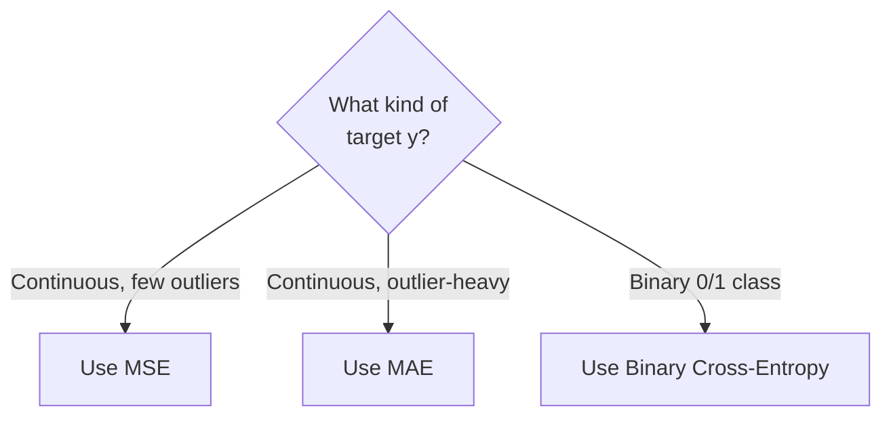

# Loss Functions & Error Metrics: MSE, MAE, and Cross-Entropy

**How algorithms quantify their own mistakes, and why different loss functions suit different problem domains.**

## 1. The Intuition

::: callout-intuition The Scorekeeper
A loss function is the scorekeeper of machine learning: given a prediction $h_\theta(x^{(i)})$ and the true answer $y^{(i)}$, it converts "how wrong was this one guess?" into a single number. A **cost function** $J(\theta)$ then averages that per-example loss across the whole dataset, giving the optimizer (Gradient Descent, covered next) a single scalar target to minimize.

Different scorekeepers punish mistakes differently — some scorekeepers are furious about huge misses and forgiving of tiny ones (squared error), some treat every unit of error equally no matter how big (absolute error), and some are specifically built for "is this a yes or a no?" style predictions (cross-entropy). Choosing the wrong scorekeeper for your problem can quietly sabotage an otherwise well-designed model.
:::

---

## 2. Theoretical Framework & Formalism

**1. Mean Squared Error (MSE) — L2 Loss.**
$$ J(\theta) = \frac{1}{2m}\sum_{i=1}^m \left( h_\theta(x^{(i)}) - y^{(i)} \right)^2 $$
- **Pros:** Smooth, differentiable everywhere, convex for linear models — very friendly to gradient-based optimizers.
- **Cons:** Heavily penalized by outliers, because the error term is squared.

**2. Mean Absolute Error (MAE) — L1 Loss.**
$$ J(\theta) = \frac{1}{m}\sum_{i=1}^m |h_\theta(x^{(i)}) - y^{(i)}| $$
- **Pros:** Robust to corrupted outlier data — errors grow linearly, not quadratically.
- **Cons:** Its gradient is non-differentiable exactly at residual $=0$, which can complicate some optimization routines.

**3. Binary Cross-Entropy (Log Loss)** — for classification, where $\hat{y}^{(i)}$ is a predicted *probability*:
$$ J(\theta) = -\frac{1}{m}\sum_{i=1}^m \left[ y^{(i)}\ln(\hat{y}^{(i)}) + (1-y^{(i)})\ln(1-\hat{y}^{(i)}) \right] $$

**Choosing a loss function based on the problem:**

| Loss | Sensitivity to Outliers | Differentiable Everywhere? | Typical Use |
| :--- | :--- | :--- | :--- |
| MSE | High (errors squared) | Yes | Standard regression |
| MAE | Low (errors linear) | No (kink at 0) | Regression with noisy/outlier-heavy data |
| Cross-Entropy | N/A (probabilistic) | Yes | Binary/multi-class classification |

---

## 3. Worked Example / Step-by-Step Scenario

::: step [Step 1: Setup] Formulating the Problem
A house-price model produces predictions for 4 houses with true prices $y = \{200, 250, 300, 900\}$ (in ₹ lakh) and predicted prices $\hat{y} = \{210, 240, 290, 500\}$ (note the 4th house is a severe outlier miss — off by 400). Compute both MSE and MAE, and compare how each loss "reacts" to that one large outlier error.
:::

::: step [Step 2: Execution] Applying Both Formulas
Residuals: $10, -10, 10, -400$.
**MAE:** $\frac{1}{4}(|10|+|10|+|10|+|400|) = \frac{430}{4} = 107.5$
**MSE (without the $\frac12$ factor here, for direct comparability):** $\frac{1}{4}(10^2+10^2+10^2+400^2) = \frac{1}{4}(100+100+100+160000) = \frac{160300}{4} = 40075$
:::

::: step [Step 3: Conclusion] Final Result
The single outlier residual of $-400$ contributes only $400$ (out of $430$ total) to MAE's sum — roughly 93% of the total error signal, proportionally. But that same residual contributes $160000$ (out of $160300$) to MSE's sum — over 99.8% of the total. This numerically confirms the "MSE is far more dominated by outliers than MAE" claim from the theory section: a model trained by minimizing MSE will contort itself dramatically to fix that one bad prediction, potentially at the expense of the other three, whereas MAE-based training would treat it more proportionately.
:::

---

## 4. Active Recall Checkpoint

::: quiz Q1: Outlier Robustness
Which regression loss function is LEAST sensitive to corrupted outlier measurements?
(A) Mean Squared Error (MSE)
(*B) Mean Absolute Error (MAE)
(C) Root Mean Squared Error (RMSE)
(D) Exponential Loss
::: explanation
MAE penalizes errors linearly ($|e|$), whereas MSE (and RMSE, which is derived from it) squares errors ($e^2$). An error of 100 contributes 100 to MAE's sum but 10,000 to MSE's sum, making MSE far more dominated by large outlier errors.
:::

::: quiz Q2: Choosing a Loss for Classification
A model predicts the probability that a patient's tumor is malignant, with true labels $y \in \{0, 1\}$. Which loss function is the mathematically appropriate choice, and why?
(A) MSE, because it is always the default choice for any prediction task
(*B) Binary Cross-Entropy, because it is specifically designed to penalize confident-but-wrong probability predictions and rewards well-calibrated probabilistic outputs
(C) MAE, because it treats every prediction error identically regardless of confidence
(D) Any loss function works identically well for probability outputs
::: explanation
Cross-entropy loss is derived directly from the likelihood of Bernoulli-distributed labels, and it grows sharply (toward infinity) as a confidently-wrong prediction ($\hat{y}$ near 0 or 1 but incorrect) gets worse — exactly the behavior you want when penalizing overconfident misclassifications, unlike MSE or MAE which don't carry this probabilistic interpretation.
:::

::: quiz Q3: The Non-Differentiability of MAE
Why can Mean Absolute Error (MAE) be more troublesome for certain gradient-based optimizers compared to MSE?
(A) MAE cannot be computed for negative residuals
(*B) MAE's gradient is undefined (has a sharp kink) exactly at a residual of zero, unlike MSE, which is smooth and differentiable everywhere
(C) MAE always produces a larger numerical value than MSE
(D) MAE cannot be used for regression problems at all
::: explanation
$|e|$ has a corner at $e=0$ where its derivative jumps discontinuously between $-1$ and $+1$, which can cause instability for optimizers that rely on smooth gradients — MSE's smooth, everywhere-differentiable parabola avoids this issue entirely.
:::
