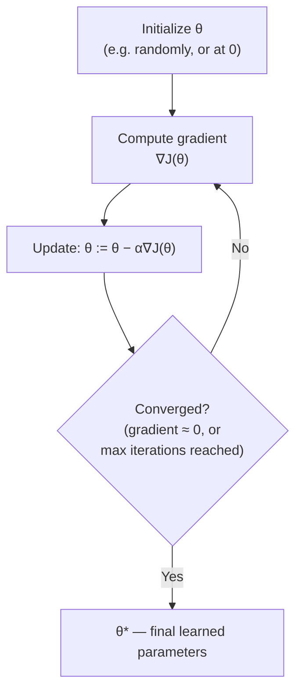

# Gradient Descent Optimization & Learning Rate Dynamics

**The iterative calculus engine powering linear models, support vector machines, and deep neural networks.**

## 1. The Intuition

::: callout-intuition Walking Down a Foggy Mountain
You are blindfolded on a foggy mountain and must reach the valley floor (the minimum of the cost function $J(\theta)$). You can't see the whole landscape, but you can feel the slope right under your feet with each step — the **gradient** $\nabla J(\theta)$. The obvious strategy: feel which direction is steepest *downhill*, take a step that way, then repeat. Take too tiny a step and you'll be on that mountain forever; take too huge a step and you might overshoot the valley entirely and end up further away than when you started.

That is exactly Gradient Descent: an iterative algorithm that repeatedly nudges parameters $\theta$ in the direction that decreases the cost function the fastest, one small step at a time.
:::

---

## 2. Theoretical Framework & Formalism

**The parameter update rule.** Simultaneously update all parameters for $j = 0, \dots, d$:
$$ \theta_j := \theta_j - \alpha \frac{\partial J(\theta)}{\partial \theta_j} $$
where $\alpha > 0$ is the **learning rate** — the size of each downhill step.

::: callout-pitfall Learning Rate Dynamics
- **$\alpha$ too small:** Extremely slow convergence; correct direction, but wastes enormous computational cost getting there.
- **$\alpha$ too large:** Overshoots the minimum, oscillates wildly, and can diverge to infinity instead of converging at all.
:::

**The iterative loop, visualized:**

**Variants by how much data each update uses:**

| Variant | Data used per update | Trade-off |
| :--- | :--- | :--- |
| **Batch Gradient Descent** | Entire dataset | Stable, accurate gradient; slow per step on large datasets |
| **Stochastic Gradient Descent (SGD)** | 1 random example | Fast, noisy updates; can escape shallow local minima |
| **Mini-Batch Gradient Descent** | Small batch (e.g. 32–256) | The practical middle ground used by most real systems |

---

## 3. Worked Example / Step-by-Step Scenario

::: step [Step 1: Setup] Formulating the Problem
A 1-parameter cost function is $J(\theta) = (\theta - 4)^2$, so $\frac{dJ}{d\theta} = 2(\theta - 4)$. Starting at $\theta_0 = 0$ with learning rate $\alpha = 0.1$, compute $\theta$ after 2 gradient descent update steps.
:::

::: step [Step 2: Execution] Applying the Update Rule Twice
**Step 1:** $\frac{dJ}{d\theta}\Big|_{\theta=0} = 2(0-4) = -8$. Update: $\theta_1 = 0 - 0.1 \times (-8) = 0 + 0.8 = 0.8$.
**Step 2:** $\frac{dJ}{d\theta}\Big|_{\theta=0.8} = 2(0.8-4) = -6.4$. Update: $\theta_2 = 0.8 - 0.1 \times (-6.4) = 0.8 + 0.64 = 1.44$.
:::

::: step [Step 3: Conclusion] Final Result
After two update steps, $\theta$ has moved from $0 \to 0.8 \to 1.44$, steadily climbing toward the true minimum at $\theta=4$ (where the derivative is exactly zero). Notice each step is getting smaller as $\theta$ approaches 4 (the step sizes were $0.8$, then $0.64$) — this is expected, since the gradient magnitude itself shrinks as you near the minimum, naturally slowing the descent as it converges.
:::

---

## 4. Active Recall Checkpoint

::: quiz Q1: Gradient at Minimum
What is the mathematical value of the gradient vector $\nabla J(\theta^*)$ when parameters reach the exact local or global minimum?
(*A) Zero vector $\vec{0}$
(B) $1.0$
(C) $-\alpha$
(D) Infinity
::: explanation
At the minimum of a smooth convex function, the tangent slope is completely flat, meaning $\nabla J(\theta) = 0$ — this is precisely the "Converged?" check in the update loop above.
:::

::: quiz Q2: Diagnosing Divergence
During training, an engineer observes the cost function $J(\theta)$ *increasing* wildly across successive iterations instead of decreasing. What is the most likely cause, and what's the fix?
(A) The dataset has too many training examples
(*B) The learning rate $\alpha$ is too large, causing the update to overshoot the minimum repeatedly; the fix is to reduce $\alpha$
(C) The gradient was computed incorrectly and should always be discarded
(D) The cost function itself is broken and needs to be replaced entirely
::: explanation
An oscillating or exploding cost curve is the textbook symptom of too large a learning rate — each step overshoots the minimum by an increasing margin. Reducing $\alpha$ (or switching to an adaptive-learning-rate optimizer) is the standard remedy.
:::

::: quiz Q3: Batch vs Stochastic Trade-off
What is the primary practical trade-off between Batch Gradient Descent and Stochastic Gradient Descent (SGD)?
(*A) Batch GD computes a stable, accurate gradient using the full dataset but is slow per update on large datasets; SGD updates quickly using single examples but with noisier, less stable gradient estimates
(B) SGD always converges to a worse final solution than Batch GD in every case
(C) Batch GD cannot be used for convex cost functions
(D) There is no meaningful difference between the two variants
::: explanation
Batch GD's gradient, averaged over the whole dataset, points in a very reliable direction each step but requires a full pass over potentially millions of examples per update. SGD trades that stability for speed by updating on just one example at a time, introducing noise that can sometimes even help escape shallow local minima, at the cost of a "jumpier" convergence path.
:::
