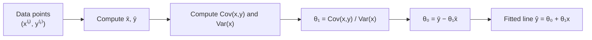

# Simple Linear Regression: Analytical Ordinary Least Squares

**Deriving the closed-form line of best fit using single-variable calculus — no iteration required.**

## 1. The Intuition

::: callout-intuition Drawing the "Best" Line Through a Scatterplot
If you plot points on a scatter graph and are asked to draw the single straight line that best represents the trend, your eye is intuitively trying to minimize how far the line sits from every point, on average. Ordinary Least Squares (OLS) formalizes that intuition mathematically: it finds the exact line $h_\theta(x) = \theta_0 + \theta_1 x$ that minimizes the *sum of squared vertical distances* between the line and each data point — and unlike Gradient Descent's iterative foghill-walking (previous topic), this particular problem has a clean, one-shot **closed-form** algebraic solution, because the MSE cost surface for a straight line is a simple, perfectly smooth bowl.
:::

---

## 2. Theoretical Framework & Formalism

**Model:** $ h_\theta(x) = \theta_0 + \theta_1 x $

Minimizing the MSE cost $J(\theta_0, \theta_1) = \frac{1}{2m}\sum_{i=1}^m \left((\theta_0 + \theta_1 x^{(i)}) - y^{(i)}\right)^2$ — by taking partial derivatives with respect to $\theta_0$ and $\theta_1$ and setting both to zero, exactly as in the MLE derivations earlier in this module — yields these closed-form solutions:

$$ \theta_1 = \frac{\sum_{i=1}^m (x^{(i)} - \bar{x})(y^{(i)} - \bar{y})}{\sum_{i=1}^m (x^{(i)} - \bar{x})^2} = \frac{\text{Cov}(x, y)}{\text{Var}(x)} $$

$$ \theta_0 = \bar{y} - \theta_1 \bar{x} $$

The slope $\theta_1$ has a clean interpretation: it's the ratio of how $x$ and $y$ co-vary to how much $x$ alone varies — essentially "how many units does $y$ move, on average, for every 1-unit move in $x$."

---

## 3. Worked Example / Step-by-Step Scenario

::: step [Step 1: Setup] Formulating the Problem
Given 3 data points: $(1, 2), (2, 4), (3, 5)$. Fit the OLS regression line $\hat{y} = \theta_0 + \theta_1 x$.
:::

::: step [Step 2: Execution] Applying the Closed-Form Formulas
1. Means: $\bar{x} = 2.0,\ \bar{y} = 3.667$.
2. Deviations and their products: $(x-\bar x, y-\bar y)$ pairs are $(-1, -1.667), (0, 0.333), (1, 1.333)$.
   $\text{Cov}(x,y)$ numerator sum $= (-1)(-1.667) + (0)(0.333) + (1)(1.333) = 1.667 + 0 + 1.333 = 3.0$.
3. $\text{Var}(x)$ numerator sum $= (-1)^2 + 0^2 + 1^2 = 1 + 0 + 1 = 2.0$.
4. $\theta_1 = \frac{3.0}{2.0} = 1.50$.
5. $\theta_0 = 3.667 - (1.50 \times 2.0) = 3.667 - 3.0 = 0.667$.
:::

::: step [Step 3: Conclusion] Final Result
**Final Line:** $\hat{y} = 0.667 + 1.50x$. This line predicts, for instance, $\hat{y}(4) = 0.667 + 1.50(4) = 6.667$ for a new point at $x=4$ — and by construction, it is the *unique* straight line that minimizes total squared vertical error across the 3 given points; no other slope-intercept pair produces a lower MSE on this data.
:::

---

## 4. Active Recall Checkpoint

::: quiz Q1: Slope Interpretation
In $\hat{y} = 10 + 3.2x$, what does $3.2$ represent?
(A) The predicted $y$ when $x=0$
(*B) The expected change in $y$ for every 1-unit increase in $x$
(C) The correlation coefficient $r$
(D) The mean squared error
::: explanation
The slope $\theta_1 = 3.2$ is the rate of change: for every $+1$ unit added to $x$, the predicted $\hat{y}$ increases by $3.2$ units. The value $10$ (the intercept $\theta_0$) is what answers "predicted $y$ when $x=0$," not the slope.
:::

::: quiz Q2: Closed-Form vs Iterative
Why does simple linear regression admit a direct closed-form solution for $\theta_0, \theta_1$, rather than requiring an iterative method like Gradient Descent?
(*A) The MSE cost function for a straight line is a smooth, convex quadratic bowl, so setting its derivatives to zero and solving algebraically gives the exact minimum directly, without needing repeated stepwise updates
(B) Linear regression cannot actually be solved with Gradient Descent at all
(C) Closed-form solutions only exist for classification problems, never regression
(D) The formulas for $\theta_0$ and $\theta_1$ were chosen arbitrarily, with no connection to minimizing MSE
::: explanation
Because $J(\theta_0,\theta_1)$ is quadratic in both parameters, its partial derivatives are linear, so setting them to zero yields a simple linear system with an exact algebraic solution — no need for the iterative, step-by-step approach that more complex, non-linear cost functions typically require.
:::

::: quiz Q3: Zero Correlation Case
If $\text{Cov}(x, y) = 0$ for a dataset (x and y are completely uncorrelated), what does OLS predict for $\theta_1$, and what does the resulting fitted line look like?
(*A) $\theta_1 = 0$, so the fitted line is a flat horizontal line at $\hat{y} = \bar{y}$, regardless of $x$
(B) $\theta_1$ is undefined and OLS cannot be computed
(C) $\theta_1 = 1$, producing a perfect diagonal line
(D) $\theta_0$ becomes negative infinity
::: explanation
With $\text{Cov}(x,y)=0$, the slope formula gives $\theta_1 = 0/\text{Var}(x) = 0$, and then $\theta_0 = \bar y - 0\times\bar x = \bar y$. The "best fit line" degenerates to a flat line at the mean of $y$ — correctly reflecting that $x$ carries no linear predictive information about $y$ in this case.
:::
