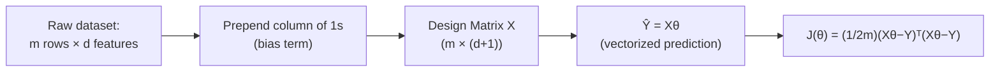

# Multiple Linear Regression: Matrix Design Formulation

**Extending linear models from a single feature to multidimensional hyperplanes, using vectorized matrix equations.**

## 1. The Intuition

::: callout-intuition From a Line to a Hyperplane
Simple linear regression (previous topic) fits a straight line through 2D data using one feature $x$. Real-world problems rarely have just one predictive feature — a house's price depends on square footage, number of bedrooms, location score, age, and more, simultaneously. With $d$ features, the "line of best fit" generalizes into a **hyperplane** slicing through $(d+1)$-dimensional space, and writing out $\theta_0 + \theta_1 x_1 + \theta_2 x_2 + \dots + \theta_d x_d$ by hand for every one of $m$ training examples gets unwieldy fast.

The fix is to stop writing individual equations altogether and instead express the *entire* dataset and model as matrices — turning $m \times d$ scalar equations into a handful of clean matrix operations that both humans and computers (via optimized linear-algebra libraries) can handle efficiently.
:::

---

## 2. Theoretical Framework & Formalism

**Matrix vectorization.** For $m$ samples and $d$ features, define the **design matrix** $X$ (with a column of 1s prepended for the bias/intercept term), target vector $Y$, and parameter vector $\theta$:

$$ X = \begin{bmatrix} 1 & x_1^{(1)} & \dots & x_d^{(1)} \\ \vdots & \vdots & \ddots & \vdots \\ 1 & x_1^{(m)} & \dots & x_d^{(m)} \end{bmatrix} \in \mathbb{R}^{m \times (d+1)}, \quad Y = \begin{bmatrix} y^{(1)} \\ \vdots \\ y^{(m)} \end{bmatrix} \in \mathbb{R}^m, \quad \theta = \begin{bmatrix} \theta_0 \\ \vdots \\ \theta_d \end{bmatrix} \in \mathbb{R}^{d+1} $$

**Vectorized prediction & cost function** — one matrix equation replaces $m$ separate scalar equations:
$$ \hat{Y} = X\theta $$
$$ J(\theta) = \frac{1}{2m} (X\theta - Y)^T (X\theta - Y) $$

::: callout-formula Why Vectorize?
Besides notational cleanliness, vectorized operations map directly onto highly optimized linear-algebra routines (BLAS/LAPACK, GPU matrix multiplication) — computing $X\theta$ as one matrix-vector product is dramatically faster in practice than looping over $m$ examples one at a time in code.
:::

---

## 3. Worked Example / Step-by-Step Scenario

::: step [Step 1: Setup] Formulating the Problem
A dataset has $m=3$ houses, each described by $d=2$ features (size in 100s of sq ft, number of bedrooms): House 1: $(size=15, beds=3)$; House 2: $(size=12, beds=2)$; House 3: $(size=20, beds=4)$. Construct the design matrix $X$ and state its exact dimensions.
:::

::: step [Step 2: Execution] Building the Design Matrix
Prepend a column of 1s for the bias term $\theta_0$, then add each feature as its own column:
$$ X = \begin{bmatrix} 1 & 15 & 3 \\ 1 & 12 & 2 \\ 1 & 20 & 4 \end{bmatrix} $$
This matrix has $m=3$ rows (one per house) and $d+1 = 3$ columns (bias + 2 features).
:::

::: step [Step 3: Conclusion] Final Result
$X \in \mathbb{R}^{3 \times 3}$ in this specific case (since $d+1$ happened to equal $m$ here, purely coincidentally). Predictions for all 3 houses at once are then given by the single matrix-vector product $\hat{Y} = X\theta$ — for example, with some fitted $\theta = [\theta_0, \theta_1, \theta_2]^T$, House 1's predicted price is exactly $\theta_0 + 15\theta_1 + 3\theta_2$, computed automatically as the first entry of $X\theta$.
:::

---

## 4. Active Recall Checkpoint

::: quiz Q1: Design Matrix Dimensions
If you have 500 training examples with 8 input features, what are the exact matrix dimensions of the Design Matrix $X$, including the bias intercept column?
(A) $500 \times 8$
(*B) $500 \times 9$
(C) $8 \times 500$
(D) $9 \times 9$
::: explanation
Adding the initial column of $1$s for bias $\theta_0$ makes the dimensions $m \times (d+1) = 500 \times (8+1) = 500 \times 9$.
:::

::: quiz Q2: Purpose of the Bias Column
Why does the Design Matrix $X$ include a prepended column of all 1s, rather than just the raw $d$ feature columns?
(*A) It lets the intercept term $\theta_0$ be handled by the same uniform matrix multiplication $X\theta$, instead of needing a separate additive term in the equation
(B) It normalizes all features to the same scale
(C) It is only needed when $d = 1$
(D) It converts the regression problem into a classification problem
::: explanation
Without the 1s column, the model would need to be written as $\hat y = \theta_0 + X'\theta_{1:d}$ with $\theta_0$ handled separately. By prepending a column of constant 1s to $X$, the single clean matrix product $X\theta$ automatically reproduces $\theta_0 \times 1 + \theta_1 x_1 + \dots$, unifying the bias term into the same vectorized operation.
:::

::: quiz Q3: Vectorized Cost Function
In $J(\theta) = \frac{1}{2m}(X\theta - Y)^T(X\theta - Y)$, what scalar-equation quantity does $(X\theta - Y)$ represent?
(*A) The vector of residuals (prediction minus actual) for every one of the $m$ training examples, all at once
(B) The final scalar cost value $J(\theta)$ itself
(C) The gradient of the cost function
(D) The learning rate used in optimization
::: explanation
$X\theta$ produces the vector of all $m$ predictions $\hat Y$; subtracting $Y$ gives the vector of $m$ residuals $(\hat y^{(i)} - y^{(i)})$. The subsequent transpose-multiply, $(\cdot)^T(\cdot)$, sums the squares of all those residuals in one operation — exactly matching the scalar sum-of-squared-errors form of MSE from the simple linear regression topic, just written compactly.
:::
