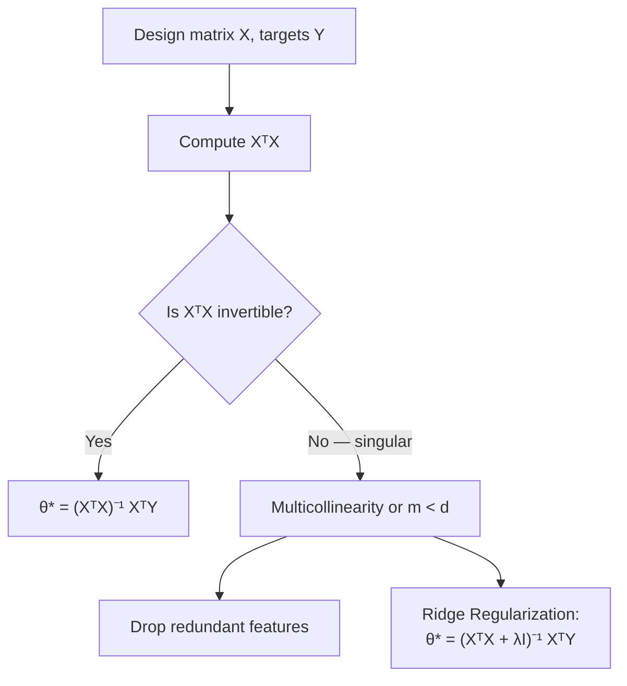

# The Normal Equation & Matrix Inversion Singularities

**Solving multiple linear regression in a single analytical step, and diagnosing when multicollinearity breaks that shortcut.**

## 1. The Intuition

::: callout-intuition Skipping the Foghill Walk Entirely
Just as simple linear regression had a direct closed-form solution instead of needing Gradient Descent's iterative descent, *multiple* linear regression also has an exact one-shot formula — the **Normal Equation**. Instead of walking downhill step by step, you solve directly for the exact point where the cost surface is perfectly flat in every direction at once.

But this shortcut has a catch: it requires inverting a matrix, and matrix inversion isn't always possible. If two features carry *redundant* information (like a house's size measured in both square feet and square meters), the matrix inversion step breaks down entirely — a problem this topic diagnoses and fixes.
:::

---

## 2. Theoretical Framework & Formalism

**Derivation.** Expanding the vectorized cost function from the previous topic:
$$ J(\theta) = \frac{1}{2m} \left( \theta^T X^T X \theta - 2 Y^T X \theta + Y^T Y \right) $$

Taking the matrix gradient with respect to $\theta$ and setting it to zero (the multivariate analogue of the single-variable derivative-equals-zero trick used throughout this module):
$$ \nabla_\theta J(\theta) = X^T X \theta - X^T Y = 0 \implies \theta^* = (X^T X)^{-1} X^T Y $$

This single equation directly gives the exact optimal $\theta^*$ — no iterations, no learning rate to tune.

::: callout-pitfall When is $(X^TX)$ Singular (Non-Invertible)?
$(X^TX)$ cannot be inverted if:
1. **Linearly Dependent Features (Multicollinearity):** e.g. $x_1 = $ size in ft² and $x_2 = $ size in m² — one is just a constant multiple of the other, carrying zero additional information.
2. **Too Few Samples ($m < d$):** more features than training examples, leaving the system underdetermined.

*Remedy:* drop redundant/derived features, or apply Ridge Regularization: $\theta^* = (X^TX + \lambda I)^{-1} X^T Y$, where adding $\lambda I$ guarantees invertibility even when $X^TX$ alone is singular.
:::

---

## 3. Worked Example / Step-by-Step Scenario

::: step [Step 1: Setup] Formulating the Problem
A dataset has 3 features: $x_1$ = house size in ft², $x_2$ = house size in m² (exactly $x_1 / 10.764$), and $x_3$ = number of bedrooms. An engineer attempts to solve $\theta^* = (X^TX)^{-1}X^TY$ using all 3 features and it fails with a "singular matrix" error. Diagnose the cause and propose two valid fixes.
:::

::: step [Step 2: Execution] Applying the Diagnostic Framework
Because $x_2$ is an exact linear function of $x_1$ ($x_2 = x_1/10.764$), the two columns of $X$ corresponding to $x_1$ and $x_2$ are linearly dependent — this is precisely the multicollinearity condition described above, which makes $X^TX$ singular (non-invertible), so $(X^TX)^{-1}$ simply does not exist.
:::

::: step [Step 3: Conclusion] Final Result
**Fix 1 (preferred here):** drop one of the two redundant size columns (e.g. keep $x_1$, discard $x_2$) — since they carry identical information, no predictive power is lost, and $X^TX$ becomes invertible again. **Fix 2 (general-purpose):** apply Ridge Regularization, using $\theta^* = (X^TX + \lambda I)^{-1}X^TY$ for some small $\lambda > 0$, which guarantees invertibility regardless of collinearity, at the cost of introducing a small amount of bias into the parameter estimates.
:::

---

## 4. Active Recall Checkpoint

::: quiz Q1: Normal Equation Scaling
What is the computational complexity of solving the Normal Equation for $d$ features?
(A) $O(d)$
(B) $O(d^2)$
(*C) $O(d^3)$ due to matrix inversion
(D) $O(\log d)$
::: explanation
Inverting a $(d+1) \times (d+1)$ matrix $(X^TX)$ scales as $O(d^3)$, making it computationally prohibitive when $d$ is very large (e.g. $d > 10{,}000$) — in that regime, iterative Gradient Descent (which scales more gently with $d$) becomes the more practical choice.
:::

::: quiz Q2: Root Cause of Singularity
A dataset has $m=50$ training examples but $d=80$ features. Why will the Normal Equation fail here even if no two features are literally redundant?
(A) $X^TX$ is always invertible regardless of $m$ and $d$
(*B) With more features than examples ($d > m$), the system is underdetermined, and $X^TX$ is guaranteed to be singular regardless of whether individual features are collinear
(C) The Normal Equation only works when $d=1$
(D) This situation instead causes the learning rate $\alpha$ to become negative
::: explanation
When $d > m$, there simply isn't enough independent information in the data to uniquely pin down all $d+1$ parameters — mathematically, $X^TX$ (a $(d+1)\times(d+1)$ matrix built from only $m$ rows of data) cannot have full rank in this regime, making it singular regardless of any feature redundancy.
:::

::: quiz Q3: Ridge Regularization's Role
How does adding $\lambda I$ inside the Normal Equation, $\theta^* = (X^TX + \lambda I)^{-1}X^TY$, fix the singularity problem?
(*A) Adding $\lambda I$ (for $\lambda > 0$) shifts every eigenvalue of $X^TX$ up by $\lambda$, guaranteeing the resulting matrix has no zero eigenvalues and is therefore always invertible
(B) It removes the redundant features from the dataset automatically
(C) It converts the regression problem into a classification problem
(D) It has no mathematical effect and is purely a coding convention
::: explanation
$X^TX$ is symmetric and positive semi-definite, meaning its eigenvalues are all $\ge 0$; a singular matrix has at least one eigenvalue equal to exactly 0. Adding $\lambda I$ shifts every eigenvalue up by $\lambda$, so as long as $\lambda > 0$, every eigenvalue becomes strictly positive, guaranteeing invertibility — this is the core mathematical trick behind Ridge Regression.
:::
