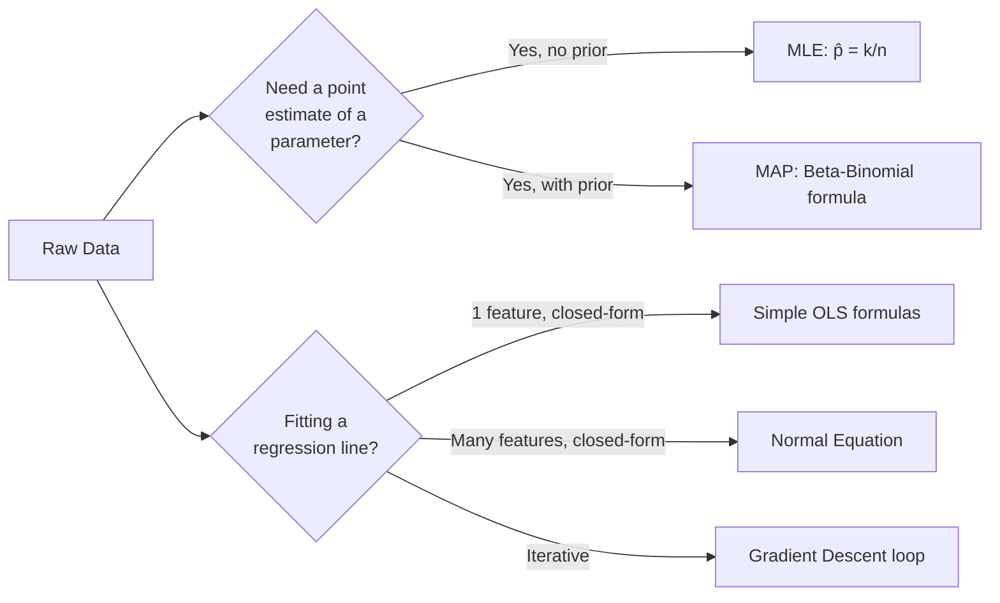

# Module 1 Practice Lab: MLE, MAP & Regression — The Complete Numerical Vault

**Step-by-step master numerical solutions spanning every major examination category from Module 1: estimation, optimization, and regression.**

## 1. The Intuition

::: callout-intuition Why a Consolidated Numerical Lab?
Module 1 built up a chain of ideas: estimate a parameter from data (MLE), regularize that estimate with prior belief (MAP), define what "wrong" even means (Loss/Cost), find the minimum of that cost either iteratively (Gradient Descent) or in one shot (OLS / Normal Equation). Exams rarely test these ideas in isolation — they mix and match them into multi-part numerical problems. This lab drills the exact same closed-form formulas derived across the module, applied to fresh numbers, so the mechanics become automatic under time pressure.
:::

---

## 2. Theoretical Framework & Formalism

**The full Module 1 formula cheat-sheet:**

| Category | Formula |
| :--- | :--- |
| MLE (Bernoulli) | $\hat p_{\text{MLE}} = k/n$ |
| MLE (Gaussian mean/variance) | $\hat\mu = \frac{1}{m}\sum x_i,\quad \hat\sigma^2 = \frac{1}{m}\sum(x_i-\hat\mu)^2$ |
| MAP (Beta-Binomial) | $\hat p_{\text{MAP}} = \dfrac{k+\alpha-1}{n+\alpha+\beta-2}$ |
| Gradient Descent update | $\theta_j := \theta_j - \alpha \dfrac{\partial J(\theta)}{\partial \theta_j}$ |
| Simple OLS slope/intercept | $\theta_1 = \dfrac{\text{Cov}(x,y)}{\text{Var}(x)},\quad \theta_0 = \bar y - \theta_1\bar x$ |
| Normal Equation | $\theta^* = (X^TX)^{-1}X^TY$ |

---

## 3. Worked Example / Step-by-Step Scenario

::: step [Category 1: Maximum Likelihood Estimation] MLE
**Problem:** Among $n = 20$ semiconductor chips, $k = 6$ are defective. Calculate $\hat{p}_{\text{MLE}}$.
1. $L(p) = p^6 (1-p)^{14} \implies \ell(p) = 6\ln(p) + 14\ln(1-p)$.
2. $\frac{d\ell}{dp} = \frac{6}{p} - \frac{14}{1-p} = 0 \implies 6(1-p) = 14p$.
3. $6 = 20p \implies \hat{p} = \frac{6}{20} = 0.30$ (30%).
:::

::: step [Category 2: Maximum A Posteriori] MAP
**Problem:** An e-commerce item gets $k=2$ five-star reviews out of $n=2$ total ratings. Prior is $\text{Beta}(\alpha=4, \beta=4)$.
$$ \hat{p}_{\text{MAP}} = \frac{k + \alpha - 1}{n + \alpha + \beta - 2} = \frac{2 + 4 - 1}{2 + 4 + 4 - 2} = \frac{5}{8} = 0.625 \ (62.5\%) $$
:::

::: step [Category 3: Gradient Descent] Two Manual Update Steps
**Problem:** $J(\theta) = (\theta-6)^2$, so $\frac{dJ}{d\theta}=2(\theta-6)$. Start at $\theta_0=1$, $\alpha=0.2$. Find $\theta_2$.
1. $\theta_0=1$: gradient $=2(1-6)=-10$. $\theta_1 = 1 - 0.2(-10) = 1+2 = 3$.
2. $\theta_1=3$: gradient $=2(3-6)=-6$. $\theta_2 = 3 - 0.2(-6) = 3+1.2 = 4.2$.
**Result:** $\theta$ moves $1 \to 3 \to 4.2$, converging toward the true minimum at $\theta=6$.
:::

::: step [Category 4: Ordinary Least Squares] OLS Line Fit
**Problem:** Fit a line for points $(1, 2), (2, 4), (3, 5), (4, 4), (5, 5)$.
1. $\bar{x} = 3.0, \bar{y} = 4.0$.
2. $\sum (x-\bar{x})(y-\bar{y}) = 6.0, \quad \sum (x-\bar{x})^2 = 10.0$.
3. $\theta_1 = \frac{6.0}{10.0} = 0.60, \quad \theta_0 = 4.0 - (0.60 \times 3.0) = 2.20$.
**Fitted Line:** $\hat{y} = 2.20 + 0.60x$.
:::

::: step [Category 5: Loss Function Comparison] MSE vs MAE
**Problem:** True values $y=\{5,5,5,5\}$, predictions $\hat y=\{6,4,6,20\}$ (last one a severe outlier). Compute MSE and MAE.
Residuals: $1,-1,1,15$.
$\text{MAE} = \frac{1+1+1+15}{4} = 4.5$. $\text{MSE (raw sum/4)} = \frac{1+1+1+225}{4} = 57.0$.
**Result:** The one outlier residual of $15$ dominates MSE (225 out of 228 total, ~98.7%) far more than it dominates MAE (15 out of 18 total, ~83%), confirming MSE's outlier sensitivity.
:::

---

## 4. Active Recall Checkpoint

::: quiz Q1: Cross-Category Recall
A dataset of $n=50$ website visits shows $k=8$ conversions, with no prior belief specified (i.e., assume a flat/uniform prior). What single formula gives the best point estimate of the true conversion probability, and what is its value?
(*A) MLE, $\hat p = k/n = 8/50 = 0.16$
(B) MAP with $\text{Beta}(1,1)$ gives a different numeric answer than MLE
(C) Gradient Descent must be run iteratively to find this value
(D) The Normal Equation, since this is a regression problem
::: explanation
With no informative prior stated, plain MLE applies directly: $\hat p = k/n = 8/50 = 0.16$. (Note: MAP with a flat $\text{Beta}(1,1)$ prior would in fact produce the exact same numeric answer, since MAP collapses to MLE under a uniform prior — but MLE is the direct, simplest tool for this exact question.)
:::

::: quiz Q2: Gradient Descent Step Direction
For $J(\theta) = (\theta - 6)^2$ starting at $\theta_0 = 1$ with $\alpha=0.2$, why does the first update move $\theta$ in the *positive* direction (from 1 toward 3, not away from it)?
(*A) The gradient at $\theta_0=1$ is negative ($-10$), and subtracting a negative quantity ($-\alpha \times -10 = +2$) increases $\theta$, correctly moving it toward the minimum at $\theta=6$
(B) Gradient descent always moves parameters toward zero regardless of the cost function
(C) The learning rate being positive forces $\theta$ to always decrease
(D) This specific direction is a coincidence with no underlying mathematical reason
::: explanation
The update rule $\theta := \theta - \alpha \cdot \text{gradient}$ always moves *against* the gradient's sign. Since the gradient at $\theta_0=1$ is negative (the function is decreasing as $\theta$ increases toward 6), subtracting a negative number increases $\theta$ — correctly walking toward the minimum, exactly as the "foghill" intuition predicts.
:::

::: quiz Q3: Choosing OLS vs Normal Equation
For a dataset with only 1 feature (simple linear regression), is there any mathematical difference between using the "simple OLS" slope/intercept formulas and using the general Normal Equation $\theta^* = (X^TX)^{-1}X^TY$?
(*A) No — the simple OLS formulas are just the closed-form solution of the Normal Equation specialized to the $d=1$ case; both yield identical $\theta_0, \theta_1$
(B) Yes — the Normal Equation only works for $d \ge 2$ features
(C) Yes — simple OLS ignores the intercept term entirely
(D) Yes — the Normal Equation requires Gradient Descent as a sub-step
::: explanation
The simple OLS slope/intercept formulas are a specific, simplified algebraic derivation of exactly the same underlying optimization problem the general Normal Equation solves — for $d=1$, both approaches produce numerically identical results, since they're solving the identical minimization problem via the same "set the derivative to zero" logic.
:::
